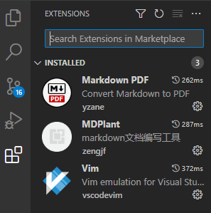
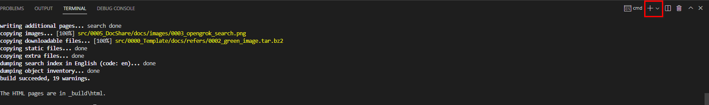
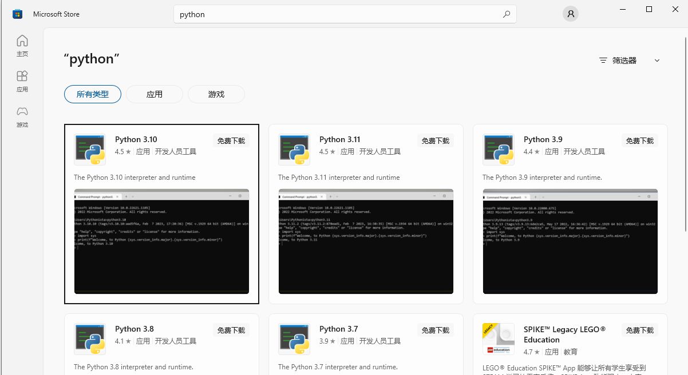
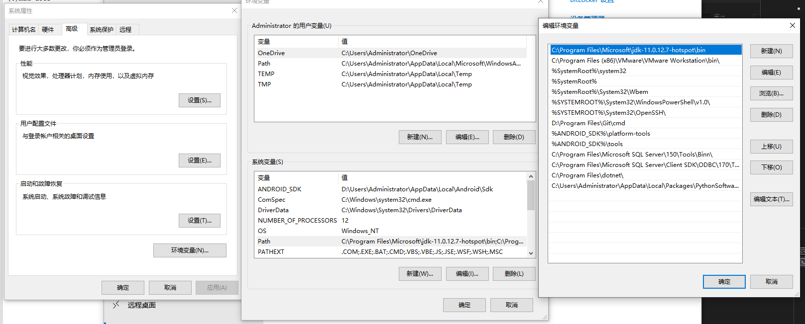

# docshare

介绍如何进行环境配置

# steps

* 工具
   * visual studio code

* 安装依赖
   * 打开 VS code，在Extensions中分别搜索vim、MDPlant、Markdown PDF,进行安装  
     
   * 配置shell，选择powershell
     
   * 安装python
     * window在开始搜索microsoft Store,打开microsoft store 搜索Python，点击获取会自动安装
       
   * 配置sphinx-build路径为环境变量
     * 找到sphinx-build文件的路径，在环境变量中增加其路径
       
   * 安装sphinx-rtd-theme
     * 点击Terminal->new Terminal
     * pip3 install sphinx-rtd-theme==1.0.0
   
   * 到这依赖已经完成，可以新建文档，然后在terminal窗口中输入指令
     * make html    //将文档转为html,每次有更新都需要执行生成新的html
     * make server //执行后，可以反问http://127.0.0.1:8080/ 查看效果
     * make docs   //

* 
