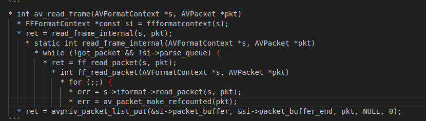

# 如何用VS code编写总结文档

如何用VS code编写总结文档

# 说明

* 文档新建
  * 选择file->open Folder... 选择一个存储文档的目录
  * 空白处右键，选择Create MDPlant Template,输入你的主题，在打开的网页顶端显示
  * 点击打开src，会有默认已经新建的模板（000_Template）,这里可以保留，后续参考
  * 不同阶段我们都会有不同主题进行总结，如果需要新建新的主题，在src进行右键选择Create MDPlant Template,创建新的模板输入主题名字
  * 每个主题可能都会有多篇文档进行总结，所以进入对应主题->docs 下右键选择Create MDPlant Template创建新的文档并输入文字。

* excel 表格插入
  * 在对应的位置添加 table + 相对json路径，然后按 ctrl + enter即可显示excel表格，

* 资源文件插入
  * 右键资源文件，选择相对路径，复制到需要的位置，按ctrl + enter 即可显示资源文件的链接

* 区域显示用配对的   
  * diff表示显示的git patch；
  * 配对的符号前的空格需要保持一致，符号内的内容才能显示在区域内
  * 右上角有预览窗口，可以在编写文档过程中打开预览窗口，看整体效果  
  
* 代码堆栈
  *+一个空格，然后按ctrl + enter ，上下级间隔两个空格
  代码输入格式如下，层级之间相距两个空格
    
  然后输入ctrl + enter就是如下效果  
    

* 文档中想换行，输入两个空格，在make html 后显示的效果就是换行
