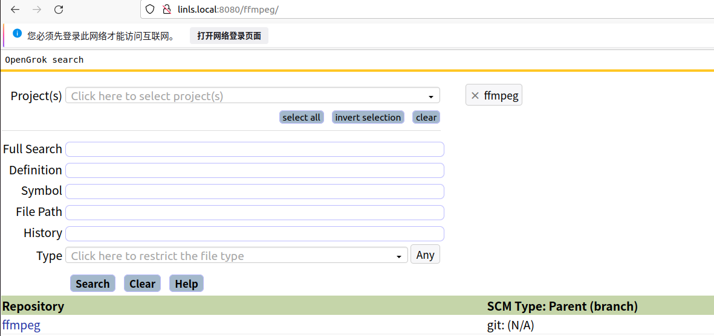

# code search server

如何搭建代码搜索服务器

# 参考文档
* [在Ubuntu20上配置OpenGrok](https://www.cnblogs.com/idorax/p/13796481.html#:~:text=%E6%9C%AC%E6%96%87%E4%BB%8B%E7%BB%8D%E5%A6%82%E4%BD%95%E5%9C%A8Ubuntu20%E6%A1%8C%E9%9D%A2%E4%B8%8A%E5%AE%89%E8%A3%85%E5%B9%B6%E9%85%8D%E7%BD%AEOpenGrok.%2001%20-%20%E5%AE%89%E8%A3%85tomcat9,sudo%20apt%20install%20-y%20tomcat9)

* [ubuntu14.04安装openGrok及多项目配置方法](https://blog.csdn.net/xl_name/article/details/79612231?spm=1001.2101.3001.6650.2&utm_medium=distribute.pc_relevant.none-task-blog-2%7Edefault%7EBlogCommendFromBaidu%7ERate-2-79612231-blog-51674224.pc_relevant_vip_default&depth_1-utm_source=distribute.pc_relevant.none-task-blog-2%7Edefault%7EBlogCommendFromBaidu%7ERate-2-79612231-blog-51674224.pc_relevant_vip_default&utm_relevant_index=3)

* 安装tomcat9
  ```sh
  sudo apt install -y tomcat9
  ```
* 安装universal ctags  
  ```
  sudo apt install -y autoconf automake    
  git clone https://github.com/universal-ctags/ctags.git
  cd ctags                                                              
  ./autogen.sh                                                          
  ./configure                                                           
  make                                                                  
  sudo make install
  ```
* 安装OpenGrok(这里版本版本我没有用最新的，只是用1.4.7，用最新的访问不成功，没有深入研究)
  ```
  cd ~/tmp
  wget https://github.com/oracle/opengrok/releases/download/1.4.7/opengrok-1.4.7.tar.gz
  mkdir ~/opengrok                                                  
  mkdir ~/opengrok/project/xxx/{src,data,dist,etc,log}                          
  tar -C ~/opengrok/dist --strip-components=1 -xzf ~/tmp/opengrok-1.4.7.tar.gz
  cp ~/opengrok/dist/doc/logging.properties ~/opengrok/etc
  cd ~/opengrok/dist/tools                                          
  sudo apt install -y python3-pip                                           
  sudo pip3 install opengrok-tools.tar.gz   
  ```
* 配置OpenGrok运行环境
  * 如果需要配置多个大型项目，建议使用多个project，这样便于后面代码的扫描，否则每次更新多个大项目都要更新三四个小时，后续项目越多，更新时间越久
  * 将源代码对应的目录保存到~/opengrok/project/xxx/src
  * 如果是本地搭建，不建议保留源码下的.git 文件会增加很多扫描时间
  ```
  sudo cp ~/opengrok/dist/lib/source.war /var/lib/tomcat9/webapps/xxx.war // 这里建议一个大型项目代码建立一个xxx project
  sudo vi /var/lib/tomcat9/webapps/xxx/WEB-INF/web.xml
  //这里修改为opengrok所在的绝对路径
  <param-value>/home/muxi/opengrok/project/xxx/etc/configuration.xml</param-value> 
  ```

* 例如这里配置了项目，分别配置项目的configuration.xml
```sh
linliangsong@linls:webapps$ pwd
/var/lib/tomcat9/webapps
linliangsong@linls:webapps$ ls 
ffmpeg  ffmpeg.war  project  project.war  ROOT x264  x264.war
```

* 新建工程目录，在src 目录下保存源码
```sh
linliangsong@linls:project$ pwd
/home/linliangsong/opengrok/project
linliangsong@linls:project$  ls -l
总用量 110516
drwxr-xr-x 5 root         root             4096 8月  18 09:40 data
drwxrwxr-x 7 linliangsong linliangsong     4096 11月  9 09:48 ffmpeg
drwxrwxr-x 7 linliangsong linliangsong     4096 11月  9 09:48 x264
linliangsong@linls:project$ 
linliangsong@linls:project$ cd ffmpeg/
linliangsong@linls:ffmpeg$ ls
data  dist  etc  log  src
linliangsong@linls:ffmpeg$ pwd
/home/linliangsong/opengrok/project/ffmpeg
linliangsong@linls:ffmpeg$ ls -l
总用量 20
drwxrwxr-x 5 linliangsong linliangsong 4096 11月  9 10:00 data
drwxrwxr-x 2 linliangsong linliangsong 4096 11月  9 09:48 dist
drwxrwxr-x 2 linliangsong linliangsong 4096 11月  9 10:00 etc
drwxrwxr-x 2 linliangsong linliangsong 4096 11月  9 09:48 log
drwxrwxr-x 3 linliangsong linliangsong 4096 11月  9 09:49 src
```


* 执行如下命令也可以保存为脚本
  * 根据自己的项目名称修改如下的路径与project的名称
  ```
  sudo java -Djava.util.logging.config.file=/home/muxi/opengrok/etc/logging.properties -jar /home/muxi/opengrok/dist/lib/opengrok.jar -c /usr/local/bin/ctags  -s /home/muxi/opengrok/project/xxx/src/  -d /home/muxi/opengrok/project/xxx/data -H -P -S -G -W /home/muxi/opengrok/project/xxx/etc/configuration.xml -U http://localhost:8080/xxx    //这里xxx需同拷贝的xxx.war名字相同。
  ```

* 例如我本的新建了两个工程,分别是ffmpeg和x264,则执行结束后可以通过http://localhost:8080/ffmpeg 和 http://localhost:8080/x264访问
  ```
   sudo java -Djava.util.logging.config.file=/home/muxi/opengrok/etc/logging.properties -jar /home/muxi/opengrok/dist/lib/opengrok.jar -c /usr/local/bin/ctags  -s /home/muxi/opengrok/project/ffmpeg/src/  -d /home/muxi/opengrok/project/ffmpeg/data -H -P -S -G -W /home/muxi/opengrok/project/ffmpeg/etc/configuration.xml -U http://localhost:8080/ffmpeg

   sudo java -Djava.util.logging.config.file=/home/muxi/opengrok/etc/logging.properties -jar /home/muxi/opengrok/dist/lib/opengrok.jar -c /usr/local/bin/ctags  -s /home/muxi/opengrok/project/x264/src/  -d /home/muxi/opengrok/project/x264/data -H -P -S -G -W /home/muxi/opengrok/project/x264/etc/configuration.xml -U http://localhost:8080/x264

  ```

* 扫描结束后就可以访问http://localhost:8080/ffmpeg，进行代码搜索


