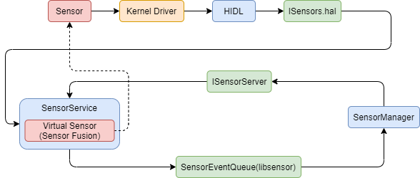
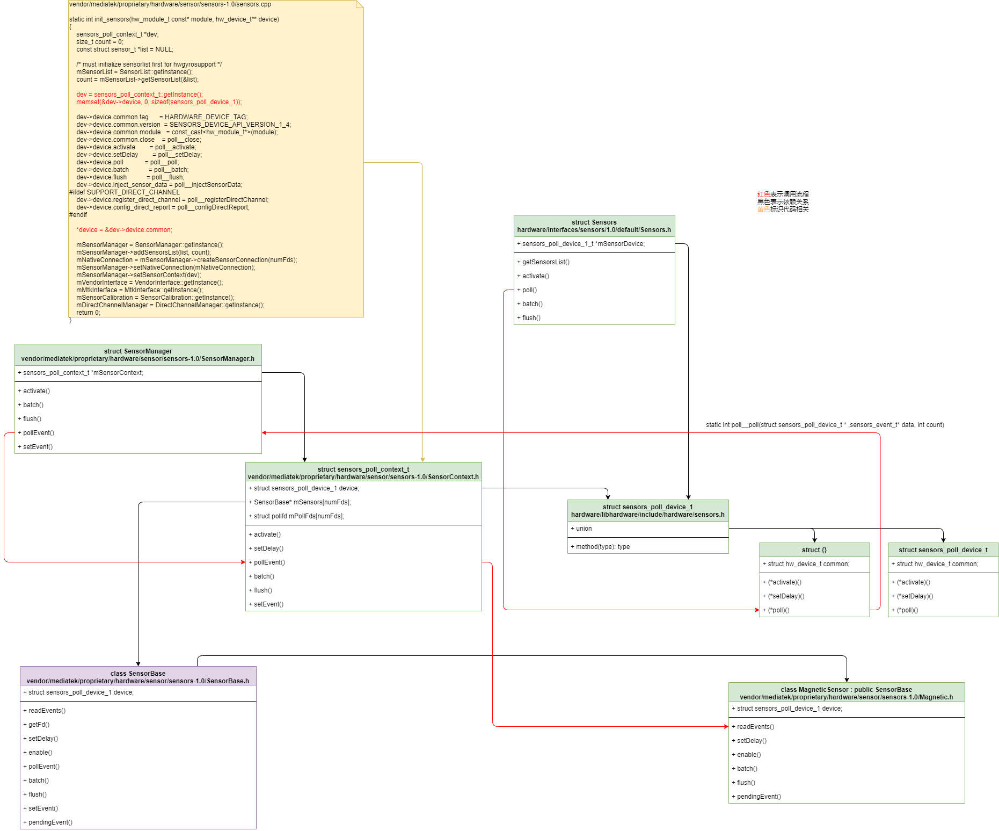
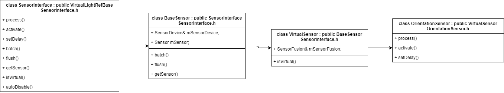

# Android Sensors

这里主要介绍传感器架构及传感器数据传递

# menu

* [1 参考文档](#1-参考文档)
* [2 传感器数据流](#2-传感器数据流)
* [3 SensorService](#3-SensorService)
  * [3.1 sensorservice的启动及sensorlist的获取](#31-sensorservice的启动及sensorlist的获取)
  * [3.2 SystemSensorManager](#32-SystemSensorManager)
  * [3.3 SensorService数据发送与SensorManager接收](#33-SensorService数据发送与SensorManager接收)
* [4 打开Sensor 连接的debug log](#4-打开Sensor-连接的debug-log)
* [5 HIDL层](#5-HIDL层)
  * [5.1 类依赖及poll调用关系](#51-类依赖及poll调用关系)
  * [5.2 确认sensor 架构](#52-确认sensor-架构)
  * [5.3 确认hidl](#53-确认hidl)
  * [5.4 HIDL初始化及poll流程：](#54-HIDL初始化及poll流程)
  * [5.5 HIDL主线程poll运行关系，poll中事件的上报：](#55-HIDL主线程poll运行关系poll中事件的上报)
  * [5.6 传感器数据格式：](#56-传感器数据格式)
  * [5.7 framework与HIDL层传感器 转换关系](#57-framework与HIDL层传感器-转换关系)
  * [5.8 传感器数组及其索引定义](#58-传感器数组及其索引定义)
* [6 虚拟传感器关系](#6-虚拟传感器关系)
* [7 sensor 调试](#7-sensor-调试)

# 1 参考文档

* [android sensor 框架分析—sensor数据流分析](https://blog.csdn.net/u012439416/article/details/74614078?ops_request_misc=%257B%2522request%255Fid%2522%253A%2522158814043219725222462036%2522%252C%2522scm%2522%253A%252220140713.130102334.pc%255Fblog.%2522%257D&request_id=158814043219725222462036&biz_id=0&utm_source=)
* [输入系统：进程间双向通信(socketpair+binder)](https://www.cnblogs.com/blogs-of-lxl/p/10542654.html)
* [7.6.3 跨进程传递文件描述符的探讨](https://www.kancloud.cn/alex_wsc/android-deep2/413529)
* [Android获取这颗Sensor对象](https://blog.csdn.net/qq_23452385/article/details/109692705)
* [android sensor 框架分析---sensor数据流分析](https://blog.csdn.net/u012439416/article/details/74614078?ops_request_misc=%257B%2522request%255Fid%2522%253A%2522158814043219725222462036%2522%252C%2522scm%2522%253A%252220140713.130102334.pc%255Fblog.%2522%257D&request_id=158814043219725222462036&biz_id=0&utm_source=)


# 2 传感器数据流




# 3 SensorService

## 3.1 sensorservice的启动及sensorlist的获取

```
* frameworks/base/services/java/com/android/server/SystemServer.java
  └── private void startBootstrapServices()
      └── mSensorServiceStart = SystemServerInitThreadPool.get().submit(() -> {TimingsTraceLog traceLog = new TimingsTraceLog( SYSTEM_SERVER_TIMING_ASYNC_TAG, Trace.TRACE_TAG_SYSTEM_SERVER); traceLog.traceBegin(START_SENSOR_SERVICE); startSensorService(); traceLog.traceEnd(); }, START_SENSOR_SERVICE);
          └── startSensorService()
              └── frameworks/base/services/core/jni/com_android_server_SystemServer.cpp
                  └── static void android_server_SystemServer_startSensorService(JNIEnv* /* env */, jobject /* clazz */)
                      ├── property_get("system_init.startsensorservice", propBuf, "1");
                      └── SensorService::publish(false /* allowIsolated */, IServiceManager::DUMP_FLAG_PRIORITY_CRITICAL);
                          └── frameworks/native/services/sensorservice/SensorService.h
                              └── class SensorService : public BinderService<SensorService>, public BnSensorServer, protected Thread
                                  └── public BinderService<SensorService>
                                      └── frameworks/native/include/binder/BinderService.h
                                          └── static status_t publish(bool allowIsolated = false, int dumpFlags = IServiceManager::DUMP_FLAG_PRIORITY_DEFAULT)
                                              └── return sm->addService(String16(SERVICE::getServiceName()), new SERVICE(), allowIsolated, dumpFlags);
                                                  └── new SERVICE() --> new SensorService()
                                                      ├── frameworks/native/services/sensorservice/SensorService.h
                                                      │   └── class SensorService : public BinderService<SensorService>, public BnSensorServer, protected Thread
                                                      │       └── public BnSensorServer
                                                      │           └── frameworks/native/libs/sensor/include/sensor/ISensorServer.h
                                                      │               └── class BnSensorServer : public BnInterface<ISensorServer>
                                                      │                   └── class ISensorServer : public IInterface
                                                      │                       ├── virtual Vector<Sensor> getSensorList(const String16& opPackageName) = 0;    // 与SensorManager.cpp沟通的时候非常重要的一个函数
                                                      │                       │   └── frameworks/native/libs/sensor/SensorManager.cpp
                                                      │                       │       └── status_t SensorManager::waitForSensorService(sp<ISensorServer> *server)
                                                      │                       └── virtual Vector<Sensor> getDynamicSensorList(const String16& opPackageName) = 0;
                                                      └── frameworks/native/services/sensorservice/SensorService.cpp
                                                          └── void SensorService::onFirstRef()
                                                              ├── SensorDevice& dev(SensorDevice::getInstance());
                                                              │   └── frameworks/native/services/sensorservice/SensorDevice.h
                                                              │       └── class SensorDevice : public Singleton<SensorDevice>, public SensorServiceUtil::Dumpable
                                                              │           └── #include <utils/Singleton.h>
                                                              │               └── system/core/libutils/include/utils/Singleton.h
                                                              │                   └── instance = new TYPE();
                                                              │                       └── SensorDevice::SensorDevice()
                                                              │                           ├── bool SensorDevice::connectHidlService()
                                                              │                           │   └── HalConnectionStatus status = connectHidlServiceV2_0();
                                                              │                           │       └── sp<V2_0::ISensors> sensors = V2_0::ISensors::getService();
                                                              │                           │           └── service vendor.sensors-hal-2-0 /vendor/bin/hw/android.hardware.sensors@2.0-service-mediatek
                                                              │                           └── initializeSensorList();
                                                              │                               └── mSensors->getSensorsList([&](const auto &list))
                                                              │                                   └── vendor/mediatek/proprietary/hardware/sensor/hidl/2.0/Sensors.cpp
                                                              │                                       └── Return<void> Sensors::getSensorsList(getSensorsList_cb _hidl_cb)
                                                              │                                           └── size_t count = mSensorModule->get_sensors_list(mSensorModule, &list);
                                                              │                                               └── _hidl_cb(out);  // -> 上面mSensors->getSensorsList([&](const auto &list))传入的回调函数
                                                              │                                                   ├── const size_t count = list.size();
                                                              │                                                   └── for循环迭代Sensor
                                                              │                                                       ├── sensor_t sensor;
                                                              │                                                       ├── convertToSensor(list[i], &sensor);
                                                              │                                                       │   └── hardware/interfaces/sensors/1.0/default/include/sensors/convert.h
                                                              │                                                       │       ├── hardware/libhardware/include/hardware/sensors.h
                                                              │                                                       │       │   ├── #include <hardware/sensors.h>
                                                              │                                                       │       │   │   └── hardware/libhardware/include/hardware/sensors.h
                                                              │                                                       │       │   │       └── struct sensor_t
                                                              │                                                       │       │   │           ├── const char*     name;
                                                              │                                                       │       │   │           ├── const char*     vendor;
                                                              │                                                       │       │   │           ├── int             version;
                                                              │                                                       │       │   │           ├── int             handle;
                                                              │                                                       │       │   │           └── int             type;
                                                              │                                                       │       │   └── #include <android/hardware/sensors/1.0/ISensors.h>
                                                              │                                                       │       │       └── hardware/interfaces/sensors/1.0/types.hal
                                                              │                                                       │       │           └── struct SensorInfo
                                                              │                                                       │       │               ├── int32_t sensorHandle;
                                                              │                                                       │       │               ├── string name;
                                                              │                                                       │       │               ├── string vendor;
                                                              │                                                       │       │               ├── int32_t version;
                                                              │                                                       │       │               └── SensorType type;
                                                              │                                                       │       └── hardware/interfaces/sensors/1.0/default/convert.cpp
                                                              │                                                       │           ├── void convertFromSensor(const sensor_t &src, SensorInfo *dst);
                                                              │                                                       │           ├── void convertToSensor(const SensorInfo &src, sensor_t *dst);
                                                              │                                                       │           ├── void convertFromSensorEvent(const sensors_event_t &src, Event *dst);
                                                              │                                                       │           └── void convertToSensorEvent(const Event &src, sensors_event_t *dst);
                                                              │                                                       ├── mSensorList.push_back(sensor);
                                                              │                                                       └── checkReturn(mSensors->activate(list[i].sensorHandle, 0 /* enabled */));     // -> 默认disable
                                                              │                                                           └── vendor/mediatek/proprietary/hardware/sensor/hidl/2.0/Sensors.cpp
                                                              │                                                               └── Return<Result> Sensors::activate(int32_t sensor_handle, bool enabled) 
                                                              │                                                                   └── mSensorDevice->activate(reinterpret_cast<sensors_poll_device_t *>(mSensorDevice), sensor_handle, enabled))
                                                              │                                                                       └── vendor/mediatek/proprietary/hardware/sensor/sensors-1.0/sensors.cpp
                                                              │                                                                           └── static int init_sensors(hw_module_t const* module, hw_device_t** device)
                                                              │                                                                               └── dev->device.activate        = poll__activate;
                                                              │                                                                                   └── static int poll__activate(struct sensors_poll_device_t * /*dev*/, int handle, int enabled)
                                                              │                                                                                       └── return mSensorManager->activate(mNativeConnection, handle - ID_OFFSET, enabled);
                                                              │                                                                                           └── vendor/mediatek/proprietary/hardware/sensor/sensors-1.0/SensorManager.cpp
                                                              │                                                                                               └── int SensorManager::activate(SensorConnection* connection, int32_t sensor_handle, bool enabled)
                                                              │                                                                                                   └── err = mSensorContext->activate(sensor_handle, enabled);
                                                              │                                                                                                       └── vendor/mediatek/proprietary/hardware/sensor/sensors-1.0/SensorContext.cpp
                                                              │                                                                                                           └── int sensors_poll_context_t::activate(int handle, int enabled)
                                                              │                                                                                                               ├── int index = handleToDriver(handle);
                                                              │                                                                                                               └── err = mSensors[index]->enable(handle, enabled);
                                                              │                                                                                                                   └── vendor/mediatek/proprietary/hardware/sensor/sensors-1.0/Acceleration.cpp
                                                              │                                                                                                                       └── int AccelerationSensor::enable(int32_t handle, int en)
                                                              │                                                                                                                           ├── int flags = en ? 1 : 0;
                                                              │                                                                                                                           ├── strlcpy(&input_sysfs_path[input_sysfs_path_len], "accactive", sizeof(input_sysfs_path) - input_sysfs_path_len);
                                                              │                                                                                                                           ├── fd = TEMP_FAILURE_RETRY(open(input_sysfs_path, O_RDWR));
                                                              │                                                                                                                           ├── int err = TEMP_FAILURE_RETRY(write(fd, buf, strlen(buf)+1));
                                                              │                                                                                                                           └── close(fd);
                                                              ├── ssize_t count = dev.getSensorList(&list);
                                                              │   ├── *list = &mSensorList[0];
                                                              │   └── return mSensorList.size();
                                                              ├── for循环迭代注册分类传感器
                                                              │   └── registerSensor( new HardwareSensor(list[i]) );
                                                              │       ├── new HardwareSensor(list[i])
                                                              │       │   └── HardwareSensor::HardwareSensor(const sensor_t& sensor): BaseSensor(sensor) 
                                                              │       │       └── BaseSensor::BaseSensor(const sensor_t& sensor) : mSensorDevice(SensorDevice::getInstance()), mSensor(&sensor, mSensorDevice.getHalDeviceVersion()) 
                                                              │       │           └── SensorDevice::getInstance()               // 每个Sensor对应的SensorDevice其实都是同一个
                                                              │       │               └── SensorDevice::SensorDevice()
                                                              │       │                   └── bool SensorDevice::connectHidlService()
                                                              │       │                       └── HalConnectionStatus status = connectHidlServiceV2_0();
                                                              │       │                           └── sp<V2_0::ISensors> sensors = V2_0::ISensors::getService();
                                                              │       │                               └── service vendor.sensors-hal-2-0 /vendor/bin/hw/android.hardware.sensors@2.0-service-mediatek
                                                              │       └── const Sensor& SensorService::registerSensor(SensorInterface* s, bool isDebug, bool isVirtual) 
                                                              │           ├── int handle = s->getSensor().getHandle();
                                                              │           ├── int type = s->getSensor().getType();
                                                              │           └── mSensors.add(handle, s, isDebug, isVirtual)
                                                              │               └── SensorServiceUtil::SensorList mSensors;
                                                              │                   ├── frameworks/native/services/sensorservice/SensorList.h
                                                              │                   │   └── bool add(int handle, SensorInterface* si, bool isForDebug = false, bool isVirtual = false);
                                                              │                   └── frameworks/native/services/sensorservice/SensorList.cpp
                                                              │                       └── bool SensorList::add(int handle, SensorInterface* si, bool isForDebug, bool isVirtual)
                                                              ├── mAckReceiver = new SensorEventAckReceiver(this);
                                                              │   └── frameworks/native/services/sensorservice/SensorService.cpp
                                                              │       └── bool SensorService::threadLoop()
                                                              │           ├── SensorDevice& device(SensorDevice::getInstance());
                                                              │           ├── ssize_t count = device.poll(mSensorEventBuffer, numEventMax);
                                                              │           │   └── [android sensor 框架分析---sensor数据流分析](https://blog.csdn.net/u012439416/article/details/74614078?ops_request_misc=%257B%2522request%255Fid%2522%253A%2522158814043219725222462036%2522%252C%2522scm%2522%253A%252220140713.130102334.pc%255Fblog.%2522%257D&request_id=158814043219725222462036&biz_id=0&utm_source=)
                                                              │           └── for (size_t i=0 ; i < numConnections; ++i)
                                                              │               └── activeConnections[i]->sendEvents(mSensorEventBuffer, count, mSensorEventScratch, mMapFlushEventsToConnections);
                                                              │                   └── frameworks/native/services/sensorservice/SensorEventConnection.cpp
                                                              │                       └── status_t SensorService::SensorEventConnection::sendEvents()
                                                              │                           └── ssize_t size = SensorEventQueue::write(mChannel, reinterpret_cast<ASensorEvent const*>(scratch), count);
                                                              │                               └── return BitTube::sendObjects(tube, events, numEvents);
                                                              │                                   └── ssize_t size = tube->write(vaddr, count*objSize);             // -> 传感器数据被写入这个地方
                                                              ├── mAckReceiver->run("SensorEventAckReceiver", PRIORITY_URGENT_DISPLAY);
                                                              └── run("SensorService", PRIORITY_URGENT_DISPLAY);
```

## 3.2 SystemSensorManager

  * SystemSensorManager提供接口给SensorManager，SystemSensorManager从sensorservice获取sensor列表
    ```
    * frameworks/base/core/java/android/hardware/SystemSensorManager.java
      └── public SystemSensorManager(Context context, Looper mainLooper)
          ├── nativeClassInit();
          │   └── private static native void nativeClassInit();
          │       └── frameworks/base/core/jni/android_hardware_SensorManager.cpp
          │           └── int register_android_hardware_SensorManager(JNIEnv *env)
          │               └── RegisterMethodsOrDie(env, "android/hardware/SystemSensorManager", gSystemSensorManagerMethods, NELEM(gSystemSensorManagerMethods));
          │                   └── static const JNINativeMethod gSystemSensorManagerMethods[]
          │                       └── {"nativeClassInit", "()V", (void*)nativeClassInit },
          │                           └── static void nativeClassInit (JNIEnv *_env, jclass _this)
          ├── mNativeInstance = nativeCreate(context.getOpPackageName());
          │   └── private static native long nativeCreate(String opPackageName);
          │       └── return (jlong) &SensorManager::getInstanceForPackage(String16(opPackageNameUtf.c_str()));
          │           └── sensorManager = new SensorManager(opPackageName);
          │               └── SensorManager::SensorManager(const String16& opPackageName) : mSensorList(nullptr), mOpPackageName(opPackageName), mDirectConnectionHandle(1)
          │                   └── assertStateLocked();
          │                       ├── waitForSensorService(&mSensorServer);
          │                       │   ├── sp<ISensorServer> s;
          │                       │   │   └── frameworks/native/libs/sensor/include/sensor/ISensorServer.h
          │                       │   │       └── virtual Vector<Sensor> getSensorList(const String16& opPackageName) = 0;    // 与SensorServer.cpp沟通的时候非常重要的一个函数
          │                       │   ├── const String16 name("sensorservice");
          │                       │   └── status_t err = getService(name, &s);
          │                       │       └── 这里就能够连上服务端了
          │                       ├── mSensors = mSensorServer->getSensorList(mOpPackageName);
          │                       └── for迭代设置Sensor
          │                           └── mSensorList[i] = mSensors.array() + i;
          └── nativeGetSensorAtIndex(mNativeInstance, sensor, index)
              └── private static native boolean nativeGetSensorAtIndex(long nativeInstance, Sensor sensor, int index);
                  └── frameworks/base/core/jni/android_hardware_SensorManager.cpp
                      └── static jboolean nativeGetSensorAtIndex(JNIEnv *env, jclass clazz, jlong sensorManager, jobject sensor, jint index)
                          ├── SensorManager* mgr = reinterpret_cast<SensorManager*>(sensorManager);
                          ├── Sensor const* const* sensorList;
                          ├── ssize_t count = mgr->getSensorList(&sensorList);      // -> 使用上面生成的SensorManager
                          └── return translateNativeSensorToJavaSensor(env, sensor, *sensorList[index]) != NULL;
                              └── 将本地Sensor转成Java Sensor，怎么处理的暂时不管
    ```
  
  * SystemSensorManager注册监听器对sensor 事件进行监听
    ```
    * frameworks/base/core/java/android/hardware/SystemSensorManager.java  // [Android sensor架构（二）SystemSensorManager以及JNI、sensorService(and5.1)](https://blog.csdn.net/kc58236582/article/details/50237123)
      └── public class SystemSensorManager extends SensorManager
          └── public abstract class SensorManager
              └── public boolean registerListener(SensorEventListener listener, Sensor sensor, int samplingPeriodUs, int maxReportLatencyUs)
                  └── return registerListenerImpl(listener, sensor, delay, null, maxReportLatencyUs, 0);
                      └── frameworks/base/core/java/android/hardware/SystemSensorManager.java
                          └── protected boolean registerListenerImpl(SensorEventListener listener, Sensor sensor, int delayUs, Handler handler, int maxBatchReportLatencyUs, int reservedFlags)
                              ├── Looper looper = (handler != null) ? handler.getLooper() : mMainLooper;
                              ├── queue = new SensorEventQueue(listener, looper, this, fullClassName);
                              │   └── static final class SensorEventQueue extends BaseEventQueue
                              │       └── public SensorEventQueue(SensorEventListener listener, Looper looper, SystemSensorManager manager, String packageName)
                              │           ├── super(looper, manager, OPERATING_MODE_NORMAL, packageName);
                              │           │   └── private abstract static class BaseEventQueue
                              │           │       └── BaseEventQueue(Looper looper, SystemSensorManager manager, int mode, String packageName)
                              │           │           └── mNativeSensorEventQueue = nativeInitBaseEventQueue(manager.mNativeInstance, new WeakReference<>(this), looper.getQueue(), packageName, mode, manager.mContext.getOpPackageName());
                              │           │               └── private static native long nativeInitBaseEventQueue(long nativeManager, WeakReference<BaseEventQueue> eventQWeak, MessageQueue msgQ, String packageName, int mode, String opPackageName);
                              │           │                   └── frameworks/base/core/jni/android_hardware_SensorManager.cpp
                              │           │                       └── static const JNINativeMethod gBaseEventQueueMethods[]
                              │           │                           └── {"nativeInitBaseEventQueue", "(JLjava/lang/ref/WeakReference;Landroid/os/MessageQueue;Ljava/lang/String;ILjava/lang/String;)J", (void*)nativeInitSensorEventQueue },
                              │           │                               └── static jlong nativeInitSensorEventQueue(JNIEnv *env, jclass clazz, jlong sensorManager, jobject eventQWeak, jobject msgQ, jstring packageName, jint mode)
                              │           │                                   ├── sp<SensorEventQueue> queue(mgr->createEventQueue(clientName, mode));
                              │           │                                   │   ├── sp<ISensorEventConnection> connection = mSensorServer->createSensorEventConnection(packageName, mode, mOpPackageName);
                              │           │                                   │   │   └── frameworks/native/libs/sensor/include/sensor/ISensorEventConnection.h
                              │           │                                   │   │       └── class ISensorEventConnection : public IInterface
                              │           │                                   │   │           └── frameworks/native/services/sensorservice/SensorService.cpp
                              │           │                                   │   │               └── sp<SensorEventConnection> result(new SensorEventConnection(this, uid, connPackageName, requestedMode == DATA_INJECTION, connOpPackageName, hasSensorAccess));
                              │           │                                   │   │                   └── mChannel = new BitTube(mService->mSocketBufferSize);
                              │           │                                   │   │                       ├── BitTube::BitTube() : mSendFd(-1), mReceiveFd(-1)
                              │           │                                   │   │                       │   └── init(DEFAULT_SOCKET_BUFFER_SIZE, DEFAULT_SOCKET_BUFFER_SIZE);
                              │           │                                   │   │                       │       ├── socketpair(AF_UNIX, SOCK_SEQPACKET, 0, sockets)
                              │           │                                   │   │                       │       ├── mReceiveFd = sockets[0];
                              │           │                                   │   │                       │       └── mSendFd = sockets[1];
                              │           │                                   │   │                       ├── int BitTube::getFd() const
                              │           │                                   │   │                       │   └── Client端从这里获取数据
                              │           │                                   │   │                       └── int BitTube::getSendFd() const
                              │           │                                   │   └── queue = new SensorEventQueue(connection);
                              │           │                                   │       └── SensorEventQueue::SensorEventQueue(const sp<ISensorEventConnection>& connection) : mSensorEventConnection(connection), mRecBuffer(nullptr), mAvailable(0), mConsumed(0), mNumAcksToSend(0) 
                              │           │                                   │           └── void SensorEventQueue::onFirstRef()
                              │           │                                   │               └── mSensorChannel = mSensorEventConnection->getSensorChannel();
                              │           │                                   │                   └── int SensorEventQueue::getFd() const
                              │           │                                   │                       └── return mSensorChannel->getFd();
                              │           │                                   │                           └── Client端从这里获取数据
                              │           │                                   ├── sp<MessageQueue> messageQueue = android_os_MessageQueue_getMessageQueue(env, msgQ);
                              │           │                                   ├── sp<Receiver> receiver = new Receiver(queue, messageQueue, eventQWeak);
                              │           │                                   │   └── frameworks/base/core/jni/android_hardware_SensorManager.cpp
                              │           │                                   │       └── class Receiver : public LooperCallback
                              │           │                                   │           ├── Receiver(const sp<SensorEventQueue>& sensorQueue, const sp<MessageQueue>& messageQueue, jobject receiverWeak)
                              │           │                                   │           ├── virtual void onFirstRef()
                              │           │                                   │           │   └── mMessageQueue->getLooper()->addFd(mSensorQueue->getFd(), 0, ALOOPER_EVENT_INPUT, this, mSensorQueue.get());
                              │           │                                   │           │       └── mSensorQueue->getFd()
                              │           │                                   │           │           └── Client端从这里获取数据
                              │           │                                   │           └── virtual int handleEvent(int fd, int events, void* data)
                              │           │                                   │               ├── sp<SensorEventQueue> q = reinterpret_cast<SensorEventQueue *>(data);
                              │           │                                   │               ├── ScopedLocalRef<jobject> receiverObj(env, jniGetReferent(env, mReceiverWeakGlobal));
                              │           │                                   │               ├── n = q->read(buffer, 16)
                              │           │                                   │               ├── env->CallVoidMethod(receiverObj.get(), gBaseEventQueueClassInfo.dispatchSensorEvent, buffer[i].sensor, mFloatScratch, status, buffer[i].timestamp);
                              │           │                                   │               │   └── gBaseEventQueueClassInfo.clazz = FindClassOrDie(env, "android/hardware/SystemSensorManager$BaseEventQueue");
                              │           │                                   │               │       └── frameworks/base/core/java/android/hardware/SystemSensorManager.java
                              │           │                                   │               │           └── static final class SensorEventQueue extends BaseEventQueue
                              │           │                                   │               │               └── mListener.onSensorChanged(t);                         // -> 调用系统注册的事件
                              │           │                                   │               └── mSensorQueue->sendAck(buffer, n);//给SensorService返回信息
                              │           │                                   └── receiver->incStrong((void*)nativeInitSensorEventQueue);
                              │           └── mListener = listener;
                              ├── queue.addSensor(sensor, delayUs, maxBatchReportLatencyUs)
                              │   └── public boolean addSensor(Sensor sensor, int delayUs, int maxBatchReportLatencyUs)
                              │       ├── int handle = sensor.getHandle();
                              │       ├── mActiveSensors.put(handle, true);
                              │       ├── addSensorEvent(sensor);
                              │       │   ├── SensorEvent t = new SensorEvent(Sensor.getMaxLengthValuesArray(sensor, mManager.mTargetSdkLevel));
                              │       │   └── mSensorsEvents.put(sensor.getHandle(), t);
                              │       └── enableSensor(sensor, delayUs, maxBatchReportLatencyUs)
                              │           └── return nativeEnableSensor(mNativeSensorEventQueue, sensor.getHandle(), rateUs, maxBatchReportLatencyUs);
                              │               └── private static native int nativeEnableSensor(long eventQ, int handle, int rateUs, int maxBatchReportLatencyUs);
                              │                   └── frameworks/base/core/jni/android_hardware_SensorManager.cpp
                              │                       └── static jint nativeEnableSensor(JNIEnv *env, jclass clazz, jlong eventQ, jint handle, jint rate_us, jint maxBatchReportLatency)
                              │                           ├── sp<Receiver> receiver(reinterpret_cast<Receiver *>(eventQ));
                              │                           │   └── 这里使用前面创建的Receiver()
                              │                           └── return receiver->getSensorEventQueue()->enableSensor(handle, rate_us, maxBatchReportLatency, 0);
                              │                               └── frameworks/native/libs/sensor/SensorEventQueue.cpp
                              │                                   └── status_t SensorEventQueue::enableSensor(int32_t handle, int32_t samplingPeriodUs, int64_t maxBatchReportLatencyUs, int reservedFlags) const
                              │                                       └── return mSensorEventConnection->enableDisable(handle, true, us2ns(samplingPeriodUs), us2ns(maxBatchReportLatencyUs), reservedFlags);
                              │                                           └── frameworks/native/services/sensorservice/SensorEventConnection.cpp
                              │                                               └── status_t SensorService::SensorEventConnection::enableDisable(int handle, bool enabled, nsecs_t samplingPeriodNs, nsecs_t maxBatchReportLatencyNs, int reservedFlags)
                              │                                                   └── err = mService->enable(this, handle, samplingPeriodNs, maxBatchReportLatencyNs, reservedFlags, mOpPackageName);
                              │                                                       └── frameworks/native/services/sensorservice/SensorService.cpp
                              │                                                           └── status_t SensorService::enable(const sp<SensorEventConnection>& connection, int handle, nsecs_t samplingPeriodNs, nsecs_t maxBatchReportLatencyNs, int reservedFlags, const String16& opPackageName) 
                              │                                                               ├── connection->addSensor(handle)
                              │                                                               ├── mActiveConnections.add(connection);
                              │                                                               ├── status_t err = sensor->batch(connection.get(), handle, 0, samplingPeriodNs, maxBatchReportLatencyNs);
                              │                                                               │   └── frameworks/native/services/sensorservice/SensorInterface.h
                              │                                                               │       └── class BaseSensor : public SensorInterface
                              │                                                               │           └── virtual status_t batch(void* ident, int handle, int, int64_t samplingPeriodNs, int64_t maxBatchReportLatencyNs)
                              │                                                               │               └── return setDelay(ident, handle, samplingPeriodNs);
                              │                                                               │                   └── frameworks/native/services/sensorservice/OrientationSensor.cpp
                              │                                                               │                       └── status_t OrientationSensor::setDelay(void* ident, int /*handle*/, int64_t ns)
                              │                                                               │                           └── return mSensorFusion.setDelay(FUSION_9AXIS, ident, ns);
                              │                                                               │                               └── frameworks/native/services/sensorservice/SensorFusion.cpp
                              │                                                               │                                   ├── mSensorDevice.batch(ident, mAcc.getHandle(), 0, ns, 0);
                              │                                                               │                                   ├── mSensorDevice.batch(ident, mMag.getHandle(), 0, ms2ns(10), 0);
                              │                                                               │                                   └── mSensorDevice.batch(ident, mGyro.getHandle(), 0, mTargetDelayNs, 0);
                              │                                                               └── err = sensor->activate(connection.get(), true);
                              │                                                                   └── 真正打开sensor的activate
                              └── mSensorListeners.put(listener, queue);
    ```


## 3.3 SensorService数据发送与SensorManager接收

  * SensorService::threadLoop()直接通过activeConnections[i]->sendEvents()将数据发送处理，并未进行处理的样子；
    ```cpp
    // frameworks/native/services/sensorservice/SensorService.cpp
    
    bool SensorService::threadLoop() {
    
        // ...省略
    
        do {
            ssize_t count = device.poll(mSensorEventBuffer, numEventMax);
    
            // ...省略
    
            // Send our events to clients. Check the state of wake lock for each client and release the
            // lock if none of the clients need it.
            bool needsWakeLock = false;
            size_t numConnections = activeConnections.size();
            ALOGI("numConnections: %d\n", (int)numConnections);
            for (size_t i=0 ; i < numConnections; ++i) {
                if (activeConnections[i] != nullptr) {
                    ALOGI("numConnections: %d, i = %d, count = %d\n", (int)numConnections, (int)i, (int)count);
    
                    // 通过这里可知道，这里是不分传感器的，只要是连接进来的，都转发过去
                    for (int temp = 0; temp < count; temp++) {
                        ALOGI("numConnections: %d, i = %d, count = %d, temp = %d, sensor = %d, type = %d\n", (int)numConnections, (int)i, (int)count, temp, mSensorEventBuffer[temp].sensor, mSensorEventBuffer[temp].type);
                    }
    
                    activeConnections[i]->sendEvents(mSensorEventBuffer, count, mSensorEventScratch,
                            mMapFlushEventsToConnections);
                    needsWakeLock |= activeConnections[i]->needsWakeLock();
                    // If the connection has one-shot sensors, it may be cleaned up after first trigger.
                    // Early check for one-shot sensors.
                    if (activeConnections[i]->hasOneShotSensors()) {
                        cleanupAutoDisabledSensorLocked(activeConnections[i], mSensorEventBuffer,
                                count);
                    }
                }
            }
    
            // ...省略
        } while()
    }
    ```

  * SensorManager负责接收SensorService发送的数据，其本身只能接收到自己订阅的Sensor的数据；
    ```cpp
    //frameworks/base/core/jni/android_hardware_SensorManager.cpp
    
    virtual int handleEvent(int fd, int events, void* data) {
        ALOGD("sensor receive %s, fd: %d", __func__, fd);
    
        // ...省略
        while ((n = q->read(buffer, 16)) > 0) {
            for (int i=0 ; i<n ; i++) {
    
                // ...省略
    
                ALOGD("sensor receive %s, i: %d, n: %d\n", __func__, i, (int)n);
                if (receiverObj.get()) {
    
                    ALOGD("sensor receive %s, i: %d, n: %d, type: %d", __func__, i, (int)n, buffer[i].type);
                    env->CallVoidMethod(receiverObj.get(),
                        gBaseEventQueueClassInfo.dispatchSensorEvent,
                        buffer[i].sensor,
                        mFloatScratch,
                        status,
                        buffer[i].timestamp);
                    }
                }
                // ...省略
    
            }
    
            // ...省略
        }
    
        // ...省略
    }
    ```

  * 一般来说数据接收的地方是直接获取到数据的，数据过滤是在数据发送方进行处理，Sensor部分是由SensorService::SensorEventConnection::sendEvents进行处理
    frameworks/native/services/sensorservice/SensorEventConnection.cpp
    ```cpp
    status_t SensorService::SensorEventConnection::sendEvents(
            sensors_event_t const* buffer, size_t numEvents,
            sensors_event_t* scratch,
            wp<const SensorEventConnection> const * mapFlushEventsToConnections) {
    
        // ...省略
    
        sendPendingFlushEventsLocked();
        ALOGD("connection write %s: numEvents = %d, count = %d\n", __func__, (int)numEvents, count);
        // Early return if there are no events for this connection.
        if (count == 0) {
            return status_t(NO_ERROR);
        }
    
        // ...省略
    }
    ```
    SensorEventConnection.cpp将判定数据是否是需要的，因为一个SensorEventConnection对应一个Sensor的registerListener()产生的connection，其中由Sensor Type信息，从而达到过滤sensor buffer资源的信息；


# 4 打开Sensor 连接的debug log

```diff 
diff --git a/frameworks/native/services/sensorservice/SensorService.h b/frameworks/native/services/sensorservice/SensorService.h
--- a/frameworks/native/services/sensorservice/SensorService.h
+++ b/frameworks/native/services/sensorservice/SensorService.h

 // ---------------------------------------------------------------------------
 #define IGNORE_HARDWARE_FUSION  false
-#define DEBUG_CONNECTIONS   false
+#define DEBUG_CONNECTIONS   true
 // Max size is 100 KB which is enough to accept a batch of about 1000 events.
 #define MAX_SOCKET_BUFFER_SIZE_BATCHED (100 * 1024)
 // For older HALs which don't support batching, use a smaller socket buffer size.
diff --git a/vendor/mediatek/proprietary/hardware/sensor/sensors-1.0/SensorManager.cpp b/vendor/mediatek/proprietary/hardware/sensor/sensors-1.0/SensorManager.cpp
--- a/vendor/mediatek/proprietary/hardware/sensor/sensors-1.0/SensorManager.cpp
+++ b/vendor/mediatek/proprietary/hardware/sensor/sensors-1.0/SensorManager.cpp
 #undef LOG_TAG
 #define LOG_TAG "SensorManager"

-#define DEBUG_CONNECTIONS false
+#define DEBUG_CONNECTIONS true

 SensorConnection::SensorConnection() {
     mFlushCnt.clear();
```

# 5 HIDL层

## 5.1 类依赖及poll调用关系



## 5.2 确认sensor 架构

  * 从ProjectConfig.mk中确认当前芯片的sensor架构
  
  ```makefile
  device/custom_info/project_info/ProjectConfig.mk
  MTK_SENSOR_ARCHITECTURE = 1.0
  ```
  
  * 根据sensor架构选择对应hidl 进行编译
  ```makefile
  vendor/mediatek/proprietary/hardware/sensor/Android.mk
  LOCAL_PATH := $(call my-dir)
  
  ifdef MTK_GENERIC_HAL
  ## layer decoupling 2.0 chips will go to this branch
  ## DO NOT USE platform macro in this branch
  
  include $(call all-named-subdir-makefiles, hidl 2.0)
  else
  ifeq ($(strip $(MTK_SENSOR_ARCHITECTURE)),1.0)
  include $(call all-named-subdir-makefiles,hidl sensors-1.0)
  else ifeq ($(MTK_SENSORS_1_0),yes)
  include $(call all-named-subdir-makefiles,hidl sensors-1.0)
  else
  include $(call all-named-subdir-makefiles,hidl $(strip $(MTK_SENSOR_ARCHITECTURE)))
  endif
  endif
  ```

## 5.3 确认hidl

  * system需要同vendor通信，所以需要确认vendor是用1.0、2.0的hidl
  * 从device.mk中确认使用的hidl
  ```makefile
  device/mediatek/vendor/common/device.mk
  # sensor HAL HIDL
  PRODUCT_COPY_FILES += $(LOCAL_PATH)/hals.conf:$(TARGET_COPY_OUT_VENDOR)/etc/sensors/hals.conf
  PRODUCT_PACKAGES += \
      android.hardware.sensors@2.0-service.multihal-mediatek
  PRODUCT_PACKAGES += \
      android.hardware.sensors@2.X-subhal-mediatek
  DEVICE_MANIFEST_FILE += $(LOCAL_PATH)/project_manifest/manifest_sensor_hidl_v2.xml
  
  ifdef MTK_GENERIC_HAL
      INIT_SENSOR_RC = init.sensor_2_0.rc
  else
      INIT_SENSOR_RC = init.sensor_$(subst .,_,$(strip $(MTK_SENSOR_ARCHITECTURE))).rc
      $(foreach custom_hal_msensorlib,$(CUSTOM_HAL_MSENSORLIB),$(eval PRODUCT_PACKAGES += lib$(custom_hal_msensorlib)))
      ifeq ($(strip $(MTK_SENSOR_ARCHITECTURE)), 1.0)
          PRODUCT_PACKAGES += libhwm
      endif
  endif
  PRODUCT_DEFAULT_PROPERTY_OVERRIDES += ro.vendor.init.sensor.rc=$(INIT_SENSOR_RC)
  PRODUCT_COPY_FILES += $(LOCAL_PATH)/$(INIT_SENSOR_RC):$(TARGET_COPY_OUT_VENDOR)/etc/init/hw/$(INIT_SENSOR_RC)
  ```
  * hardware/interfaces/sensors/2.0/ISensors.hal
  

## 5.4 HIDL初始化及poll流程：

  ```
  * vendor/mediatek/proprietary/hardware/sensor/hidl/2.0/service.cpp  // hidl主程序
    ├── android::sp<ISensors> sensors = new Sensors();                  // 创建Sensors Service Binder及相关初始化；
    │   └── vendor/mediatek/proprietary/hardware/sensor/hidl/2.0/Sensors.cpp
    │       └── Sensors::Sensors()                                          // Sensors的构造函数
    │           ├── err = hw_get_module(SENSORS_HARDWARE_MODULE_ID, (hw_module_t const **)&mSensorModule);  // 加载HAL模块
    │           ├── err = sensors_open_1(&mSensorModule->common, &mSensorDevice);                           // 调用HAL层的open函数，初始化HAL层
    │           │   └── hardware/libhardware/include/hardware/sensors.h                                       // 衔接HIDL到HAL层
    │           │       └── static inline int sensors_open_1(const struct hw_module_t* module, sensors_poll_device_1_t** device)
    │           │           └── return module->methods->open(module, SENSORS_HARDWARE_POLL, TO_HW_DEVICE_T_OPEN(device));   // 打开HAL层open函数
    │           │               └── vendor/mediatek/proprietary/hardware/sensor/sensors-1.0/sensors.cpp
    │           │                   └── static struct hw_module_methods_t sensors_module_methods
    │           │                       └── .open = open_sensors                                                                  // open函数所在位置
    │           │                           └── static int open_sensors(const struct hw_module_t* module, const char* name, struct hw_device_t** device)
    │           │                               └── return init_sensors(module, device);                                              // 初始化HAL层所有的sensors
    │           │                                   ├── mSensorList = SensorList::getInstance();                                        // 获取SensorList
    │           │                                   │   └── SensorList *SensorList::getInstance()
    │           │                                   │       └── SensorList *mInterface = new SensorList;
    │           │                                   │           └── SensorList::SensorList()
    │           │                                   │               ├── initSensorList();                                 // 初始化SensorList
    │           │                                   │               └── ALOGE("read /dev/sensorlist fail we use defaultsensorlist\n");  // log中提示，所以只是用了initSensorList中的传感器
    │           │                                   ├── count = mSensorList->getSensorList(&list);
    │           │                                   ├── dev = sensors_poll_context_t::getInstance();              // 创建所有的Sensor的操作统一接口sensors_poll_context_t
    │           │                                   │   ├── dev->device.common.tag      = HARDWARE_DEVICE_TAG;
    │           │                                   │   ├── dev->device.activate        = poll__activate;           // 这部分主要是赋值sensors_poll_context_t统一接口函数
    │           │                                   │   ├── dev->device.setDelay        = poll__setDelay;
    │           │                                   │   ├── dev->device.poll            = poll__poll;               // 这里注册的poll，在Service主线程中的poll处理函数主要就是调用这个函数
    │           │                                   │   │   └── vendor/mediatek/proprietary/hardware/sensor/sensors-1.0/sensors.cpp
    │           │                                   │   │       └── static int poll__poll(struct sensors_poll_device_t *, sensors_event_t* data, int count)
    │           │                                   │   │           └── return mSensorManager->pollEvent(data, count);    // 由这里可知，sensors_poll_context_t统一接口函数又加了一层SensorManager
    │           │                                   │   │               ├── int err = mSensorContext->pollEvent(pollBuffer.get(), pollBufferSize);  // 一次poll会读取当前所有的传感器的数据
    │           │                                   │   │               │   └── for (int i = 0; count && loop && i < numFds; i++)                     // for循环迭代获取所有数据
    │           │                                   │   │               │       └── if (mPollFds[i].revents & POLLIN || sensor->pendingEvent())     // 传感器有数据或者已经读了部分数据了在pendingEvent缓冲区中
    │           │                                   │   │               │           └── int nb = sensor->readEvents(data, averageCount);              // 读取sensor数据
    │           │                                   │   │               │               └── vendor/mediatek/proprietary/hardware/sensor/sensors-1.0/Magnetic.cpp
    │           │                                   │   │               │                   └── int MagneticSensor::readEvents(sensors_event_t* data, int count)
    │           │                                   │   │               │                       └── while (count && mSensorReader.readEvent(&event))        // 读取sensor数据
    │           │                                   │   │               │                           └── processEvent(event);                                  // 处理校正问题
    │           │                                   │   │               └── nbCount = parsePollData(data, pollBuffer.get(), pollCount);
    │           │                                   │   ├── dev->device.batch           = poll__batch;
    │           │                                   │   └── dev->device.flush           = poll__flush;
    │           │                                   ├── *device = &dev->device.common;
    │           │                                   ├── mSensorManager = SensorManager::getInstance();
    │           │                                   └── mSensorManager->setSensorContext(dev);                    // 将sensors_poll_context_t设置到SensorManager
    │           └── mRunThread = std::thread(startThread, this);
    │               └── void Sensors::startThread(Sensors* sensors)                               // Sensors poll线程
    │                   └── sensors->poll();
    │                       └── void Sensors::poll()
    │                           └── while (mRunThreadEnable.load())                                     // poll线程while循环
    │                               ├── err = mSensorDevice->poll(reinterpret_cast<sensors_poll_device_t *>(mSensorDevice), data.get(), bufferSize);    // 从SensorDevice(sensors_poll_context_t)获取数据
    │                               │   └── vendor/mediatek/proprietary/hardware/sensor/sensors-1.0/sensors.cpp
    │                               │       └── static int poll__poll(struct sensors_poll_device_t *, sensors_event_t* data, int count)
    │                               │           └── return mSensorManager->pollEvent(data, count);    // 由这里可知，sensors_poll_context_t统一接口函数又加了一层SensorManager
    │                               │               ├── int err = mSensorContext->pollEvent(pollBuffer.get(), pollBufferSize);  // 一次poll会读取当前所有的传感器的数据
    │                               │               │   └── for (int i = 0; count && loop && i < numFds; i++)                     // for循环迭代获取所有数据
    │                               │               │       └── if (mPollFds[i].revents & POLLIN || sensor->pendingEvent())     // 传感器有数据或者已经读了部分数据了在pendingEvent缓冲区中
    │                               │               │           └── int nb = sensor->readEvents(data, averageCount);              // 读取sensor数据
    │                               │               │               └── vendor/mediatek/proprietary/hardware/sensor/sensors-1.0/Magnetic.cpp
    │                               │               │                   └── int MagneticSensor::readEvents(sensors_event_t* data, int count)
    │                               │               │                       └── while (count && mSensorReader.readEvent(&event))        // 读取sensor数据
    │                               │               │                           └── processEvent(event);                                  // 处理校正问题
    │                               │               └── nbCount = parsePollData(data, pollBuffer.get(), pollCount);
    │                               ├── convertFromSensorEvents(count, data.get(), &events);
    │                               └── postEvents(events, false);
    └── sensors->registerAsService()
  ```

  * 主线程Sensors::startThread主要是通过初始化时候获取的sensors_poll_device_1_t来poll所有的Sensor的数据，假装一次能把所有的Sensor数据拿完；

    ```
    hardware/interfaces/sensors/1.0/default/Sensors.cpp
    
    Sensors Service thread -> sensors_poll_device_1_t(即sensors_poll_device_1其含sensors_poll_device_t) -> SensorManager -> sensors_poll_context_t -> sensor -> read event -> process event -> post event
    ```
    
    ```cpp
    // vendor/mediatek/proprietary/hardware/sensor/sensors-1.0/sensors.cpp
    
    static int init_sensors(hw_module_t const* module, hw_device_t** device)
    {
        sensors_poll_context_t *dev;
        size_t count = 0;
        const struct sensor_t *list = NULL;
    
        /* must initialize sensorlist first for hwgyrosupport */
        mSensorList = SensorList::getInstance();
        count = mSensorList->getSensorList(&list);
    
        dev = sensors_poll_context_t::getInstance();
        memset(&dev->device, 0, sizeof(sensors_poll_device_1));
    
        dev->device.common.tag      = HARDWARE_DEVICE_TAG;
        dev->device.common.version  = SENSORS_DEVICE_API_VERSION_1_4;
        dev->device.common.module   = const_cast<hw_module_t*>(module);
        dev->device.common.close    = poll__close;
        dev->device.activate        = poll__activate;
        dev->device.setDelay        = poll__setDelay;
        dev->device.poll            = poll__poll;
        dev->device.batch           = poll__batch;
        dev->device.flush           = poll__flush;
        dev->device.inject_sensor_data = poll__injectSensorData;
    #ifdef SUPPORT_DIRECT_CHANNEL
        dev->device.register_direct_channel = poll__registerDirectChannel;
        dev->device.config_direct_report = poll__configDirectReport;
    #endif
    
        *device = &dev->device.common;
    
        mSensorManager = SensorManager::getInstance();
        mSensorManager->addSensorsList(list, count);
        mNativeConnection = mSensorManager->createSensorConnection(numFds);
        mSensorManager->setNativeConnection(mNativeConnection);
        mSensorManager->setSensorContext(dev);
        mVendorInterface = VendorInterface::getInstance();
        mMtkInterface = MtkInterface::getInstance();
        mSensorCalibration = SensorCalibration::getInstance();
        mDirectChannelManager = DirectChannelManager::getInstance();
        return 0;
    }
    
    ```

## 5.5 HIDL主线程poll运行关系，poll中事件的上报：

  ```cpp
  // vendor/mediatek/proprietary/hardware/sensor/hidl/2.0/Sensors.cpp
  
  void Sensors::startThread(Sensors* sensors) {
      sensors->poll();
  }
  
  // ...省略
  
  void Sensors::poll() {
      int err = 0;
      std::unique_ptr<sensors_event_t[]> data;
      int bufferSize = kPollMaxBufferSize;
      std::vector<Event> events;
  
      signal(SIGQUIT, pollThreadSigQuit);
  
      data.reset(new sensors_event_t[bufferSize]);
  
      while (mRunThreadEnable.load()) {
          memset(data.get(), 0, bufferSize * sizeof(sensors_event_t));
          err = mSensorDevice->poll(
                  reinterpret_cast<sensors_poll_device_t *>(mSensorDevice),
                  data.get(), bufferSize);
  
          if (err < 0)
              continue;
          const size_t count = (size_t)err;
          events.resize(count);
          convertFromSensorEvents(count, data.get(), &events);
          // no need to wakelock, we hold wakeup source in kernel space
          postEvents(events, false);
      }
  }
  ```

## 5.6 传感器数据格式：

  ```h
  // hardware/libhardware/include/hardware/sensors.h
  
  typedef struct sensors_event_t {
      /* must be sizeof(struct sensors_event_t) */
      int32_t version;
      /* sensor identifier */
      int32_t sensor;
      /* sensor type */
      int32_t type;
      /* reserved */
      int32_t reserved0;
      /* time is in nanosecond */
      int64_t timestamp;
      union {
          union {
              float           data[16];
              /* acceleration values are in meter per second per second (m/s^2) */
              sensors_vec_t   acceleration;
              /* magnetic vector values are in micro-Tesla (uT) */
              sensors_vec_t   magnetic;
              /* orientation values are in degrees */
              sensors_vec_t   orientation;
              /* gyroscope values are in rad/s */
              sensors_vec_t   gyro;
              /* temperature is in degrees centigrade (Celsius) */
              float           temperature;
              /* distance in centimeters */
              float           distance;
              /* light in SI lux units */
              float           light;
              /* pressure in hectopascal (hPa) */
              float           pressure;
              /* relative humidity in percent */
              float           relative_humidity;
              /* uncalibrated gyroscope values are in rad/s */
              uncalibrated_event_t uncalibrated_gyro;
              /* uncalibrated magnetometer values are in micro-Teslas */
              uncalibrated_event_t uncalibrated_magnetic;
              /* uncalibrated accelerometer values are in  meter per second per second (m/s^2) */
              uncalibrated_event_t uncalibrated_accelerometer;
              /* heart rate data containing value in bpm and status */
              heart_rate_event_t heart_rate;
              /* this is a special event. see SENSOR_TYPE_META_DATA above.
               * sensors_meta_data_event_t events are all reported with a type of
               * SENSOR_TYPE_META_DATA. The handle is ignored and must be zero.
               */
              meta_data_event_t meta_data;
              /* dynamic sensor meta event. See SENSOR_TYPE_DYNAMIC_SENSOR_META type for details */
              dynamic_sensor_meta_event_t dynamic_sensor_meta;
              /*
               * special additional sensor information frame, see
               * SENSOR_TYPE_ADDITIONAL_INFO for details.
               */
              additional_info_event_t additional_info;
          };
          union {
              uint64_t        data[8];
              /* step-counter */
              uint64_t        step_counter;
          } u64;
      };
      /* Reserved flags for internal use. Set to zero. */
      uint32_t flags;
      uint32_t reserved1[3];
  } sensors_event_t;
  ```

## 5.7 framework与HIDL层传感器 转换关系

  ```cpp
  // vendor/mediatek/proprietary/hardware/sensor/sensors-1.0/SensorContext.cpp
  
  static int handleToDriver(int handle) {
      switch (handle) {
          case ID_ACCELEROMETER:
              return accel;
          case ID_MAGNETIC:
              return magnetic;
          case ID_PROXIMITY:
              return proximity;
          case ID_LIGHT:
          case ID_RGBW:
              return light;
          case ID_GYROSCOPE:
              return gyro;
          case ID_PRESSURE:
              return pressure;
          case ID_RELATIVE_HUMIDITY:
              return humidity;
          // ...省略
      }
      return -EINVAL;
  }
  
  int sensors_poll_context_t::activate(int handle, int enabled) {
      int err = 0;
      int index = handleToDriver(handle);
  
      if ((index >= numFds) || (index < 0)) {
          ALOGE("activate error index = %d\n", index);
          return -1;
      }
      if (NULL != mSensors[index])
          err = mSensors[index]->enable(handle, enabled);
      return err;
  }
  ```

## 5.8 传感器数组及其索引定义

  ```h
  // vendor/mediatek/proprietary/hardware/sensor/sensors-1.0/SensorContext.h
  
  enum {
      accel,
      magnetic,
      gyro,
      light,
      proximity,
      pressure,
      humidity,
      stepcounter,
      pedometer,
      activity,
      situation,
      scpfusion,
      apfusion,
      bio,
      wakeupset,
      numFds,
  };
  
  struct sensors_poll_context_t {
      // ...省略
      struct pollfd mPollFds[numFds];
      SensorBase* mSensors[numFds];
      static sensors_poll_context_t *contextInstance;
  };
  ```

# 6 虚拟传感器关系



虚拟传感器是指硬件上并没有对应的器件，通过软件或者借用其他器件结合软件进行实现，例如计步器。  
虚拟传感器的配置也是在device/custominfo_xxx/project_xxx/ProjectConfig.mk进行配置
AOSP虚拟传感器注册，如果打开的是融合传感器，可能就要调整这里的位置了，否则HAL层的校正库无法获取到正常的校正数据

```cpp
// frameworks/native/services/sensorservice/SensorService.cpp

void SensorService::onFirstRef() {

    // ...省略

    // it's safe to instantiate the SensorFusion object here
    // (it wants to be instantiated after h/w sensors have been
    // registered)
    SensorFusion::getInstance();

    if (hasGyro && hasAccel && hasMag) {
        // Add Android virtual sensors if they're not already
        // available in the HAL
        bool needRotationVector =
                (virtualSensorsNeeds & (1<<SENSOR_TYPE_ROTATION_VECTOR)) != 0;

        registerSensor(new RotationVectorSensor(), !needRotationVector, true);
        registerSensor(new OrientationSensor(), !needRotationVector, true);

        // virtual debugging sensors are not for user
        registerSensor( new CorrectedGyroSensor(list, count), true, true);
        registerSensor( new GyroDriftSensor(), true, true);
    }

    if (hasAccel && hasGyro) {
        bool needGravitySensor = (virtualSensorsNeeds & (1<<SENSOR_TYPE_GRAVITY)) != 0;
        registerSensor(new GravitySensor(list, count), !needGravitySensor, true);

        bool needLinearAcceleration =
                (virtualSensorsNeeds & (1<<SENSOR_TYPE_LINEAR_ACCELERATION)) != 0;
        registerSensor(new LinearAccelerationSensor(list, count),
                       !needLinearAcceleration, true);

        bool needGameRotationVector =
                (virtualSensorsNeeds & (1<<SENSOR_TYPE_GAME_ROTATION_VECTOR)) != 0;
        registerSensor(new GameRotationVectorSensor(), !needGameRotationVector, true);
    }

    if (hasAccel && hasMag) {
        bool needGeoMagRotationVector =
                (virtualSensorsNeeds & (1<<SENSOR_TYPE_GEOMAGNETIC_ROTATION_VECTOR)) != 0;
        registerSensor(new GeoMagRotationVectorSensor(), !needGeoMagRotationVector, true);
    }
    
    // ...省略
}
```

# 7 sensor 调试

* 打开关闭定义传感器的宏：device/custominfo_xxx/project_xxx/ProjectConfig.mk，依赖关系如下：

```
* vendor/mediatek/proprietary/hardware/sensor/sensors-1.0/Android.mk
  └── LOCAL_CFLAGS += -DCUSTOM_KERNEL_ORIENTATION_SENSOR
      └── vendor/mediatek/proprietary/hardware/sensor/sensors-1.0/SensorList.cpp
          └── #ifdef CUSTOM_KERNEL_ORIENTATION_SENSOR
              └── sensor.name = ORIENTATION;
```

* 在移植的时候需要注意关闭不需要的传感器，有些传感器间存在冲突，ORIENTATION(只会打开Mag)和Orientation Sensor(会打开ACC/Mag/Gyro)就存在冲突，二选一
  * ORIENTATION通过宏CUSTOM_KERNEL_ORIENTATION_SENSOR控制，单独打开测试如下
    ```diff
    diff --git a/vendor/mediatek/proprietary/hardware/sensor/sensors-1.0/SensorList.cpp b/vendor/mediatek/proprietary/hardware/sensor/sensors-1.0/SensorList.cpp
    index e940a185828..e4f6c66fea4 100644
    --- a/vendor/mediatek/proprietary/hardware/sensor/sensors-1.0/SensorList.cpp
    +++ b/vendor/mediatek/proprietary/hardware/sensor/sensors-1.0/SensorList.cpp
    @@ -1992,7 +1992,6 @@ void SensorList::initSensorList(void) {
         mSensorList.push_back(sensor);
     #endif
    
    -#ifdef CUSTOM_KERNEL_ORIENTATION_SENSOR
         memset(&sensor, 0, sizeof(struct sensor_t));
         sensor.name = ORIENTATION;
         sensor.vendor = ORIENTATION_VENDER;
    @@ -2009,8 +2008,8 @@ void SensorList::initSensorList(void) {
         sensor.maxDelay = ORIENTATION_MAXDELAY;
         sensor.flags = ORIENTATION_FLAGS;
         mSensorList.push_back(sensor);
    -#endif
    ```

* 通过dumpsys sensorservice 查看当前挂载了什么sensor

```
Captured at: 11:49:09.497
Sensor Device:
Total 5 h/w sensors, 5 running:
0x00000001) active-count = 2; sampling_period(ms) = {50.0, 20.0}, selected = 20.00 ms; batching_period(ms) = {0.0, 100.0}, selected = 50.00 ms
0x00000002) active-count = 1; sampling_period(ms) = {10.0}, selected = 10.00 ms; batching_period(ms) = {0.0}, selected = 0.00 ms
0x00000004) active-count = 1; sampling_period(ms) = {5.0}, selected = 5.00 ms; batching_period(ms) = {0.0}, selected = 0.00 ms
Sensor List:
0x00000001) ACCELEROMETER             | MTK             | ver: 1 | type: android.sensor.accelerometer(1) | perm: n/a | flags: 0x00000000
        continuous | minRate=50.00Hz | maxRate=200.00Hz | no batching | non-wakeUp |
0x00000002) MAGNETOMETER              | MTK             | ver: 1 | type: android.sensor.magnetic_field(2) | perm: n/a | flags: 0x00000000
        continuous | minRate=5.00Hz | maxRate=50.00Hz | no batching | non-wakeUp |
0x00000004) GYROSCOPE                 | MTK             | ver: 1 | type: android.sensor.gyroscope(4) | perm: n/a | flags: 0x00000000
        continuous | minRate=1.00Hz | maxRate=200.00Hz | no batching | non-wakeUp |
0x00000005) LIGHT                     | MTK             | ver: 1 | type: android.sensor.light(5) | perm: n/a | flags: 0x00000002
        on-change | minRate=1.00Hz | minDelay=0us | no batching | non-wakeUp |
0x00000008) PROXIMITY                 | MTK             | ver: 1 | type: android.sensor.proximity(8) | perm: n/a | flags: 0x00000003
        on-change | minRate=1.00Hz | minDelay=0us | FIFO (max,reserved) = (4500, 100) events | wakeUp |
0x5f636779) Corrected Gyroscope Sensor | AOSP            | ver: 1 | type: android.sensor.gyroscope(4) | perm: n/a | flags: 0x00000000
        continuous | maxDelay=0us | maxRate=200.00Hz | no batching | non-wakeUp |
0x5f676172) Game Rotation Vector Sensor | AOSP            | ver: 3 | type: android.sensor.game_rotation_vector(15) | perm: n/a | flags: 0x00000000
        continuous | maxDelay=0us | maxRate=200.00Hz | no batching | non-wakeUp |
0x5f676273) Gyroscope Bias (debug)    | AOSP            | ver: 1 | type: android.sensor.accelerometer(1) | perm: n/a | flags: 0x00000000
        continuous | maxDelay=0us | maxRate=200.00Hz | no batching | non-wakeUp |
0x5f67656f) GeoMag Rotation Vector Sensor | AOSP            | ver: 3 | type: android.sensor.geomagnetic_rotation_vector(20) | perm: n/a | flags: 0x00000000
        continuous | maxDelay=0us | maxRate=200.00Hz | no batching | non-wakeUp |
0x5f677276) Gravity Sensor            | AOSP            | ver: 3 | type: android.sensor.gravity(9) | perm: n/a | flags: 0x00000000
        continuous | maxDelay=0us | maxRate=200.00Hz | no batching | non-wakeUp |
0x5f6c696e) Linear Acceleration Sensor | AOSP            | ver: 3 | type: android.sensor.linear_acceleration(10) | perm: n/a | flags: 0x00000000
        continuous | maxDelay=0us | maxRate=200.00Hz | no batching | non-wakeUp |
0x5f726f76) Rotation Vector Sensor    | AOSP            | ver: 3 | type: android.sensor.rotation_vector(11) | perm: n/a | flags: 0x00000000
        continuous | maxDelay=0us | maxRate=200.00Hz | no batching | non-wakeUp |
0x5f797072) Orientation Sensor        | AOSP            | ver: 1 | type: android.sensor.orientation(3) | perm: n/a | flags: 0x00000000
        continuous | maxDelay=0us | maxRate=200.00Hz | no batching | non-wakeUp |
Fusion States:
9-axis fusion enabled (1 clients), gyro-rate= 195.58Hz, q=< 0.0125634, 0.0118969, 0.181534, 0.983232 > (1), b=< 4.50206e-06, -5.35514e-06, -0.000171062 >
game fusion(no mag) disabled (0 clients), gyro-rate= 195.58Hz, q=< 0, 0, 0, 0 > (0), b=< 0, 0, 0 >
geomag fusion (no gyro) disabled (0 clients), gyro-rate= 195.58Hz, q=< 0, 0, 0, 0 > (0), b=< 0, 0, 0 >
Recent Sensor events:
PROXIMITY: last 3 events
         1 (ts=30.579639155, wall=11:18:15.125) 1.00, 0.00, 0.00,
         2 (ts=430.790011486, wall=11:24:55.363) 1.00, 0.00, 0.00,
         3 (ts=431.482683563, wall=11:24:55.608) 1.00, 0.00, 0.00,
GYROSCOPE: last 10 events
         1 (ts=1885.311220804, wall=11:49:09.452) -0.00, 0.00, 0.00,
         2 (ts=1885.316198189, wall=11:49:09.452) -0.00, 0.00, 0.00,
         3 (ts=1885.321198189, wall=11:49:09.468) 0.00, -0.00, 0.00,
         ...
MAGNETOMETER: last 10 events
         1 (ts=1885.172252573, wall=11:49:09.297) 6.38, 13.84, -29.85,
         2 (ts=1885.192265419, wall=11:49:09.317) 6.48, 13.85, -30.54,
         3 (ts=1885.212385112, wall=11:49:09.337) 6.38, 13.85, -30.64,
         ...
Orientation Sensor: last 10 events
         1 (ts=1885.176616035, wall=11:49:09.312) 339.00, -1.67, -1.08,
         2 (ts=1885.196587496, wall=11:49:09.333) 338.99, -1.66, -1.08,
         3 (ts=1885.216560112, wall=11:49:09.352) 338.98, -1.66, -1.08,
         ...
ACCELEROMETER: last 50 events
         1 (ts=1884.376569112, wall=11:49:08.512) -0.20, 0.27, 9.51,
         2 (ts=1884.396604189, wall=11:49:08.532) -0.18, 0.28, 9.50,
         3 (ts=1884.416571496, wall=11:49:08.552) -0.17, 0.27, 9.49,
         ...
Active sensors:
ACCELEROMETER (handle=0x00000001, connections=1)
Socket Buffer size = 984 events
WakeLock Status: not held
Mode : NORMAL
Sensor Privacy: disabled
2 active connections
Connection Number: 0
        Operating Mode: NORMAL
         com.compass.MainActivity | WakeLockRefCount 0 | uid 10112 | cache size 0 | max cache size 0
         Orientation Sensor 0x5f797072 | status: active | pending flush events 0
         events recvd: 72658 | sent 72658 | cache 0 | dropped 0 | total_acks_needed 0 | total_acks_recvd 0
Connection Number: 1
        Operating Mode: NORMAL
         com.android.server.policy.WindowOrientationListener | WakeLockRefCount 0 | uid 1000 | cache size 0 | max cache size 0
         ACCELEROMETER 0x00000001 | status: active | pending flush events 0
         events recvd: 72729 | sent 72729 | cache 0 | dropped 0 | total_acks_needed 0 | total_acks_recvd 0
0 direct connections
Previous Registrations:
11:24:56 - 0x00000008 pid= 1175 uid=10099 package=com.android.systemui.classifier.brightline.BrightLineFalsingManager
11:24:56 + 0x5f797072 pid= 2819 uid=10112 package=com.compass.MainActivity samplingPeriod=200000us batchingPeriod=0us
11:24:55 + 0x00000008 pid= 1175 uid=10099 package=com.android.systemui.classifier.brightline.BrightLineFalsingManager samplingPeriod=20000us batchingPeriod=0us
11:24:54 + 0x00000001 pid= 1014 uid= 1000 package=com.android.server.policy.WindowOrientationListener samplingPeriod=20000us batchingPeriod=100000us
11:20:02 - 0x5f797072 pid= 2819 uid=10112 package=com.compass.MainActivity
11:20:02 - 0x00000001 pid= 1014 uid= 1000 package=com.android.server.policy.WindowOrientationListener
11:18:58 + 0x5f797072 pid= 2819 uid=10112 package=com.compass.MainActivity samplingPeriod=200000us batchingPeriod=0us
11:18:45 - 0x00000008 pid= 1175 uid=10099 package=com.android.systemui.classifier.brightline.BrightLineFalsingManager
11:18:45 + 0x00000008 pid= 1175 uid=10099 package=com.android.systemui.classifier.brightline.BrightLineFalsingManager samplingPeriod=20000us batchingPeriod=0us
11:18:44 + 0x00000001 pid= 1014 uid= 1000 package=com.android.server.policy.WindowOrientationListener samplingPeriod=20000us batchingPeriod=100000us
11:18:26 - 0x00000008 pid= 1175 uid=10099 package=com.android.systemui.classifier.brightline.BrightLineFalsingManager
11:18:26 - 0x00000001 pid= 1014 uid= 1000 package=com.android.server.policy.WindowOrientationListener
11:18:15 + 0x00000001 pid= 1014 uid= 1000 package=com.android.server.policy.WindowOrientationListener samplingPeriod=20000us batchingPeriod=100000us
11:18:14 + 0x00000008 pid= 1175 uid=10099 package=com.android.systemui.classifier.brightline.BrightLineFalsingManager samplingPeriod=20000us batchingPeriod=0us
```
