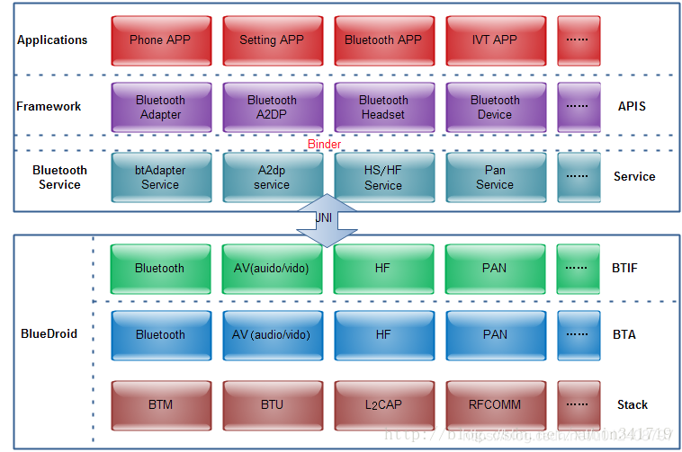

# Wireshark Bluetooth HCI

使用Wireshark分析BT HCI(类比到Wifi nl80211)

# 参考文档

* [MTK android 蓝牙版本查看](https://blog.csdn.net/u012932409/article/details/107066768/)
* [Android Bluetooth HCI log 详解](https://blog.csdn.net/grit_wang/article/details/107635258)

# HIC log
 
* HCI log是用来分析蓝牙设备之间的交互行为是否符合预期，是否符合蓝牙规范
* 故障分析
* 竟品分析。
* 蓝牙学习

 # 蓝牙核心架构

* 蓝牙核心系统架构抽象为3层：
  * User Application(Host)：User Application即应用层，也被称为Host，我们调用Bluetooth API就属于应用层
  * HCI (Host controller Interface)：上层在调用蓝牙API时，不会直接操作蓝牙底层(Controller)相关接口，而是通过HCI下发对应操作的Command给Controller，然后底层执行命令后返回执行结果，即Controller发送Event给HCI，HCI再通知给应用层，HCI起到了一个中间层的作用
  * Controller：Controller是在最底层，可以理解为我们手机上的蓝牙芯片。  
  
* profile config: packages/apps/Bluetooth/res/values/config.xml

# HCI file

* 如何抓取HCI log  
  * 在开发者选项中打开启用蓝牙HCI信息收集日志开关
  
  * 需要开关下蓝牙
  * MTK 保存蓝牙日志的路径：
    ``` 
    /data/misc/bluetooth/logs/BT_HCI_2023_0315_132134.cfa
    ```
  * 如果不确定蓝牙日志的路径，可以查看如下文件：
    ```
    cat /etc/bluetooth/bt_stack.conf
    会有类似如下信息
    BtSnoopFileName=/data/log/bt/btsnoop_hci.log
    ```
  