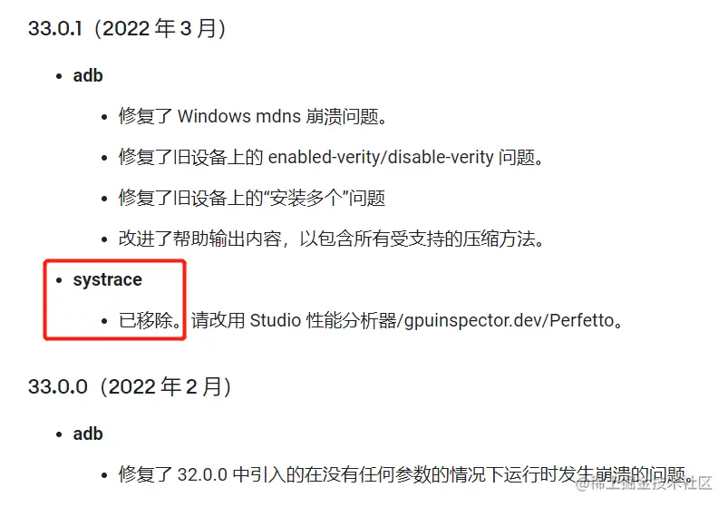
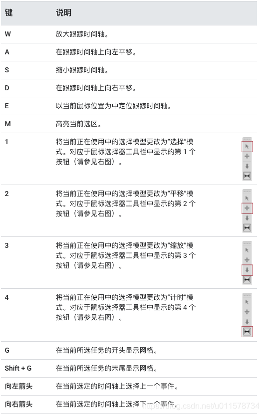

# systrace

Platform-Tools无systrace，对应的Android后台时atrace

# 参考文档

* [Android Systrace 学习记录](https://juejin.cn/post/7202891949380255800)
* [SDK 平台工具版本说明](https://developer.android.google.cn/studio/releases/platform-tools?hl=zh-cn#downloads)

# Platform-Tools无systrace

打开你的Android SDK 目录，进入platform-tools文件夹，竟然没有systrace文件夹，是不是很惊喜？查看官网，哦，原来是被官网删除了，问题不大，我们找到release notes，找到是在哪个版本删掉的，然后下载它之前的版本就行了。  



# download

* https://dl.google.com/android/repository/platform-tools_r33.0.0-linux.zip
* https://dl.google.com/android/repository/platform-tools_r33.0.0-windows.zip

# help

```sh
python systrace.py --list-categories
```

```
         gfx - Graphics
       input - Input
        view - View System
     webview - WebView
          wm - Window Manager
          am - Activity Manager
          sm - Sync Manager
       audio - Audio
       video - Video
      camera - Camera
         hal - Hardware Modules
         res - Resource Loading
      dalvik - Dalvik VM
          rs - RenderScript
      bionic - Bionic C Library
       power - Power Management
          pm - Package Manager
          ss - System Server
    database - Database
     network - Network
         adb - ADB
    vibrator - Vibrator
        aidl - AIDL calls
       nnapi - NNAPI
         rro - Runtime Resource Overlay
         pdx - PDX services
       sched - CPU Scheduling
         irq - IRQ Events
         i2c - I2C Events
        freq - CPU Frequency
        idle - CPU Idle
        disk - Disk I/O
        sync - Synchronization
       workq - Kernel Workqueues
  memreclaim - Kernel Memory Reclaim
  regulators - Voltage and Current Regulators
  binder_driver - Binder Kernel driver
  binder_lock - Binder global lock trace
   pagecache - Page cache
      memory - Memory
     thermal - Thermal event

NOTE: more categories may be available with adb root
```

```
python systrace.py -o mynewtrace.html sched freq idle am wm gfx view binder_driver hal dalvik camera input res
```


# systrace查看快捷键

