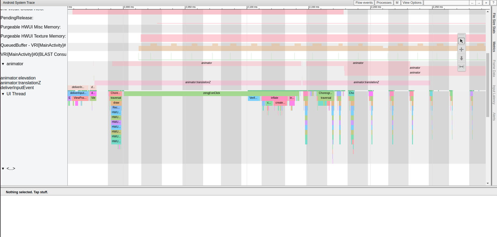

# APP Trace

APP中加入自定义trace

# 参考文档

* [定义自定义事件](https://developer.android.google.cn/topic/performance/tracing/custom-events?hl=zh-cn)
* [原生代码中的自定义跟踪事件](https://developer.android.google.cn/topic/performance/tracing/custom-events-native?hl=zh-cn)
* [手把手教你使用Systrace（一）](https://zhuanlan.zhihu.com/p/27331842)

# APP Trace

使用方法 

```
//省略
import android.os.Trace;
//省略

public class MainActivity extends AppCompatActivity {
    //省略

    protected void onCreate(Bundle savedInstanceState) {
        //省略

        binding.fab.setOnClickListener(new View.OnClickListener() {
            @Override
            public void onClick(View view) {

                Trace.beginSection("zengjf.onClick");
                SystemClock.sleep(100);
                Trace.endSection();

                Snackbar.make(view, "Replace with your own action", Snackbar.LENGTH_LONG)
                        .setAction("Action", null).show();
            }
        });

        //省略
    }

    //省略
}
```

# trace数据获取

* atrace -z -b 40000 sched freq idle am wm gfx view binder_driver hal dalvik camera input res -t 15 -a com.example.templates > /data/local/tmp/trace_output &
  * -a <package_name>：这个选项可以开启指定包名App中自定义Trace Label的Trace功能。也就是说，如果你在代码中使用了Trace.beginSection("tag"), Trace.endSection；默认情况下，你的这些代码是不会生效的，因此，这个选项一定要开启！
* adb pull /data/local/tmp/trace_output 
* python systrace.py --from-file trace_output -o output.html


# 如何分析非Debug的App

systrace官方文档说待trace的App必须是debuggable的，但是官方又说，debuggable的App与非debuggable的性能有较大差别；因为系统为了支持debug开启了一些列功能并且关闭掉了某些重要的优化，见 文档：
```
Run a release (or at least non-debuggable) version of your app. The ART runtime disables several important optimizations in order to support debugging features, so make sure you're looking at something similar to what a user will see.
```

如果我们想要待分析的App尽可能接近真实情况，那么必须要在非Debug的App中能启用systrace功能；因为相同情况下Debug的App性能比非Debuggable的差，你无法确保在debuggable版本上分析出来的结论能准确推广到非debuggable的版本上。
分析systrace源码之后 ，发现这个条件只是个障眼法而已；我们可以手动开启App的自定义Label的Trace功能，方法也很简单，调用一个函数即可；但是这个函数是SDK @hide的，我们需要反射调用：
```
Class<?> trace = Class.forName("android.os.Trace");
Method setAppTracingAllowed = trace.getDeclaredMethod("setAppTracingAllowed", boolean.class);
setAppTracingAllowed.invoke(null, true);
```
把这段代码放在Application的attachBaseContext 中，这样就可以手动开启App自定义Label的Trace功能，在非debuggable的版本中也适用！

# JNI Trace
  * 原生代码中的自定义跟踪事件 https://developer.android.google.cn/topic/performance/tracing/custom-events-native?hl=zh-cn
