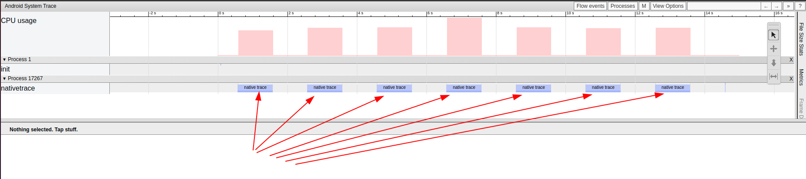

# HIDL Native Trace

可执行程序的Trace

# 参考文档

* [定义自定义事件](https://developer.android.google.cn/topic/performance/tracing/custom-events?hl=zh-cn)
* [原生代码中的自定义跟踪事件](https://developer.android.google.cn/topic/performance/tracing/custom-events-native?hl=zh-cn)
* [ATrace: Android system and app trace events](https://perfetto.dev/docs/data-sources/atrace)
* [android性能分析之Systrace](https://blog.csdn.net/zhzhangnews/article/details/106135403)

# 参考代码

# build
  * source build/envsetup.sh
  * lunch vnd_tc422_64_wifi-userdebug
  * mmm external/native_trace_example/
  * adb root
  * adb push out/target/product/tc422_64_wifi/system/bin/nativetrace /data/data
  * adb shell
  * chmod +x /data/data/nativetrace
  * ./data/data/nativetrace &
  ```
  [1] 8025
  ```
# trace获取查看

* atrace -z -b 40000 sched freq idle am wm gfx view binder_driver hal dalvik camera input res -t 15 > /data/local/tmp/trace_output &
  * atrace -b 40000 hal -t 15 > /data/local/tmp/trace_output &
  ```
  #define ATRACE_TAG ATRACE_TAG_HAL
  ```
    * 所以只需要获取hal层的就好了
    * 不加-z参数，表示不压缩
* adb pull /data/local/tmp/trace_output .
* [0008_trace_output](refers/0008_trace_output)

* python systrace.py --from-file trace_output -o output.html


# ATRACE_BEGIN分析

格式
```
nativetrace-17267 (17267) [000] .... 77823.269772: tracing_mark_write: B|17267|native trace
nativetrace-17267 (17267) [000] .... 77824.270452: tracing_mark_write: E|17267
```

代码调用
```
* system/core/libcutils/include/cutils/trace.h
  ├── #define ATRACE_BEGIN(name) atrace_begin(ATRACE_TAG, name)
  │   └── static inline void atrace_begin(uint64_t tag, const char* name)
  │       └── if (CC_UNLIKELY(atrace_is_tag_enabled(tag)))
  │           ├── atrace_is_tag_enabled()
  │           │   └── return atrace_get_enabled_tags() & tag;
  │           │       └── vendor/mediatek/proprietary/hardware/ril/platformlib/include/cutils/trace.h
  │           │           └── static inline uint64_t atrace_get_enabled_tags()
  │           │               ├── atrace_init();
  │           │               └── return atrace_enabled_tags;
  │           └── atrace_begin_body(name);
  │               └── system/core/libcutils/trace-dev.cpp
  │                   └── void atrace_begin_body(const char* name)
  │                       └── WRITE_MSG("B|%d|", "%s", name, "");
  │                           └── vendor/mediatek/proprietary/hardware/ril/platformlib/common/libmtkcutils/trace-dev.c
  │                               └── #define WRITE_MSG(format_begin, format_end, pid, name, value)
  │                                   ├── char buf[ATRACE_MESSAGE_LENGTH];
  │                                   ├── int len = snprintf(buf, sizeof(buf), format_begin "%s" format_end, pid, name, value); 
  │                                   ├── len = snprintf(buf, sizeof(buf), format_begin "%.*s" format_end, pid, name_len, name, value);
  │                                   └── write(atrace_marker_fd, buf, len);
  └── #define ATRACE_END() atrace_end(ATRACE_TAG)
      └── static inline void atrace_end(uint64_t tag)
          └── if (CC_UNLIKELY(atrace_is_tag_enabled(tag)))
              └── atrace_end_body();
                  └── system/core/libcutils/trace-dev.cpp
                      └── void atrace_end_body()
                          └── WRITE_MSG("E|%d", "%s", "", "");
```