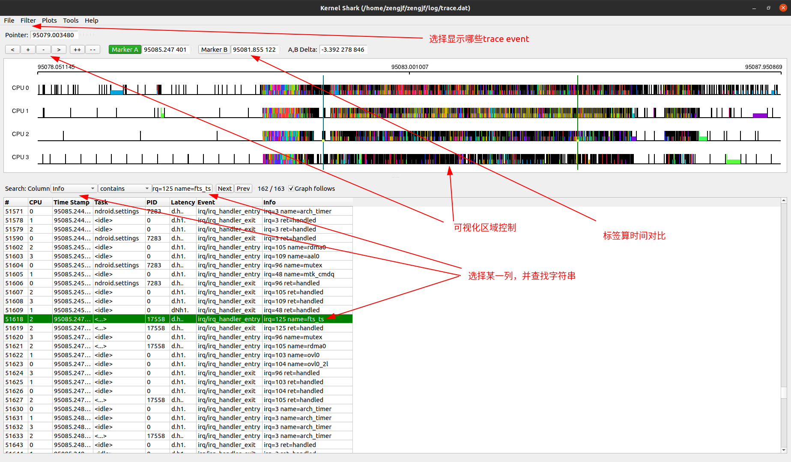
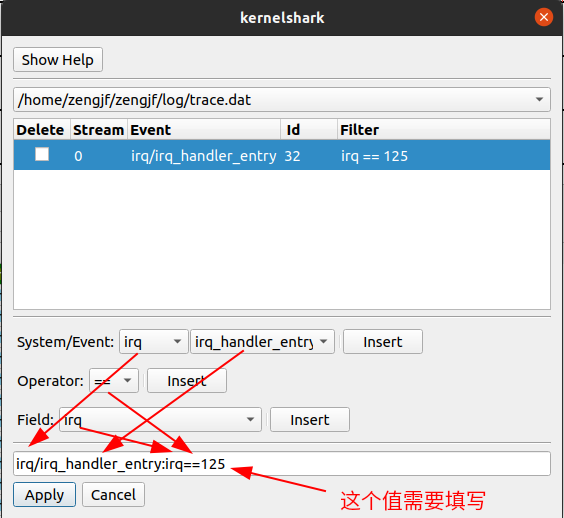

# trace-cmd kernelshark

kernelshark显示trace-cmd 数据

# 参考文档

* https://android.googlesource.com/platform/external/libtracefs
* https://android.googlesource.com/platform/external/libtraceevent
* https://android.googlesource.com/platform/external/trace-cmd

# trace-cmd build error

```
[ 99% 710/714] //external/trace-cmd:trace-cmd link trace-cmd
FAILED: out/soong/.intermediates/external/trace-cmd/trace-cmd/android_arm64_armv8-a_cortex-a53/unstripped/trace-cmd
prebuilts/clang/host/linux-x86/clang-r416183b1/bin/clang++ out/soong/.intermediates/bionic/libc/crtbegin_static/android_arm64_armv8-a_cortex-a53/crtbegin_static.o @out/soong/.intermediates/external/trace
-cmd/trace-cmd/android_arm64_armv8-a_cortex-a53/unstripped/trace-cmd.rsp out/soong/.intermediates/external/trace-cmd/libtracecmd/android_arm64_armv8-a_cortex-a53_static/libtracecmd.a out/soong/.intermedi
ates/external/libtracefs/libtracefs/android_arm64_armv8-a_cortex-a53_static/libtracefs.a out/soong/.intermediates/external/libtraceevent/libtraceevent/android_arm64_armv8-a_cortex-a53_static/libtraceeven
t.a out/soong/.intermediates/system/core/libcutils/libcutils/android_arm64_armv8-a_cortex-a53_static/libcutils.a out/soong/.intermediates/system/logging/liblog/liblog/android_arm64_armv8-a_cortex-a53_sta
tic/liblog.a out/soong/.intermediates/external/libcxx/libc++_static/android_arm64_armv8-a_cortex-a53_static/libc++_static.a out/soong/.intermediates/external/libcxxabi/libc++demangle/android_arm64_armv8-
a_cortex-a53_static/libc++demangle.a out/soong/.intermediates/bionic/libm/libm/android_arm64_armv8-a_cortex-a53_static/libm.a out/soong/.intermediates/bionic/libc/libc/android_arm64_armv8-a_cortex-a53_st
atic/libc.a prebuilts/clang/host/linux-x86/clang-r416183b1/lib64/clang/12.0.7/lib/linux/aarch64/libunwind.a -Wl,--start-group out/soong/.intermediates/bionic/libc/libc/android_arm64_armv8-a_cortex-a53_st
atic/libc.a prebuilts/clang/host/linux-x86/clang-r416183b1/lib64/clang/12.0.7/lib/linux/libclang_rt.builtins-aarch64-android.a -Wl,--end-group out/soong/.intermediates/bionic/libc/crtend_android/android_
arm64_armv8-a_cortex-a53/obj/bionic/libc/arch-common/bionic/crtend.o -o out/soong/.intermediates/external/trace-cmd/trace-cmd/android_arm64_armv8-a_cortex-a53/unstripped/trace-cmd -target aarch64-linux-a
ndroid10000 -Bprebuilts/gcc/linux-x86/aarch64/aarch64-linux-android-4.9/aarch64-linux-android/bin -Wl,-z,noexecstack -Wl,-z,relro -Wl,-z,now -Wl,--build-id=md5 -Wl,--warn-shared-textrel -Wl,--fatal-warni
ngs -Wl,--no-undefined-version -Wl,--exclude-libs,libgcc.a -Wl,--exclude-libs,libgcc_stripped.a -Wl,--exclude-libs,libunwind_llvm.a -Wl,--exclude-libs,libunwind.a -Wl,--icf=safe -fuse-ld=lld -Wl,--pack-d
yn-relocs=android+relr -Wl,--no-undefined -Wl,--hash-style=gnu -Wl,-z,separate-code -Wl,-z,max-page-size=4096 -Wl,--fix-cortex-a53-843419 -Wl,--exclude-libs=libclang_rt.builtins-aarch64-android.a  -stati
c -nostdlib -Bstatic -Wl,--gc-sections prebuilts/clang/host/linux-x86/clang-r416183b1/lib64/clang/12.0.7/lib/linux/libclang_rt.ubsan_minimal-aarch64-android.a -Wl,--exclude-libs,libclang_rt.ubsan_minimal
-aarch64-android.a 
ld.lld: error: undefined symbol: dlopen
>>> referenced by event-plugin.c:461 (external/libtraceevent/src/event-plugin.c:461)
>>>               event-plugin.o:(load_plugin) in archive out/soong/.intermediates/external/libtraceevent/libtraceevent/android_arm64_armv8-a_cortex-a53_static/libtraceevent.a

ld.lld: error: undefined symbol: dlsym
>>> referenced by event-plugin.c:468 (external/libtraceevent/src/event-plugin.c:468)
>>>               event-plugin.o:(load_plugin) in archive out/soong/.intermediates/external/libtraceevent/libtraceevent/android_arm64_armv8-a_cortex-a53_static/libtraceevent.a
>>> referenced by event-plugin.c:472 (external/libtraceevent/src/event-plugin.c:472)
>>>               event-plugin.o:(load_plugin) in archive out/soong/.intermediates/external/libtraceevent/libtraceevent/android_arm64_armv8-a_cortex-a53_static/libtraceevent.a
>>> referenced by event-plugin.c:482 (external/libtraceevent/src/event-plugin.c:482)
>>>               event-plugin.o:(load_plugin) in archive out/soong/.intermediates/external/libtraceevent/libtraceevent/android_arm64_armv8-a_cortex-a53_static/libtraceevent.a
>>> referenced 1 more times

ld.lld: error: undefined symbol: dlerror
>>> referenced by event-plugin.c:464 (external/libtraceevent/src/event-plugin.c:464)
>>>               event-plugin.o:(load_plugin) in archive out/soong/.intermediates/external/libtraceevent/libtraceevent/android_arm64_armv8-a_cortex-a53_static/libtraceevent.a
>>> referenced by event-plugin.c:485 (external/libtraceevent/src/event-plugin.c:485)
>>>               event-plugin.o:(load_plugin) in archive out/soong/.intermediates/external/libtraceevent/libtraceevent/android_arm64_armv8-a_cortex-a53_static/libtraceevent.a

ld.lld: error: undefined symbol: dlclose
>>> referenced by event-plugin.c:707 (external/libtraceevent/src/event-plugin.c:707)
>>>               event-plugin.o:(tep_unload_plugins) in archive out/soong/.intermediates/external/libtraceevent/libtraceevent/android_arm64_armv8-a_cortex-a53_static/libtraceevent.a
clang-12: error: linker command failed with exit code 1 (use -v to see invocation)
12:47:04 ninja failed with: exit status 1
```

external/trace-cmd/Android.bp中添加libdl
```
cc_binary {
    name: "trace-cmd",

    local_include_dirs: [
        "lib/trace-cmd/include/private",
        "include/trace-cmd",
        "tracecmd/include",
        "include",
    ],

    srcs: ["tracecmd/*.c"],

    static_libs: [
        "libtraceevent",
        "libtracecmd",
        "libtracefs",
        "libdl",
    ],

    static_executable: true,

    cflags: [
        "-D_GNU_SOURCE",
        "-DNO_AUDIT",
        "-DVSOCK",
        "-Wno-unused-parameter",
        "-Wno-macro-redefined",
        "-Wno-visibility",
        "-Wno-pointer-arith",
    ],

    c_std: "gnu99",
}
```
# build

* source build/envsetup.sh
* lunch vnd_tc422_64_wifi-userdebug'
* mmm external/libtraceevent
* mmm external/libtracefs
* mmm external/trace-cmd

# steps

* adb push out/target/product/tc422_64_wifi/system/bin/trace-cmd /data/data
* adb shell
* chmod +x /data/data/trace-cmd
* ./data/data/trace-cmd

```
trace-cmd version 3.0.3 (not-a-git-repo)

usage:
  trace-cmd [COMMAND] ...

  commands:
     record - record a trace into a trace.dat file
     set - set a ftrace configuration parameter
     start - start tracing without recording into a file
     extract - extract a trace from the kernel
     stop - stop the kernel from recording trace data
     restart - restart the kernel trace data recording
     show - show the contents of the kernel tracing buffer
     reset - disable all kernel tracing and clear the trace buffers
     clear - clear the trace buffers
     report - read out the trace stored in a trace.dat file
     stream - Start tracing and read the output directly
     profile - Start profiling and read the output directly
     hist - show a histogram of the trace.dat information
     stat - show the status of the running tracing (ftrace) system
     split - parse a trace.dat file into smaller file(s)
     options - list the plugin options available for trace-cmd report
     listen - listen on a network socket for trace clients
     agent - listen on a vsocket for trace clients
     setup-guest - create FIFOs for tracing guest VMs
     list - list the available events, plugins or options
     restore - restore a crashed record
     snapshot - take snapshot of running trace
     stack - output, enable or disable kernel stack tracing
     check-events - parse trace event formats
     dump - read out the meta data from a trace file
     convert - convert trace file to different version
```

* ./data/data/trace-cmd list | grep irq
```
irq
irq:irq_handler_entry
irq:irq_handler_exit
irq:softirq_entry
irq:softirq_exit
irq:softirq_raise
ccci:cldma_irq
mtk_amms:amms_event_receive_irq
rtc:rtc_irq_set_freq
rtc:rtc_irq_set_state
rtc:rtc_alarm_irq_enable
asoc:snd_soc_jack_irq
funcgraph-irqs
irq-info
```

* cd /data
  * /data/data/trace-cmd record -e irq:*
  * [0011_trace.dat](refers/0011_trace.dat)
  * 其中有很多跟irq无关的trace，可以认为有些trace是android默认打开的导致的

# kernelshark
  * 默认Ubuntu apt安装的kernelshark无法打开目前用trace-cmd抓取的log，需要自己编译
  * https://kernelshark.org/
    * https://kernelshark.org/build.html
      * 必须编译那些依赖库
      * 出现如下问题可以不管
        ```
        python-dev is not installed, not compiling python plugins
        ```


  * [Filter] -> [TEP Advance Filtering]
  

  * [Plots] -> [CPUs]
    * 可视化绘图区绘制CPU信息
  * [Plots] -> [Tasks]
    * 可视化绘图区绘制任务信息


