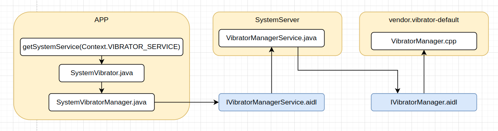

# README

分析Vibrator工作原理

# 参考文档

* [realme-kernel-opensource](https://github.com/realme-kernel-opensource)
* [realme_C21-AndroidR-kernel-source](https://github.com/realme-kernel-opensource/realme_C21-AndroidR-kernel-source)

# 调用架构

# docs

NO.  |文件名称|摘要
:---:|:--|:--
0007 | [PL_LK_vibrator](docs/0007_PL_LK_vibrator.md) | PL/LK阶段振动
0006 | [Vibrator_IVibratorManager](docs/0006_Vibrator_IVibratorManager.md) | VibratorManagerService如何与HIDL通信？
0005 | [Vibrator_SystemService](docs/0005_Vibrator_SystemService.md) | Vibrator SystemService是是如何启动运行
0004 | [Vibrator_cts](docs/0004_Vibrator_cts.md) | Vibrator cts测试方法
0003 | [Vibrator_HIDL](docs/0003_Vibrator_HIDL.md) | 分析Vibrator HIDL启动、调用
0002 | [Vibrator_Driver](docs/0002_Vibrator_Driver.md) | 分析vibrator驱动处理原理
0001 | [Vibrator_Shell](docs/0001_Vibrator_Shell.md) | 命令行控制振动
