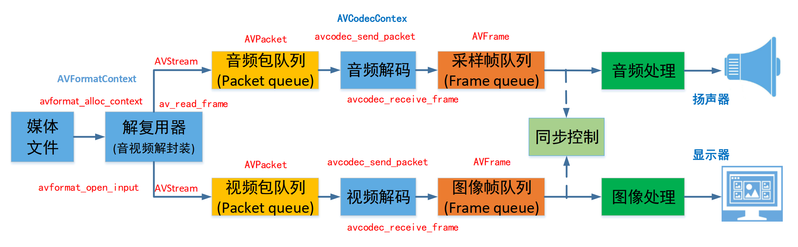

# ffmepg structure

ffmpeg 架构

# 参考文档

* [02 《FFMPEG使用、源码框架、架构解析》](https://blog.csdn.net/qq582880551/article/details/119687558)
* [FFmpeg源码分析与实践](https://blog.csdn.net/u011686167/category_11663067_2.html)
* [FFmpeg实战 - 解复用与解码](https://blog.csdn.net/m0_73759312/article/details/140784264)

# 解复用、解码的流程分析

