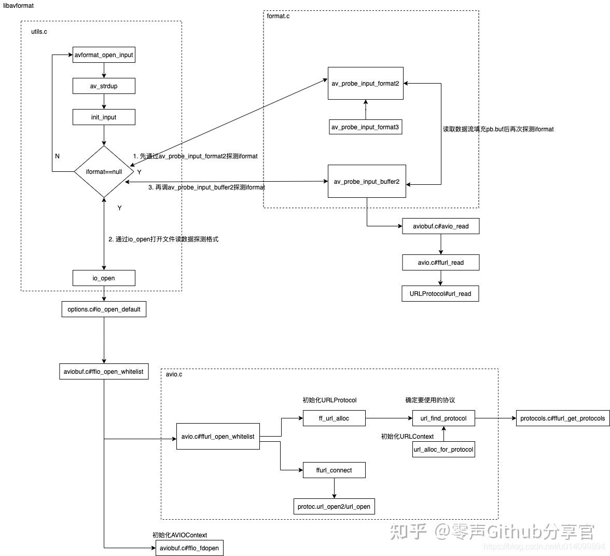

# ffmpeg avformat open input

avformat_open_input

# 参考文档

* [FFmpeg学习 avformat_open_input()函数分析](https://zhuanlan.zhihu.com/p/526054550)
* [ffmpeg源码分析 （四)](https://codeleading.com/article/57154844919/)
* [FFmpeg源代码简单分析：avformat_open_input()](https://blog.csdn.net/leixiaohua1020/article/details/44064715)
* [FFmpeg5.0源码阅读——mov文件格式解析](https://blog.csdn.net/GrayOnDream/article/details/130918865)


# 功能简介

avformat_open_input()函数在FFmpeg库中的主要功能是打开输入文件，‌并将输入文件中的数据读入到缓冲区，‌同时判断输入文件的格式。‌ 这一过程包括但不限于识别文件是否为flv格式，‌并将输入文件的格式信息保存到AVFormatContext结构的iformat成员中。‌这个函数的使用通常伴随着对输入文件的打开操作，‌以及对输入文件格式的判断和处理。‌

具体来说，‌avformat_open_input()函数的参数包括一个指向AVFormatContext结构体的指针的指针（‌用于存储打开文件后的上下文信息）‌、‌输入文件的文件名、‌输入文件的格式（‌可选参数，‌用于指定预期的文件格式以加速打开过程）‌、‌以及一个可选的AVDictionary指针（‌用于设置一些打开文件时的选项）‌。‌函数执行成功后，‌输入文件的格式信息将被保存在AVFormatContext结构的iformat成员中，‌这样后续的解码和处理操作就可以根据这个信息来进行。‌

在使用avformat_open_input()打开输入文件之后，‌通常还需要使用avformat_close_input()函数来释放AVFormatContext及其相关资源，‌以确保资源的正确管理和避免内存泄漏。‌这一对函数的组合使用，‌构成了在FFmpeg中处理输入文件的基本流程 


# 代码堆栈

* avformat_open_input

根据传入的url确定了要使用的协议URLProtocol，比如http的或是file类型的协议；

然后按该协议打开文件或建立连接，循环从2048byte大小2的幂次递增开始读取数据，

然后再遍历所有的AVInputFormat，确定iformat，即确定是个什么格式的数据，flv啊还是mp4啥的；




* avformat_open_input 这里打开多媒体文件，在av_probe_input_format3调用av_demuxer_iterate遍历解复用,
通过获取read_probe获取当前的分数，以获取最匹配的解复用

```
* avformat_open_input
  ├── if ((ret = av_opt_set_dict(s, &tmp)) < 0)
  │   └── int av_opt_set_dict(void *obj, AVDictionary **options)
  │       └── return av_opt_set_dict2(obj, options, 0);
  │           └── int av_opt_set_dict2(void *obj, AVDictionary **options, int search_flags)
  │               └── while ((t = av_dict_get(*options, "", t, AV_DICT_IGNORE_SUFFIX))) 
  │                   └── ret = av_opt_set(obj, t->key, t->value, search_flags);
  ├── if (!(s->url = av_strdup(filename ? filename : ""))) // 赋值s->url  
  │   └── char *av_strdup(const char *s)
  │       └── memcpy(ptr, s, len);
  └── if ((ret = init_input(s, filename, &tmp)) < 0)  //找到文件格式
      ├── static int init_input(AVFormatContext *s, const char *filename,AVDictionary **options)
      │   ├── if ((ret = s->io_open(s, &s->pb, filename, AVIO_FLAG_READ | s->avio_flags, options)) < 0)
      │   │   └── int (*io_open)(struct AVFormatContext *s, AVIOContext **pb, const char *url,int flags, AVDictionary **options);
      │   └── return av_probe_input_buffer2(s->pb, &s->iformat, filename,s, 0, s->format_probesize);
      │       └── int av_probe_input_buffer2(AVIOContext *pb, const AVInputFormat **fmt, const char *filename, void *logctx, unsigned int offset, unsigned int max_probe_size)
      │           └── *fmt = av_probe_input_format2(&pd, 1, &score);
      │               └── const AVInputFormat *fmt = av_probe_input_format3(pd, is_opened, &score_ret);
      │                   └── const AVInputFormat *av_probe_input_format3(const AVProbeData *pd, int is_opened, int *score_ret)
      │                       └── while ((fmt1 = av_demuxer_iterate(&i)))//遍历解复用列表，进行得分计算，返回最佳的解复用
      │                           └── const AVInputFormat *av_demuxer_iterate(void **opaque)
      │                               └── const AVInputFormat *av_demuxer_iterate(void **opaque)
      │                                   ├── f = demuxer_list[i];
      │                                   │   └── static const AVInputFormat * const demuxer_list[] =  { &ff_aa_demuxer, // 获取demuxer列表
      │                                   │       └── const AVInputFormat ff_aa_demuxer = {
      │                                   │           ├── .read_probe     = aa_probe,
      │                                   │           ├── .read_header    = aa_read_header,
      │                                   │           ├── .read_packet    = aa_read_packet,
      │                                   │           ├── .read_seek      = aa_read_seek,
      │                                   │           └── .read_close     = aa_read_close,
      │                                   └── *opaque = (void*)(i + 1);
      └── if (s->iformat->read_header)
          └── if ((ret = s->iformat->read_header(s)) < 0)
              └── static int mov_read_header(AVFormatContext *s) //这里指向av_probe_input_format3函数获得的read_header，这里以mov 为例
                  └── if ((err = mov_read_default(mov, pb, atom)) < 0)
                      └── static int mov_read_default(MOVContext *c, AVIOContext *pb, MOVAtom atom)
                          └── while (total_size <= atom.size - 8 && !avio_feof(pb))
                              └── for (i = 0; mov_default_parse_table[i].type; i++)
                                  ├── static const MOVParseTableEntry mov_default_parse_table[] = {{ MKTAG('t','r','a','k'), mov_read_trak },
                                  │   └── st = avformat_new_stream(c->fc, NULL);
                                  │       └── AVStream *avformat_new_stream(AVFormatContext *s, const AVCodec *c)
                                  │           ├── st->codecpar = avcodec_parameters_alloc(); // 申请codec参数
                                  │           └── s->streams[s->nb_streams++] = st;  // 这里s->nb_streams 自加1  
                                  └── if (mov_default_parse_table[i].type == a.type)
                                      └── parse = mov_default_parse_table[i].parse; //这里查找匹配的               
```
* 这里av_probe_input_format3这里通过一个while循环遍历demuxer_list，通过获取最高分，判断最优的解复用 
* 这里在s->iformat->read_header通过调用通过调用avformat_new_stream中获取视频流的信息


* io_open

io_open 是个回调函数在avformat_alloc_context函数中进行注册回调
```
* AVFormatContext *avformat_alloc_context(void)
  ├── FFFormatContext *const si = av_mallocz(sizeof(*si));
  ├── AVFormatContext *s;
  ├── s = &si->pub;
  └── s->io_open  = io_open_default;
      └── static int io_open_default(AVFormatContext *s, AVIOContext **pb, const char *url, int flags, AVDictionary **options)
          └── return ffio_open_whitelist(pb, url, flags, &s->interrupt_callback, options, s->protocol_whitelist, s->protocol_blacklist);
              └── int ffio_open_whitelist(AVIOContext **s, const char *filename, int flags, const AVIOInterruptCB *int_cb, AVDictionary **options, const char *whitelist, const char *blacklist）
                  ├── err = ffurl_open_whitelist(&h, filename, flags, int_cb, options, whitelist, blacklist, NULL);
                  │   ├──  int ret = ffurl_alloc(puc, filename, flags, int_cb);
                  │   │   └── int ffurl_alloc(URLContext **puc, const char *filename, int flags,const AVIOInterruptCB *int_cb)
                  │   │       ├── p = url_find_protocol(filename); //查找匹配的协议
                  │   │       │   └── static const struct URLProtocol *url_find_protocol(const char *filename)
                  │   │       │       └── protocols = ffurl_get_protocols(NULL, NULL);
                  │   │       │           └── const URLProtocol **ffurl_get_protocols(const char *whitelist, const char *blacklist)//获取支持的协议
                  │   │       └── return url_alloc_for_protocol(puc, p, filename, flags, int_cb);
                  │   │           └── static int url_alloc_for_protocol(URLContext **puc, const URLProtocol *up, const char *filename, int flags, const AVIOInterruptCB *int_cb)
                  │   │               ├── uc = av_mallocz(sizeof(URLContext) + strlen(filename) + 1);
                  │   │               └── uc->prot            = up; //赋值URLProtocol
                  │   └── int ffurl_open_whitelist(URLContext **puc, const char *filename, int flags,
                  │       └── ret = ffurl_connect(*puc, options);
                  │           └── int ffurl_connect(URLContext *uc, AVDictionary **options) 
                  │               └── err =uc->prot->url_open2 ? uc->prot->url_open2(uc,uc->filename,uc->flags,options) : uc->prot->url_open(uc, uc->filename, uc->flags);
                  └── err = ffio_fdopen(s, h);
                      └── *s = avio_alloc_context(buffer, buffer_size, h->flags & AVIO_FLAG_WRITE, h, (int (*)(void *, uint8_t *, int))  ffurl_read, (int (*)(void *, uint8_t *, int))  ffurl_write,(int64_t (*)(void *, int64_t, int))ffurl_seek);
                          └── ffio_init_context(s, buffer, buffer_size, write_flag, opaque,   //由avio_alloc_context函数传入write_packet、read_packet作为回调函数
                              └── void ffio_init_context(FFIOContext *ctx,
                                  ├── s->write_packet    = write_packet;
                                  └── s->read_packet     = read_packet;
```

s->write_packet 功能实现
在avio_alloc_context函数中以ffurl_write、ffurl_seek、ffurl_read为入参进行传递，后面进行回调
实际上就是调用URLProtocol的write_packet方法
```
* int ffurl_write(URLContext *h, const unsigned char *buf, int size)
  └── return retry_transfer_wrapper(h, (unsigned char *)buf, size, size, (int (*)(struct URLContext *, uint8_t *, int))h->prot->url_write); //h->prot 在url_alloc_for_protocol中进行赋值 
      └── .url_write           = file_write,  //这里以本地文件为例，即 h->prot= file,所以这里指向libavformat/file.c文件
          └── static int file_write(URLContext *h, const unsigned char *buf, int size)
              └── ret = write(c->fd, buf, size);
```


# 多媒体音视频资源解复用解析
```
* static int mov_read_stsd(MOVContext *c, AVIOContext *pb, MOVAtom atom)
  └── ret = ff_mov_read_stsd_entries(c, pb, entries);
      └── int ff_mov_read_stsd_entries(MOVContext *c, AVIOContext *pb, int entries)
          ├── id = mov_codec_id(st, format);
          │   └── int id = ff_codec_get_id(ff_codec_movaudio_tags, format);
          │       └── enum AVCodecID ff_codec_get_id(const AVCodecTag *tags, unsigned int tag)
          │           └── for (int i = 0; tags[i].id != AV_CODEC_ID_NONE; i++)
          │               └── if (tag == tags[i].tag)
          │                   └── return tags[i].id; 
          └── st->codecpar->codec_id = id; //这里获取编码器id
``` 


* url_find_protocol 查找匹配的协议
```cpp
 static const struct URLProtocol *url_find_protocol(const char *filename)
{
    const URLProtocol **protocols;
    char proto_str[128], proto_nested[128], *ptr;
    size_t proto_len = strspn(filename, URL_SCHEME_CHARS);
    int i;

    if (filename[proto_len] != ':' &&
        (strncmp(filename, "subfile,", 8) || !strchr(filename + proto_len + 1, ':')) ||
        is_dos_path(filename))
        strcpy(proto_str, "file");
    else
        av_strlcpy(proto_str, filename,
                   FFMIN(proto_len + 1, sizeof(proto_str)));

    av_strlcpy(proto_nested, proto_str, sizeof(proto_nested));
    if ((ptr = strchr(proto_nested, '+')))
        *ptr = '\0';

    protocols = ffurl_get_protocols(NULL, NULL);
    if (!protocols)
        return NULL;
    for (i = 0; protocols[i]; i++) {
            const URLProtocol *up = protocols[i];
        //文件名是否同协议名匹配，如果匹配则返回对应的URL协议
        if (!strcmp(proto_str, up->name)) {
            av_freep(&protocols);
            return up;
        }
        if (up->flags & URL_PROTOCOL_FLAG_NESTED_SCHEME &&
            !strcmp(proto_nested, up->name)) {
            av_freep(&protocols);
            return up;
        }
    }
    av_freep(&protocols);
    if (av_strstart(filename, "https:", NULL) || av_strstart(filename, "tls:", NULL))
        av_log(NULL, AV_LOG_WARNING, "https protocol not found, recompile FFmpeg with "
                                     "openssl, gnutls or securetransport enabled.\n");

    return NULL;
}
 ```

