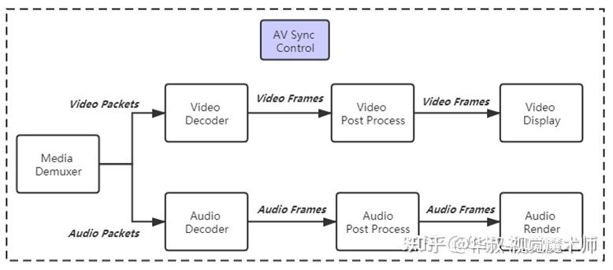
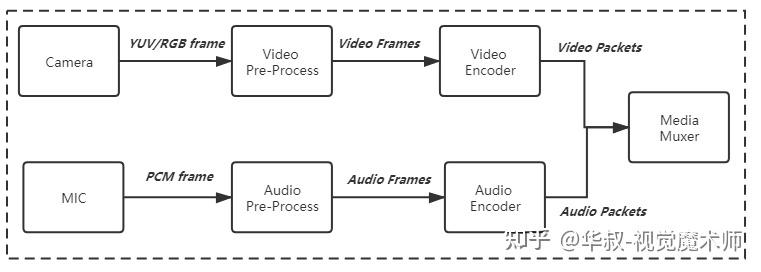

# android mediaplayer

android mediaplayer summary

# menu


# 参考文档

* [MediaPlayerService流程简要分析](https://blog.csdn.net/thh159/article/details/96596111)
* [MediaPlayerService分析](https://blog.csdn.net/chuiziky/article/details/82713126)
* [安卓IPC-Binder通信】第一篇：media进程注册](https://www.jianshu.com/p/c1dafb6e9846)
* [Android MultiMedia框架完全解析 - 从开机到MediaServer的注册过程](https://blog.csdn.net/yanbixing123/article/details/88926554?spm=1001.2101.3001.6661.1&utm_medium=distribute.pc_relevant_t0.none-task-blog-2%7Edefault%7EBlogCommendFromBaidu%7ERate-1-88926554-blog-109020673.235%5Ev38%5Epc_relevant_anti_t3_base&depth_1-utm_source=distribute.pc_relevant_t0.none-task-blog-2%7Edefault%7EBlogCommendFromBaidu%7ERate-1-88926554-blog-109020673.235%5Ev38%5Epc_relevant_anti_t3_base&utm_relevant_index=1)
* [多媒体框架](https://blog.csdn.net/wangbuji/article/details/124594132?utm_medium=distribute.pc_relevant.none-task-blog-2~default~baidujs_baidulandingword~default-2-124594132-blog-109020673.235^v38^pc_relevant_anti_t3_base&spm=1001.2101.3001.4242.2&utm_relevant_index=5)


# 多媒体流程图




# mediaplayerservice 启动

* frameworks/av/media/mediaserver/mediaserver.rc

```
 on property:init.svc.media=*
     setprop init.svc.mediadrm ${init.svc.media}
 
 service media /system/bin/mediaserver
     class main
     user media
     group audio camera inet net_bt net_bt_admin net_bw_acct drmrpc mediadrm
     ioprio rt 4
     task_profiles ProcessCapacityHigh HighPerformance
```

* frameworks/av/media/mediaserver/main_mediaserver.cpp 

```
      signal(SIGPIPE, SIG_IGN);
      // 获得ProcessState实例
      sp<ProcessState> proc(ProcessState::self());
      //获得 BpServiceManager对象
      sp<IServiceManager> sm(defaultServiceManager());
      ALOGI("ServiceManager: %p", sm.get());
      AIcu_initializeIcuOrDie();
      //MediaplayerService的注册
      MediaPlayerService::instantiate();
      ResourceManagerService::instantiate();
      registerExtensions();
      ::android::hardware::configureRpcThreadpool(16, false);
      //驱动binder线程池
      ProcessState::self()->startThreadPool();
      //将当前线程加入线程池
      IPCThreadState::self()->joinThreadPool();
      ::android::hardware::joinRpcThreadpool();
```

## 向ServiceManager中注册了一个实名Binder：media.player
* frameworks/av/media/libmediaplayerservice/MediaPlayerService.cpp
```
void MediaPlayerService::instantiate() {
    //获取Service Manager代理对象，调用addService成员函数将MediaService组件注册到Service Manager中
      defaultServiceManager()->addService(
              //"media.player"->服务名， new MediaPlayerService()->服务对象
              String16("media.player"), new MediaPlayerService());
  }
  
```