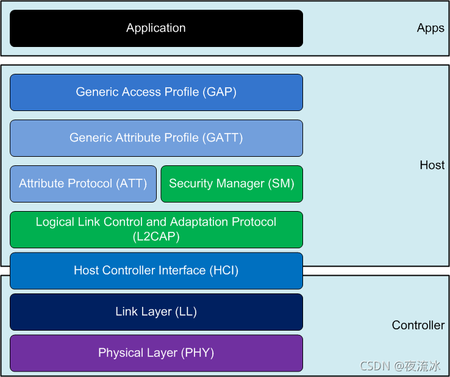
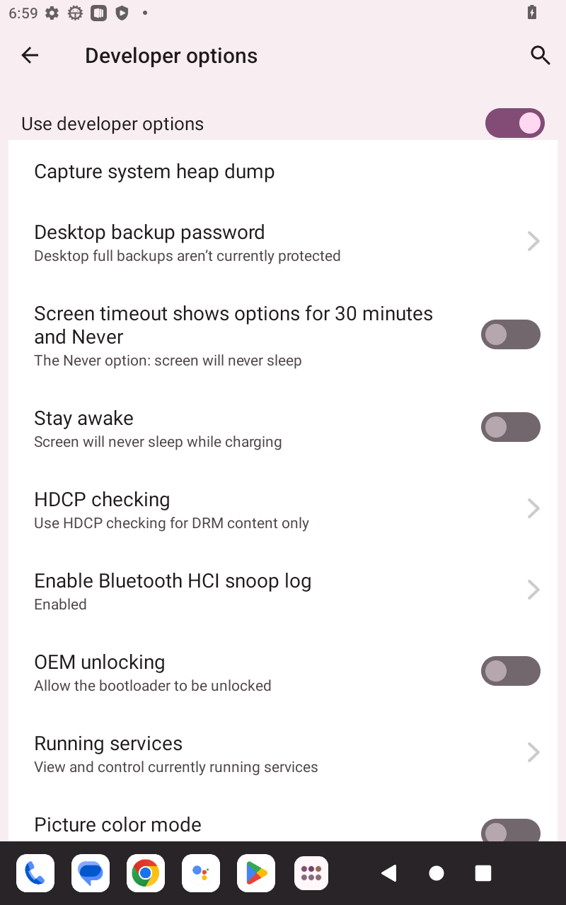
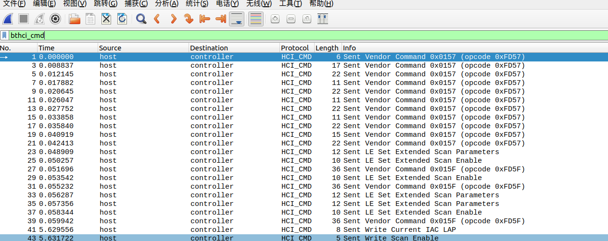

# Wireshark Bluetooth HCI

使用Wireshark分析BT HCI(类比到Wifi nl80211)

# 参考文档

* [MTK android 蓝牙版本查看](https://blog.csdn.net/u012932409/article/details/107066768/)
* [Android Bluetooth HCI log 详解](https://blog.csdn.net/grit_wang/article/details/107635258)
* [蓝牙协议分析工具Wireshark/Frontline/Ellisys的使用](https://blog.csdn.net/XiaoXiaoPengBo/article/details/107541241)
* [吐血推荐历史最全的蓝牙协议栈介绍](https://blog.csdn.net/XiaoXiaoPengBo/article/details/107466841)
* [蓝牙 - HCI介绍](https://blog.csdn.net/guoqx/article/details/121370194)


 # 蓝牙核心架构

* 蓝牙核心系统架构抽象为3层：
  * User Application(Host)：User Application即应用层，也被称为Host，我们调用Bluetooth API就属于应用层
  * HCI (Host controller Interface)：上层在调用蓝牙API时，不会直接操作蓝牙底层(Controller)相关接口，而是通过HCI下发对应操作的Command给Controller，然后底层执行命令后返回执行结果，即Controller发送Event给HCI，HCI再通知给应用层，HCI起到了一个中间层的作用
  * Controller：Controller是在最底层，可以理解为我们手机上的蓝牙芯片。  
  
* profile config: packages/apps/Bluetooth/res/values/config.xml

# HIC log
 
* HCI log是用来分析蓝牙设备之间的交互行为是否符合预期，是否符合蓝牙规范
* 故障分析
* 竟品分析。
* 蓝牙学习

# HCI file

* 如何抓取HCI log  
  （1）MTK 打开debuglogui，setting将ConnsysLog中 HCI Log勾选，另外设置Log Path为system data，否则不能保存HCI logo
  （2）单独保存HCI log：
  * 在开发者选项中打开启用蓝牙HCI信息收集日志开关
  
  * 需要开关下蓝牙
  * MTK 保存蓝牙日志的路径：
    ``` 
    /data/misc/bluetooth/logs/BT_HCI_2023_0315_132134.cfa
    ```
  * 如果不确定蓝牙日志的路径，可以查看如下文件：
    ```
    cat /etc/bluetooth/bt_stack.conf
    会有类似如下信息
    BtSnoopFileName=/data/log/bt/btsnoop_hci.log
    ```
# 高通HCI log
```
/data/misc/bluetooth/logs/
```
# HCI FILE analysis
    
   * 参看文档
     * [传统蓝牙HCI Command（蓝牙HCI命令）详细介绍](https://blog.csdn.net/XiaoXiaoPengBo/article/details/107642672)
     * [传统蓝牙HCI Event（蓝牙HCI事件）详细介绍](https://blog.csdn.net/XiaoXiaoPengBo/article/details/107642939)

HCI一共有五种HCI data:

* HCI COMMAND:由蓝牙协议栈发送给芯片的命令

* HCI EVENT:由蓝牙芯片上报给蓝牙协议栈的事件

* HCI ACL:蓝牙协议栈跟蓝牙芯片双向交互的普通数据

* HCI SCO:蓝牙芯片跟蓝牙协议栈双向交互的通话/语音识别等音频数据

* HCI ISO（这部分是在core5.2才添加）:LE audio用的数据包格式
     
   hci log的分析工具主要由三个Wireshark/Frontline/Ellisys，这里以wireshark进行介绍
   * 在用wireshark打开HCI 文件后，在wireshark上可以进行筛选，需要查看HCI的类型，是bthci_acl、bthci_cmd、bthci_event、bthci_sco等
   