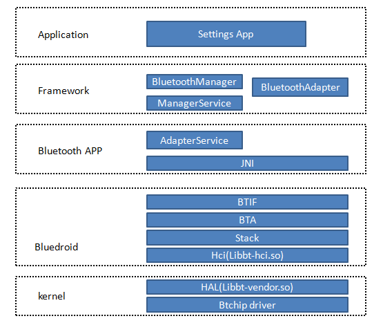

# android bluetooth structure

anddroid bluethooth structure

# 参考文档

* [Android 蓝牙启动流程(以及设置蓝牙为作为sink模式 & 接收端模式)](https://blog.csdn.net/ChaoLi_Chen/article/details/108285847)
* [system/bt目录内容解析](https://blog.csdn.net/weixin_40537714/article/details/121861858)
* [Android 蓝牙源码学习笔记](http://www.taodudu.cc/news/show-4739055.html)

# 蓝牙的总体流程



# 蓝牙状态切换日志

在蓝牙打开后，设置如下属性，蓝牙重新打开后会设置为off
adb shell setprop persist.vendor.bluetooth.hostloglevel sqc

# 查看蓝牙关键日志
请分别提供一下adb shell dumpsys bluetooth_manager的结果

# 确认hidl

  device/mediatek/vendor/common/device.mk
  ```
  # Bluetooth HAL
  # android.hardware.bluetooth@1.1-impl-mediatek is cc_library_shared
  # android.hardware.bluetooth@1.1-service-mediatek is service
  PRODUCT_PACKAGES += \
    android.hardware.bluetooth@1.1-impl-mediatek \
    android.hardware.bluetooth@1.1-service-mediatek
  ```
# bt 命令、数据传输

```
//apk 调用接口
* mssi/vendor/mediatek/proprietary/packages/modules/Bluetooth/system/hci/src/hci_layer_android.cc

//hidl 服务，功能实现
* mtk_vendor/vendor/mediatek/proprietary/hardware/connectivity/bluetooth/service/1.1/bluetooth_hci.cc

```


命令、数据传输这里会有些绕
mssi/vendor/mediatek/proprietary/packages/modules/Bluetooth/system/hci/src/hci_layer.cc 
在hci_module_start_up 函数中packet_fragmenter->init(&packet_fragmenter_callbacks);

packet_fragmenter_callbacks是一个函数指针的结构体，用于回调。
static const packet_fragmenter_callbacks_t packet_fragmenter_callbacks = {
      transmit_fragment, dispatch_reassembled, fragmenter_transmit_finished};

这里需要关注下packet_fragmenter 是什么：packet_fragmenter = packet_fragmenter_get_interface();
packet_fragmenter_get_interface 返回的也是一个函数指针的结构体

这样就可以在mssi/packages/modules/Bluetooth/system/hci/src/packet_fragmenter.cc 回调接口transmit_fragment，进行命令、数据传输
这样在hci_layer.cc 中通过event_command_ready、event_packet_ready调用fragment_and_dispatch

```c++

static const packet_fragmenter_callbacks_t packet_fragmenter_callbacks = {
      transmit_fragment, dispatch_reassembled, fragmenter_transmit_finished};

typedef struct {
    // Called for every packet fragment.
    packet_fragmented_cb fragmented;
  
    // Called for every completely reassembled packet.
    packet_reassembled_cb reassembled;
  
    // Called when the fragmenter finishes sending all requested fragments,
    // but the packet has not been entirely sent.
    transmit_finished_cb transmit_finished;
  } packet_fragmenter_callbacks_t;
 

static void init(const packet_fragmenter_callbacks_t* result_callbacks) {
    callbacks = result_callbacks;
  }

static const packet_fragmenter_t interface = {init, cleanup,
                                                fragment_and_dispatch,
                                                reassemble_and_dispatch};

const packet_fragmenter_t* packet_fragmenter_get_interface() {
    controller = controller_get_interface();
    buffer_allocator = buffer_allocator_get_interface();
    return &interface;
  }

```

# enable bluetooth
```
* packages/modules/Bluetooth/framework/java/android/bluetooth/BluetoothAdapter.java 
  └── public boolean enable()
      └── return mManagerService.enable(mAttributionSource);
          └── packages/modules/Bluetooth/service/java/com/android/server/bluetooth/BluetoothManagerService.java
              └── sendEnableMsg(false, BluetoothProtoEnums.ENABLE_DISABLE_REASON_APPLICATION_REQUEST, packageName); 
                  └── mHandler.sendMessage(mHandler.obtainMessage(MESSAGE_ENABLE, quietMode ? 1 : 0, 0));
                      ├── handleEnable(mQuietEnable);
                      │   └── if (!doBind(i, mConnection, Context.BIND_AUTO_CREATE | Context.BIND_IMPORTANT, UserHandle.CURRENT)) 
                      │       └── public void onServiceConnected(ComponentName componentName, IBinder service)
                      │           └── Message msg = mHandler.obtainMessage(MESSAGE_BLUETOOTH_SERVICE_CONNECTED);
                      │               ├── mBluetooth = IBluetooth.Stub.asInterface(Binder.allowBlocking(service));//获取的是 IBluetooth 对象, 而AdapterService.java 内部类 AdapterServiceBinder  实现了 IBluetooth 
                      │               ├── mBluetooth.registerCallback(mBluetoothCallback, mContext.getAttributionSource()); 
                      │               └── if (!mBluetooth.enable(mQuietEnable, mContext.getAttributionSource()))
                      │                   └── packages/modules/Bluetooth/android/app/src/com/android/bluetooth/btservice/AdapterService.java
                      │                       └── service.enable(quietMode)
                      │                           └── mAdapterStateMachine.sendMessage(AdapterState.BLE_TURN_ON);
                      │                               └── transitionTo(mTurningBleOnState);
                      │                                   ├── sendMessageDelayed(BREDR_START_TIMEOUT, BREDR_START_TIMEOUT_DELAY);
                      │                                   └── mAdapterService.startProfileServices();
                      │                                       ├── Class[] supportedProfileServices = Config.getSupportedProfiles();
                      │                                       └── setAllProfileServiceStates(supportedProfileServices, BluetoothAdapter.STATE_ON); 
                      │                                           └── setProfileServiceState(service, state);
                      │                                               ├── intent.putExtra(EXTRA_ACTION, ACTION_SERVICE_STATE_CHANGED);
                      │                                               ├── intent.putExtra(BluetoothAdapter.EXTRA_STATE, state);
                      │                                               └── startService(intent);
                      │                                                   └── packages/modules/Bluetooth/android/app/src/com/android/bluetooth/btservice/ProfileService.java 
                      │                                                       └── public int onStartCommand(Intent intent, int flags, int startId)
                      │                                                           ├── if (state == BluetoothAdapter.STATE_OFF)
                      │                                                           │   └── doStop(); 
                      │                                                           └── else if (state == BluetoothAdapter.STATE_ON)
                      │                                                               └── doStart();
                      │                                                                   └── mAdapterService.onProfileServiceStateChanged(this, BluetoothAdapter.STATE_ON);
                      │                                                                       ├── Message m = mHandler.obtainMessage(MESSAGE_PROFILE_SERVICE_STATE_CHANGED);
                      │                                                                       └── mHandler.sendMessage(m);
                      │                                                                           └── processProfileServiceStateChanged((ProfileService) msg.obj, msg.arg1);
                      │                                                                               └── enableNative();
                      │                                                                                   └── packages/modules/Bluetooth/android/app/jni/com_android_bluetooth_btservice_AdapterService.cpp 
                      │                                                                                       └── int ret = sBluetoothInterface->enable();
                      │                                                                                           └── packages/modules/Bluetooth/system/btif/src/bluetooth.cc
                      │                                                                                               └── stack_manager_get_interface()->start_up_stack_async();
                      │                                                                                                   └── packages/modules/Bluetooth/system/btif/src/stack_manager.cc
                      │                                                                                                       └── management_thread.DoInThread(FROM_HERE, base::Bind(event_start_up_stack, nullptr)); 
                      │                                                                                                           └── static void event_start_up_stack(UNUSED_ATTR void* context)
                      │                                                                                                               ├── ensure_stack_is_initialized();
                      │                                                                                                               │   └── static void event_init_stack(void* context) 
                      │                                                                                                               │       ├── btif_init_bluetooth();
                      │                                                                                                               │       └── bte_main_init();
                      │                                                                                                               │           ├── hci = bluetooth::shim::hci_layer_get_interface()
                      │                                                                                                               │           └── hci->set_data_cb(base::Bind(&post_to_main_message_loop));
                      │                                                                                                               ├── module_start_up(get_local_module(BTIF_CONFIG_MODULE));
                      │                                                                                                               ├── module_start_up(get_local_module(HCI_MODULE)) //这里同hci_layer挂钩
                      │                                                                                                               │   ├── if (!call_lifecycle_function(module->start_up)) //这里就调用到hci_layer.cc 的start_up 接口
                      │                                                                                                               │   │   └── static future_t* hci_module_start_up(void)
                      │                                                                                                               │   │       ├── packet_fragmenter->init(&packet_fragmenter_callbacks);
                      │                                                                                                               │   │       │   ├── packet_fragmenter = packet_fragmenter_get_interface();
                      │                                                                                                               │   │       │   │   └── mssi/vendor/mediatek/proprietary/packages/modules/Bluetooth/system/hci/src/packet_fragmenter.cc
                      │                                                                                                               │   │       │   │       └── const packet_fragmenter_t* packet_fragmenter_get_interface() 
                      │                                                                                                               │   │       │   │           └── static const packet_fragmenter_t interface = {init, cleanup, fragment_and_dispatch, reassemble_and_dispatch};
                      │                                                                                                               │   │       │   ├── static void init(const packet_fragmenter_callbacks_t* result_callbacks) {callbacks = result_callbacks;}
                      │                                                                                                               │   │       │   ├── static void fragment_and_dispatch(BT_HDR* packet)
                      │                                                                                                               │   │       │   │   ├── if (event == MSG_STACK_TO_HC_HCI_ACL) 
                      │                                                                                                               │   │       │   │   │   └── fragment_and_dispatch_acl(packet);
                      │                                                                                                               │   │       │   │   ├── else if (event == MSG_HC_TO_STACK_HCI_SCO)
                      │                                                                                                               │   │       │   │   │   └── callbacks->fragmented(packet, true);
                      │                                                                                                               │   │       │   │   ├── else if (event == MSG_STACK_TO_HC_HCI_ISO)
                      │                                                                                                               │   │       │   │   │   └── fragment_and_dispatch_iso(packet);
                      │                                                                                                               │   │       │   │   └── else 
                      │                                                                                                               │   │       │   │       └── callbacks->fragmented(packet, true);
                      │                                                                                                               │   │       │   └── static const packet_fragmenter_callbacks_t packet_fragmenter_callbacks = {transmit_fragment, dispatch_reassembled, fragmenter_transmit_finished};
                      │                                                                                                               │   │       └── hci_thread.DoInThread(FROM_HERE, base::Bind(&hci_initialize));
                      │                                                                                                               │   │           └── mssi/vendor/mediatek/proprietary/packages/modules/Bluetooth/system/hci/src/hci_layer_android.cc
                      │                                                                                                               │   │               ├── btHci_1_1 = V1_1::IBluetoothHci::getService();
                      │                                                                                                               │   │               ├── android::sp<V1_1::IBluetoothHciCallbacks> callbacks = new BluetoothHciCallbacks();
                      │                                                                                                               │   │               └── auto ret = btHci_1_1->initialize_1_1(callbacks);
                      │                                                                                                               │   │                   └── mtk_vendor/vendor/mediatek/proprietary/hardware/connectivity/bluetooth/service/1.1/bluetooth_hci.cc 
                      │                                                                                                               │   │                       └── Return<void> BluetoothHci::initialize_1_1
                      │                                                                                                               │   └── const struct module_lookup module_table[] = {...,{HCI_MODULE, &hci_module},...}
                      │                                                                                                               │       └── mssi/vendor/mediatek/proprietary/packages/modules/Bluetooth/system/hci/src/hci_layer.cc 
                      │                                                                                                               │           └──  EXPORT_SYMBOL extern const module_t hci_module = {...,start_up = hci_module_start_up,shut_down = hci_module_shut_down,...};
                      │                                                                                                               ├── BTA_dm_init()  //搜索事件回调
                      │                                                                                                               │   └── bta_sys_register(BTA_ID_DM_SEARCH, &bta_dm_search_reg);
                      │                                                                                                               │       └── static const tBTA_SYS_REG bta_dm_search_reg = {bta_dm_search_sm_execute, bta_dm_search_sm_disable};
                      │                                                                                                               │           └── bool bta_dm_search_sm_execute(BT_HDR_RIGID* p_msg) 
                      │                                                                                                               │               └── void bta_dm_search_start(tBTA_DM_MSG* p_data) 
                      │                                                                                                               │                   └── result.status = BTM_StartInquiry(bta_dm_inq_results_cb, bta_dm_inq_cmpl_cb);
                      │                                                                                                               │                       └── static void bta_dm_inq_results_cb(tBTM_INQ_RESULTS* p_inq, const uint8_t* p_eir,uint16_t eir_len)
                      │                                                                                                               │                           └── bta_dm_search_cb.p_search_cback(BTA_DM_INQ_RES_EVT, &result);
                      │                                                                                                               ├── bta_dm_enable(bte_dm_evt);
                      │                                                                                                               └── BTA_dm_on_hw_on();
                      ├── Message enableDelayedMsg = mHandler.obtainMessage(MESSAGE_HANDLE_ENABLE_DELAYED);
                      └── mHandler.sendMessageDelayed(enableDelayedMsg, ENABLE_DISABLE_DELAY_MS);
```
# bluetooth scan

```
* packages/modules/Bluetooth/framework/java/android/bluetooth/BluetoothAdapter.java
  └── public boolean startDiscovery()
      └── mService.startDiscovery(mAttributionSource, recv);
          └── public void startDiscovery(AttributionSource source, SynchronousResultReceiver receiver)  
              └── receiver.send(startDiscovery(source));
                  └── private boolean startDiscovery(AttributionSource attributionSource) 
                      └── return service.startDiscovery(attributionSource);
                          └── boolean startDiscovery(AttributionSource attributionSource) 
                              └── return startDiscoveryNative();
                                  └── int ret = sBluetoothInterface->start_discovery();
                                      └── do_in_main_thread(FROM_HERE, base::BindOnce(btif_dm_start_discovery));
                                          └── packages/modules/Bluetooth/system/btif/src/btif_dm.cc
                                              └── void btif_dm_start_discovery(void) 
                                                  ├── if (bta_dm_is_search_request_queued())
                                                  │   └──  return bta_dm_search_cb.p_pending_search != NULL;
                                                  └──  BTA_DmSearch(btif_dm_search_devices_evt, is_bonding_or_sdp());
                                                      ├── void BTA_DmSearch(tBTA_DM_SEARCH_CBACK* p_cback, bool is_bonding_or_sdp)
                                                      └── static void btif_dm_search_devices_evt(tBTA_DM_SEARCH_EVT event, tBTA_DM_SEARCH* p_search_data)
                                                          └── invoke_device_found_cb(num_properties, properties);
                                                              └── void invoke_device_found_cb(int num_properties, bt_property_t* properties)  
```

# app 获取搜索到的设备

在初始化的过程中注册回调函数，在搜索到设备时进行上报
```
* packages/modules/Bluetooth/android/app/src/com/android/bluetooth/btservice/AdapterService.java 
  └── public void onCreate()
      └── initNative(mUserManager.isGuestUser(), isCommonCriteriaMode(), configCompareResult, getInitFlags(), isAtvDevice, getApplicationInfo().dataDir);
          └── packages/modules/Bluetooth/android/app/jni/com_android_bluetooth_btservice_AdapterService.cpp 
              └── int ret = sBluetoothInterface->init(&sBluetoothCallbacks, isGuest == JNI_TRUE ? 1 : 0,isCommonCriteriaMode == JNI_TRUE ? 1 : 0, configCompareResult, flags, isAtvDevice == JNI_TRUE ? 1 : 0, user_data_directory);
                  ├── static int init(bt_callbacks_t* callbacks, bool start_restricted
                  │   └── set_hal_cbacks(callbacks);
                  │       └── void set_hal_cbacks(bt_callbacks_t* callbacks) { bt_hal_cbacks = callbacks; }
                  └── static bt_callbacks_t sBluetoothCallbacks = {sizeof(sBluetoothCallbacks),adapter_state_change_callback,adapter_properties_callback,remote_device_properties_callback,device_found_callback,discovery_state_changed_callback,pin_request_callback,ssp_request_callback,bond_state_changed_callback,address_consolidate_callback,acl_state_changed_callback,callback_thread_event,dut_mode_recv_callback,le_test_mode_recv_callback,energy_info_recv_callback,link_quality_report_callback,generate_local_oob_data_callback,switch_buffer_size_callback,switch_codec_callback};
                      └── sCallbackEnv->CallVoidMethod(sJniCallbacksObj, method_deviceFoundCallback,addr.get());
                          └── method_deviceFoundCallback = env->GetMethodID(jniCallbackClass, "deviceFoundCallback", "([B)V");
                              └── packages/modules/Bluetooth/android/app/src/com/android/bluetooth/btservice/JniCallbacks.java
                                  └── mRemoteDevices.deviceFoundCallback(address);
                                      └── packages/modules/Bluetooth/android/app/src/com/android/bluetooth/btservice/RemoteDevices.java 
                                          └── void deviceFoundCallback(byte[] address) 
                                              ├── Intent intent = new Intent(BluetoothDevice.ACTION_FOUND);
                                              └── sAdapterService.sendBroadcastMultiplePermissions
                                            
```

# 蓝牙配对

* 点击开始配对
```
* frameworks/base/packages/SettingsLib/src/com/android/settingslib/bluetooth/CachedBluetoothDevice.java 
  └── public boolean startPairing()  
      └── if (!mDevice.createBond())
          └── vendor/mediatek/proprietary/packages/modules/Bluetooth/framework/java/android/bluetooth/BluetoothDevice.java 
              └── return createBond(TRANSPORT_AUTO);
                  ├── return createBondInternal(transport, null, null);
                  │   └── service.createBond(this, transport, remoteP192Data, remoteP256Data,mAttributionSource, recv);
                  │       └── vendor/mediatek/proprietary/packages/modules/Bluetooth/android/app/src/com/android/bluetooth/btservice/AdapterService.java 
                  │           └── receiver.send(createBond(device, transport, remoteP192Data, remoteP256Data, source));
                  │               └── private boolean createBond(BluetoothDevice device, int transport, OobData remoteP192Data, OobData remoteP256Data, AttributionSource attributionSource) 
                  │                   └── Message msg = mBondStateMachine.obtainMessage(BondStateMachine.CREATE_BOND);
                  │                       └── vendor/mediatek/proprietary/packages/modules/Bluetooth/android/app/src/com/android/bluetooth/btservice/BondStateMachine.java
                  │                           └── result = createBond(dev, msg.arg1, p192Data, p256Data, false);
                  │                               └── result = mAdapterService.createBondNative(addr, transport);
                  │                                   └── vendor/mediatek/proprietary/packages/modules/Bluetooth/android/app/jni/com_android_bluetooth_btservice_AdapterService.cpp 
                  │                                       └── int ret = sBluetoothInterface->create_bond((RawAddress*)addr, transport);
                  │                                           └── do_in_main_thread(FROM_HERE, base::BindOnce(btif_dm_create_bond, *bd_addr, transport));
                  │                                               └── void btif_dm_create_bond(const RawAddress bd_addr, int transport) 
                  │                                                   ├── btif_stats_add_bond_event(bd_addr, BTIF_DM_FUNC_CREATE_BOND,pairing_cb.state);
                  │                                                   └── btif_dm_cb_create_bond(bd_addr, transport);
                  │                                                       └── static void btif_dm_cb_create_bond(const RawAddress bd_addr,tBT_TRANSPORT transport)
                  │                                                           └── bond_state_changed(BT_STATUS_SUCCESS, bd_addr, BT_BOND_STATE_BONDING);  ///这里进行蓝牙状态变化的上报
                  │                                                               ├── invoke_bond_state_changed_cb(status, bd_addr, state, pairing_cb.fail_reason);
                  │                                                               │   └── HAL_CBACK(bt_hal_cbacks,bond_state_changed_cb, status,&bd_addr, state, fail_reason);
                  │                                                               │       └── typedef struct {... bond_state_changed_callback bond_state_changed_cb;...}
                  │                                                               │           └── static void bond_state_changed_callback(bt_status_t status, RawAddress* bd_addr,bt_bond_state_t state, int fail_reason)
                  │                                                               │               └── void bondStateChangeCallback(int status, byte[] address, int newState, int hciReason) 
                  │                                                               │                   └── mBondStateMachine.bondStateChangeCallback(status, address, newState, hciReason);// 
                  │                                                               └── BTA_DmBond(bd_addr, addr_type, transport, device_type);
                  │                                                                   └── do_in_main_thread(FROM_HERE, base::Bind(bta_dm_bond, bd_addr, addr_type, transport, device_type));
                  │                                                                       ├── BTM_SecBond(bd_addr, addr_type, transport, device_type, 0, NULL);
                  │                                                                       │   └── btm_sec_bond_by_transport(bd_addr, addr_type, transport, pin_len, p_pin);
                  │                                                                       │       ├── if (!controller_get_interface()->supports_simple_pairing()) 
                  │                                                                       │       └── btsnd_hcic_write_pin_type(HCI_PIN_TYPE_FIXED);
                  │                                                                       └── bta_dm_cb.p_sec_cback(BTA_DM_AUTH_CMPL_EVT, &sec_event);
                  ├── mRemoteDevices.setBondingInitiatedLocally(Utils.getByteAddress(device));
                  ├── cancelDiscoveryNative();
                  └── mBondStateMachine.sendMessage(msg);
```

* 开始配对后，确认是否进行配对
```
* packages/apps/Settings/src/com/android/settings/bluetooth/BluetoothPairingController.java
  └── private void onPair(String passkey)
      ├── mDevice.setPin(passkey);
      └── mDevice.setPairingConfirmation(true);
          └── packages/modules/Bluetooth/framework/java/android/bluetooth/BluetoothDevice.java
              ├── final IBluetooth service = getService();
              └── service.setPairingConfirmation(this, confirm, mAttributionSource, recv);
                  └── packages/modules/Bluetooth/android/app/src/com/android/bluetooth/btservice/AdapterService.java
                      └── public void setPairingConfirmation(BluetoothDevice device, boolean accept, AttributionSource source, SynchronousResultReceiver receiver) 
                          └── receiver.send(setPairingConfirmation(device, accept, source));
                              └── AdapterService service = getService();
                                  └── service.sspReplyNative(getBytesFromAddress(device.getAddress()),AbstractionLayer.BT_SSP_VARIANT_PASSKEY_CONFIRMATION, accept,0);
                                      └── packages/modules/Bluetooth/android/app/jni/com_android_bluetooth_btservice_AdapterService.cpp
                                          └── int ret = sBluetoothInterface->ssp_reply((RawAddress*)addr, (bt_ssp_variant_t)type, accept, passkey);
                                              └── packages/modules/Bluetooth/system/btif/src/bluetooth.cc
                                                  └── do_in_main_thread(FROM_HERE, base::BindOnce(btif_dm_ssp_reply, *bd_addr, variant, accept))
                                                      └── packages/modules/Bluetooth/system/btif/src/btif_dm.cc
                                                          └── void btif_dm_ssp_reply(const RawAddress bd_addr, bt_ssp_variant_t variant, uint8_t accept) 
```

# 蓝牙配对状态改变

IDLE => WAIT_PIN_REQ => WAIT_NUM_CONFIRM => WAIT_AUTH_COMPLETE => IDLE
```
03-23 17:56:52.593652  9439  9489 I bt_btm_sec: btm_sec_change_pairing_state: Pairing state changed IDLE => WAIT_PIN_REQ pairing_flags:0x5
03-23 17:56:54.060246  9439  9489 I bt_btm_sec: btm_sec_change_pairing_state: Pairing state changed WAIT_PIN_REQ => WAIT_LOCAL_IOCAPS pairing_flags:0x5
03-23 17:56:54.311093  9439  9489 I bt_btm_sec: btm_sec_change_pairing_state: Pairing state changed WAIT_LOCAL_IOCAPS => WAIT_NUM_CONFIRM pairing_flags:0x5
03-23 17:56:55.985548  9439  9489 I bt_btm_sec: btm_sec_change_pairing_state: Pairing state changed WAIT_NUM_CONFIRM => WAIT_AUTH_COMPLETE pairing_flags:0x5
03-23 17:56:56.057715  9439  9489 I bt_btm_sec: btm_sec_change_pairing_state: Pairing state changed WAIT_AUTH_COMPLETE => IDLE pairing_flags:0x5
```

# 配置persist.vendor.bluetooth.hostloglevel=sqc

```diff 
diff --git a/boe/product/tc423_64/lenovo/configs.mk b/boe/product/tc423_64/lenovo/configs.mk
index 7ca979f85..344a544e5 100644
--- a/boe/product/tc423_64/lenovo/configs.mk
+++ b/boe/product/tc423_64/lenovo/configs.mk
@@ -34,6 +34,7 @@ PRODUCT_SYSTEM_DEFAULT_PROPERTIES += ro.config.ringtone1=$(RING_TONE)
 PRODUCT_SYSTEM_DEFAULT_PROPERTIES += ro.config.notification_sound=$(NOTIFICATION_SOUND)
 PRODUCT_SYSTEM_DEFAULT_PROPERTIES += ro.config.alarm_alert=$(ALARM_ALERT)
 
+PRODUCT_PRODUCT_PROPERTIES +=persist.vendor.bluetooth.hostloglevel=sqc
 # remove 3rd app
 PRODUCT_REMOVE_PACKAGES += \
     NonFrameworkLbs \
```
