# BlueZ BlueDroid

可用于测试Android蓝牙通信或者协议栈修改，譬如安全方面的修改，理解just_works

# 参考文档

* [HCI Bluetooth Module SPP Connection on Linux](https://connectivity-staging.s3.us-east-2.amazonaws.com/s3fs-public/2018-10/HCI%20Bluetooth%20Module%20SPP%20Connection%20on%20Linux%20v1_0.pdf)
* [Setting Up Bluetooth Serial Port Profile on Raspberry Pi using sdptool](https://scribles.net/setting-up-bluetooth-serial-port-profile-on-raspberry-pi/)
* [Android 9.0 Bluetooth源码分析（一）蓝牙开启流程](https://www.jianshu.com/p/a150d55e29ca)
* [Android 9.0 Bluetooth源码分析（二）蓝牙扫描流程](https://www.jianshu.com/p/4ce366089c1d)
* [Android 9.0 Bluetooth源码分析（三）蓝牙配对流程](https://www.jianshu.com/p/0b748b11fa62)
* [Traditional Profile Specifications](https://www.bluetooth.com/specifications/specs/)
* [0003_Core_v5.0.pdf](refers/0003_Core_v5.0.pdf)

# 协议栈说明

常用的两种协议栈说明如下
  * BlueZ is Official Linux Bluetooth protocol stack
  * Bluedroid is a stack provided by Broadcom and is now opensource in android.

# L2CAP
https://www.amd.e-technik.uni-rostock.de/ma/gol/lectures/wirlec/bluetooth_info/l2cap.html

Two link types are supported for the Baseband layer : Synchronous Connection-Oriented (SCO) links and Asynchronous Connection-Less (ACL) links. SCO links support real-time voice traffic using reserved bandwidth. ACL links support best effort traffic. The L2CAP Specification is defined for only ACL links and no support for SCO links is planned.

如上所述，L2CAP层目前只有ACL这种链接实现

L2CAP must support protocol multiplexing because the Baseband Protocol does not support any ’type?field identifying the higher layer protocol being multiplexed above it. L2CAP must be able to distinguish between upper layer protocols such as the Service Discovery Protocol , RFCOMM , and Telephony Control.

如上所述，L2CAP层区分SDP、RFCOMM、TC协议

L2CAP负责适配基带中的上层协议，它同LM并行工作，向上层协议提供面向连接和无连接的数据服务，并提供多路复用，分段和重组操作，允许高层次的协议和应用能够以64KB的长度发送和接收数据包(L2CAP Serveice Data Units, SDU)

L2CAP提供了逻辑信道，名为L2CAP Channels，即在一个或多个逻辑链路上进行多路复用，可以认为是向上提供socket的port的那种

# SDP

https://www.amd.e-technik.uni-rostock.de/ma/gol/lectures/wirlec/bluetooth_info/sdp.html

# Bluetooth Profiles

https://www.amd.e-technik.uni-rostock.de/ma/gol/lectures/wirlec/bluetooth_info/profiles.html
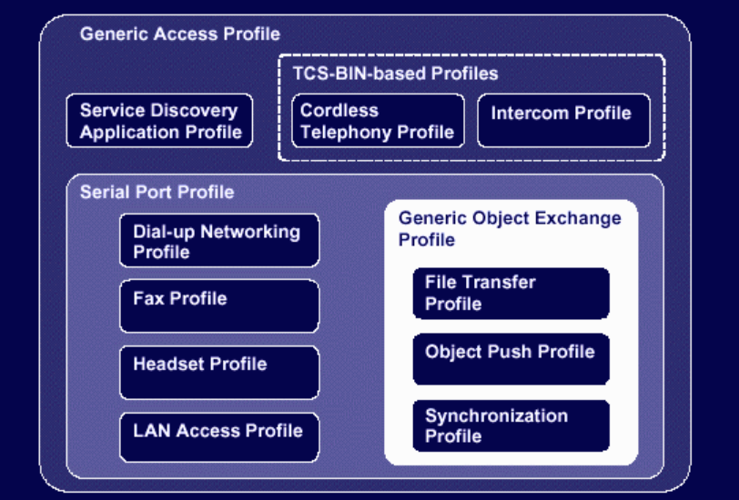
* Generic Access Profile: 处理握手、配对、扫描、发现、安全连接，这部分貌似只能配置，他主要是Host Controller里面，和Wifi的配置差不多概念
* Serial Port Profile: 很多Profile是基于SPP Profile
* Service Discovery Protocol: 主要是提供一个查询机器支持哪些Profile信息功能；
* TCS: 了解不多

# 蓝牙控制器版本

  * hciconfig -a
    ```
    hci0:   Type: Primary  Bus: UART
        BD Address: DC:A6:32:B2:F8:FF  ACL MTU: 1021:8  SCO MTU: 64:1
        UP RUNNING PSCAN
        RX bytes:1823697 acl:20935 sco:0 events:39002 errors:0
        TX bytes:505283 acl:20982 sco:0 commands:2828 errors:0
        Features: 0xbf 0xfe 0xcf 0xfe 0xdb 0xff 0x7b 0x87
        Packet type: DM1 DM3 DM5 DH1 DH3 DH5 HV1 HV2 HV3
        Link policy: RSWITCH SNIFF
        Link mode: SLAVE ACCEPT
        Name: 'raspberrypi'
        Class: 0x480000
        Service Classes: Capturing, Telephony
        Device Class: Miscellaneous,
        HCI Version: 5.0 (0x9)  Revision: 0x122
        LMP Version: 5.0 (0x9)  Subversion: 0x6119
        Manufacturer: Cypress Semiconductor Corporation (305)
    ```
  * HCI Version: 5.0 (0x9) Revision: 0x122
  * LMP Version: 5.0 (0x9) Subversion: 0x6119

<!-- table 11*2 -->
HCI version  | Bluetooth versioncol 
------|------
 0 (0x0)     |   1.0b   
 1 (0x1)     |   1.1   
 2 (0x2)     |   1.2
 3 (0x3)     |   2.0
 4 (0x4)     |   2.1   
 5 (0x5)     |   3.0   
 6 (0x6)     |   4.0   
 7 (0x7)     |   4.1   
 8 (0x8)     |   4.2   
 9 (0x9)     |   5.0   
 10 (0xa)    |   5.1   

 # 蓝牙配对模式

 * 参考：
   * Raspberry BLE Encryption / Pairing
   * 蓝牙配对模式？
     * Numeric Comparison：适用于两个设备都可以显示六位数字并且能够让用户输入”Yes”或”No”的情况；在这个模型中，有针对MITM的保护，故而即使知道这六位数字对解密数据也没有意义；这也是Android中蓝牙常用的配对模式。例如手机之间的配对。
     * Just Works：适用于两个设备都没有任何输入和输出能力的情况；它使用与数字比较相同的协议，但它不向用户显示任何数字，也不要求确认这些数字；该模型不提供针对MITM的保护。用于配对没有显示没有输入的设备，主动发起连接即可配对，用户看不到配对过程。例如连接蓝牙耳机。
     * Passkey Entry: 适用于一个设备具有数字键盘但没有显示器且另一个设备至少具有数字输出的情况；在配对过程中，带显示屏的设备显示一个6位数字，另一个设备必须通过键盘进行输入
     * Out of Band：两设备的通过别的途径交换配对信息，例如NFC等。例如一些NFC蓝牙音箱。
  * 这四种配对模式，在Classic和LE中都有，这四种配对方式，除开JUSTWORK外，都可以防止这两种攻击。JUSTWORK由于不涉及人机交互，所以没法防止MITM的中间人攻击。
  * BluZ对应的模式
    ```
    bluetoothctl --agent KeyboardOnly
    bluetoothctl --agent KeyboardDisplay
    bluetoothctl --agent NoInputNoOutput
    bluetoothctl --agent DisplayOnly 
    ```
    * NoInputNoOutput是just_works
  * 在修改模式的时候，注意要off，再on才能生效
  * 两个设备在配对过程开始时交换其IOCapability。发起方发送IOCapabilityRequest，响应设备使用IOCapabilityResponse进行应答。
  * [蓝牙IO Capabilities](https://blog.csdn.net/zmk0810612124/article/details/82661041)
    * 设备的input能力
      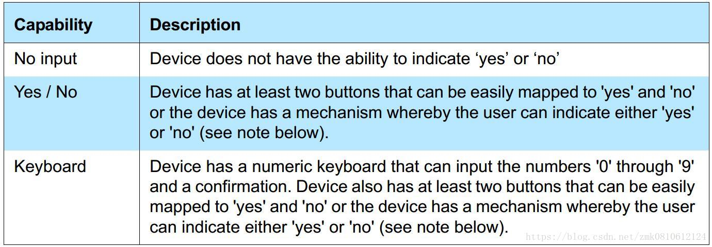
    * 设备的output能力
      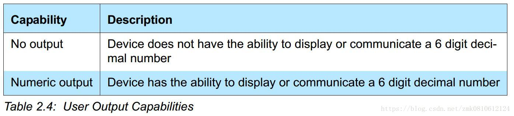
    * 设备的IO Capacity
      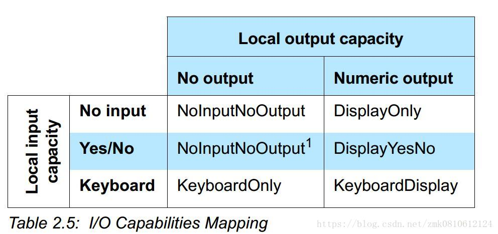
  * NoInputNoOutput: 设备没有输入和输出的能力
  * DisplayOnly: 设置只有输出显示的能力
  * NoInputNoOutput1: 因为没有一个配对算法可以通过yes和no出入，而且设备不支持输出，所以设备的IO能力定义为没有输入和输出
  * DisplayYesNo: 设置只有输入 YES和NO的能力，能够显示
  * KeyboardOnly: 设备可以输入0-9，确认键 和YES/NO的能力，没有显示的能力
  * KeyboardDisplay: 设备可以输入0-9，确认键 和YES/NO的能力，也有显示的能力
* Initiator位配对发起方, Responder为配对接收方
  * BLE协议栈 – SM
    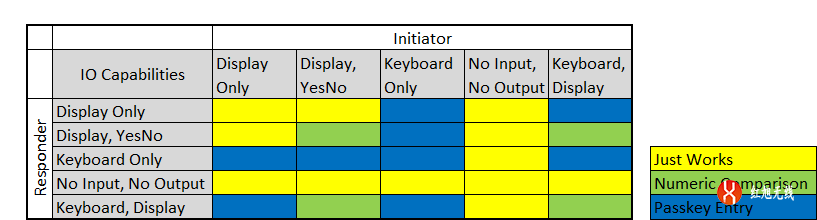

# Android BlueDroid协议栈

# 架构运行图
# 体系架构
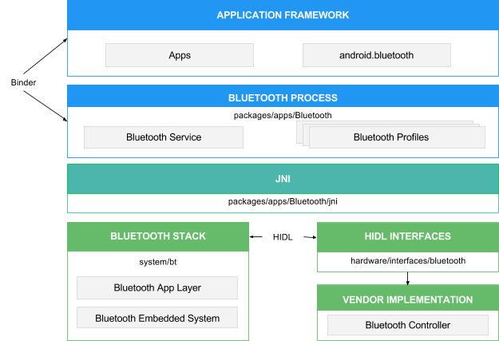
# 运行架构
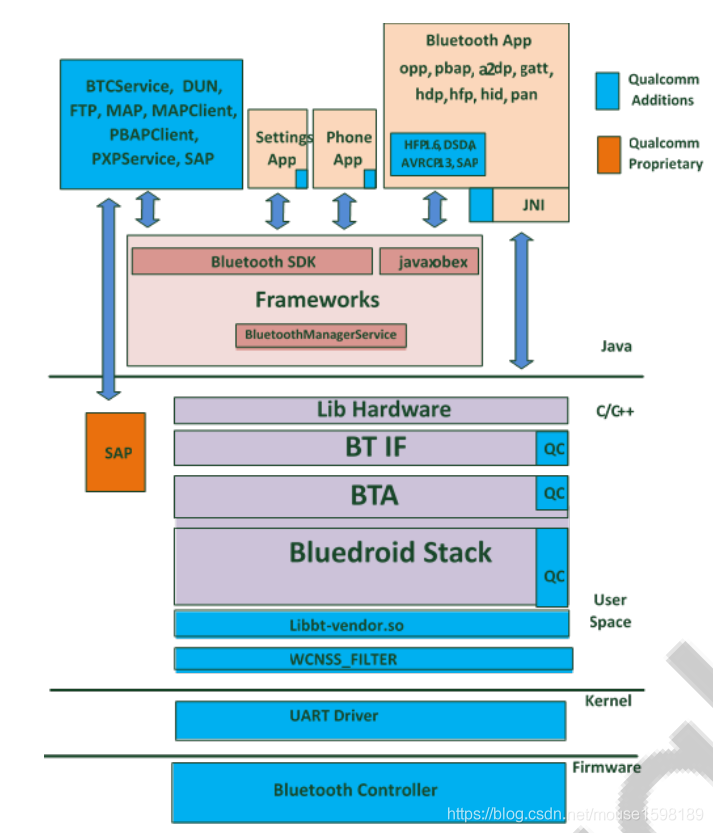

* [# bluedroid 框架](https://blog.csdn.net/luopingfeng/article/details/44001511)
  * BTIF: Bluetooth Interface
  * BTU: Bluetooth Upper Layer
  * BTM: Bluetooth Manager
  * BTE: Bluetooth embedded system
  * BTA: Blueetooth application layer
  * CO: call out\CI: call in
  * HF: Handsfree Profile
  * HH: HID Host Profile
  * HL: Health Device Profile
  * AV: audio\vidio
  * ag: audio gateway
  * ar: audio/video registration
  * gattc: GATT client
```
          Java                                                                                   
+--------------------------------+
  +-----------------+     C++/C
  |       BTIF      |
  +-----------------+
  |       BTA       |
  +-----------------+
  | Bluedroid Stack |
  +-----------------+  user space
+---------------------------------+
          kernel space 
```
# BTIF
Bluetooth Profile Interface在Bluetooth Application task (BTA)和JNI层之间充当了胶水层的角色，对上层（JNI）提供了所有profile功能性的接口。这一层上有一个Bluetooth Interface Instance，所有Profile的操作函数都注册在其中（GAP, AV, DM, PAN, HF,HH, HL, Storage, Sockets）。Client应用通过操作这个Instance来操作Profile。

# BTA

这一层实现了各种Profile状态机。用户通过驱动状态机来操作Profile。Profile状态机包含以下几个主要组成部分：

  * BTA_profilexx_act.c => 包含对应Profile的”Action”函数，一般来说由Profile状态机调用。
  * BTA_profilexx_api.c => 对应Profile的API的具体实现。通常它们是提供给用户使用，完成usecase的函数和回调
  * BTA_profilexx_ci.c => 对应Profile的”call-in”函数的实现（供Profile以外的模块调用）
  * BTA_profilexx_co.c => 对应Profile的”call-out”函数的实现（调用Profile以外的模块）
  * BTA_profilexx_main.c => 对应Profile的状态机和处理协议栈上传消息的handler的具体实现。主要负责维护Profile状态的变化及其引起的”Action”

例如，调用”BTA_profilexx_act.c”中的API函数时，各部分的执行流程图如下所示：
```
                                                 seq2 +---------------------+   seq3   +-----------------------+
                                                 +----> BTA_Profilexx_API.c <----------> BTA's SYS Msg Posting |
                                                 |    +----------^----------+          +-----------^-----------+
                                                 |               |                                 |            
                                                 |               |seq7                             | seq4       
                                                 |               |                                 |            
+--------------+  seq1   +------------------+    |    +----------v-----------+   seq5  +-----------v-------+    
| User Command <---------> BTIF_Exposed_API +----+----> BTA_Profilexx_Main.c <---------> OS Message Posted |    
+--------------+  seq9   +------------------+    seq8 +----------^-----------+         +-------------------+    
                                                                 |                                              
                                                                 |seq6                                          
                                                                 |                                              
                                                      +----------v---------+ 
                                                      | BTA_Profilexx.Ci.c | 
                                                      +--------------------+ 
```

# RFCOMM工作流程

* [The Implementation of RFCOMM in Android](https://blog.csdn.net/Wendell_Gong/article/details/45060337)
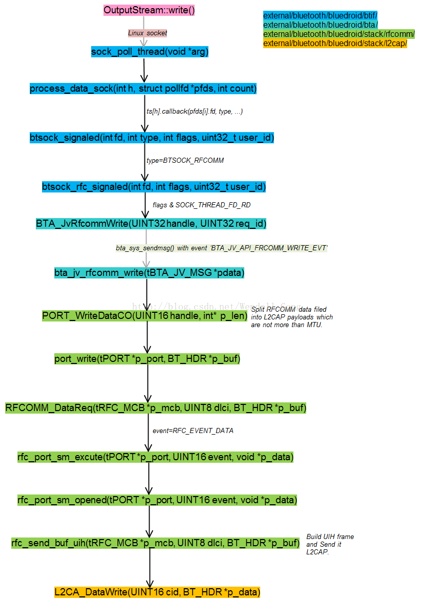

# BLE基础

参考
 * [BLE基础概念](https://draapho.github.io/2017/04/19/1713-ble/)
BLE点对点连接的数据交换示意图, 也同时说明了频道的变化:
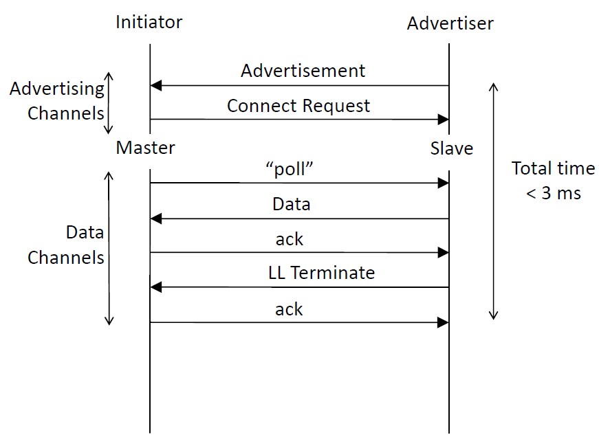

  * Advertiser: 广播者, 处于 Advertising 模式即广播者
  * Scanner: 扫描者, 处于 Scanning 模式即扫描者
  * Initiator: 扫描者, 处于 Initiating 模式的扫描, 用于准备建立连接
  * Slave (Server): 建立通讯后 (Connection 模式), 之前的广播者就变成了Slave从机
  * Master (Client): 建立通讯后 (Connection 模式), 之前的扫描者/发起者就变成了Master主机
  * Server: 提供信息(即Attribute)的一方为服务方, 一般是传感器节点 (大多数情况是Advertiser/Slaver/Peripheral)
  * Client: 访问信息(即Attribute)的一方为客户端, 一般是手机等终端 (大多数情况是Scanner/Master/Central)

GATT访问及Profile架构如下：
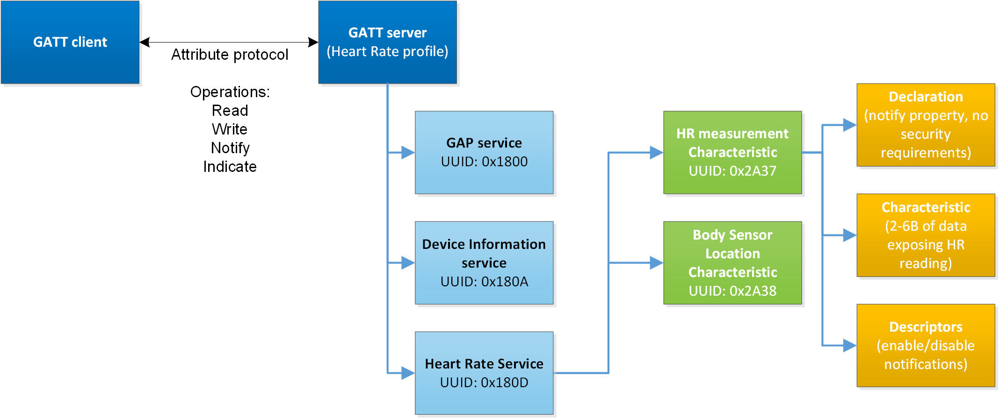
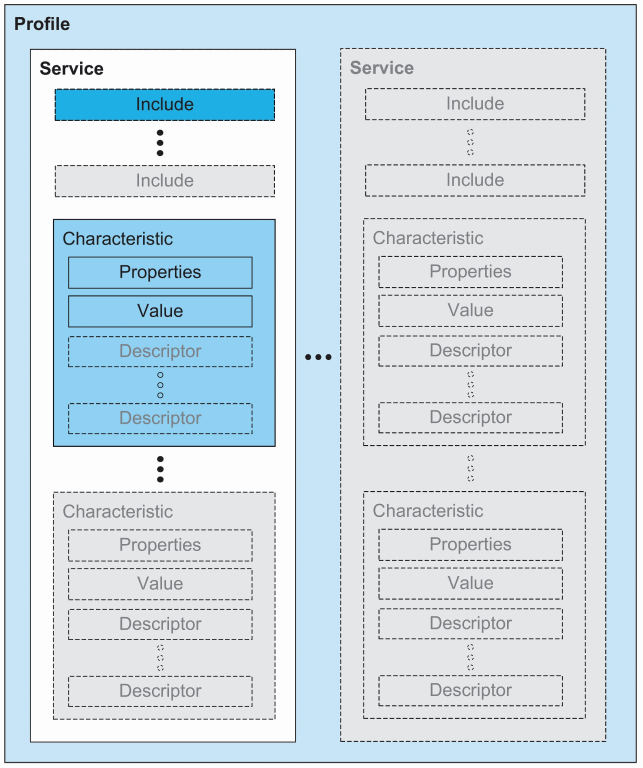
  * Profile是基于GATT所派生出的真正的Profile， 由一个或者多个和某一应用场景有关的 Service 组成
  * Service包含一个或者多个 Characteristic, 也可以通过Include的方式, 包含其它 Service
  * Characteristic则是GATT profile中最基本的数据单位, 由一个 Properties / Declaration, 一个 Value, 一个或者多个Descriptor组成
  * Characteristic Properties / Declaration定义了characteristic的Value如何被使用，以及characteristic的Descriptor如何被访问。
  * Characteristic Value是特征的实际值，例如一个温度特征，其Characteristic Value就是温度值就。
  * Characteristic Descriptor则保存了一些和Characteristic Value相关的信息。

一个 BLE 设备，可以使用两种类型的地址（一个 BLE 设备可同时具备两种地址）: Public Device Address 和 Random Device Address。
  * Public Device Address: 在通信系统中，设备地址是用来唯一识别一个物理设备的，如 TCP/IP 网络中的 MAC 地址、传统蓝牙中的蓝牙地址等。 对设备地址而言，一个重要的特性，就是唯一性。
  * Random Device Address：是在设备设备启动后随机生成的。根据不同的目的 Random Device Address 分为 Static Device Address 和 Private Device Address 两类。
    * Static Device Address: 是在设备上电时随机生成的；
    * Private Device Address: Static Device Address 通过地址随机生成的方式，解决了部分问题，Private Device Address 则更进一步，通过定时更新和地址加密两种方法，提高蓝牙地址的可靠性和安全性。根据地址是否加密，Private Device Address 又分为两类，Non-resolvable private address 和 Resolvable private address。
      * Non-resolvable private address: 会定时更新，更新的周期是由GAP规定的，称作T_GAP(private_addr_int)，建议值是15分钟。
      * Resolvable private address: 比较有用，它通过一个随机数和一个称作 identity resolving key (IRK) 的密码生成，因此只能被拥有相同 IRK 的设备扫描到，可以防止被未知设备扫描和追踪。

# 蓝牙安全连接
  * SC最先提出在BR/EDR中，追溯其起源可以到Core 2.1，在Core 2.1之前，加密认证方式所有的安全均建立在0-16位的数字上，存在被破解的风险，于是人们提出了SSP（Secure Simple Pairing），SSP是一种在传统认证基础上改进过来的认证加密方式；SSP的改变主要在于认证阶段，采用椭圆曲线非对称加密方式，交换公钥、存留私钥、公钥结合私钥计算共享密钥的方式进行认证，最终认证通过后由共享密钥生成连接密钥（Link Key）；可以发现在认证加密过程中密钥的生成存在随机性，并且用户都不会直接接触到密钥，大大的提高了其安全系数，并且椭圆曲线非对称加密算法其加密程度也非常高，在此基础上，配对的安全系数提高了加密过程依然采用传统的E0算法，直到在Core 4.1中将BLE的AES-CCM加密算法引入过来，将SSP认证与AES-CCM加密结合，提出了SC加密认证机制。
  * BLE直接将BR/EDR的SC安全机制借鉴过来，提出LE Secure Connections，新提出的安全机制对于BLE来讲，改变的仅仅是配对阶段，加密阶段原本BLE就是使用的AES-CCM。


