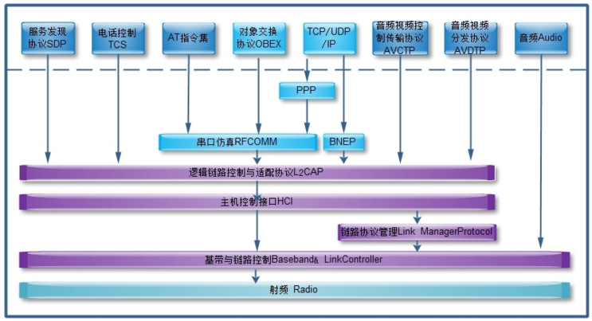
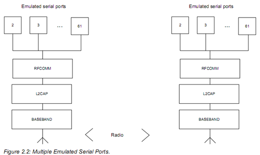
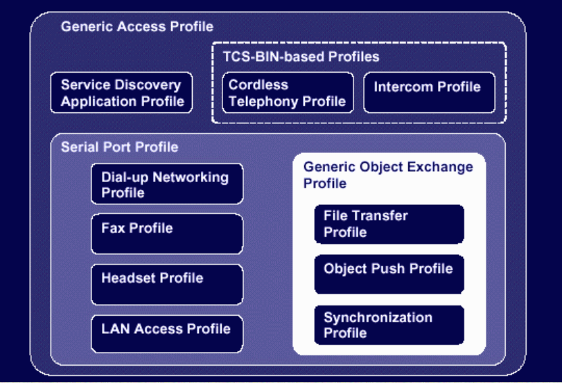

# Bluetooth RFCOMM SPP

理解蓝牙协议栈中的RFCOMM和SPP的关系

# 参考文档

# 蓝牙数据层级关系



# RFCOMM SPP关系
 
  * 参考:
     * [K5 - Serial Port Profile](https://www.amd.e-technik.uni-rostock.de/ma/gol/lectures/wirlec/bluetooth_info/k5_spp.html)
       * The Serial Port Profile defines the requirements for Bluetooth devices necessary for setting up emulated serial cable connections using RFCOMM between two peer devices.
     * [RFCOMM Protocol](https://www.amd.e-technik.uni-rostock.de/ma/gol/lectures/wirlec/bluetooth_info/rfcomm.html)
       * The RFCOMM protocol provides emulation of serial ports over the L2CAP protocol. The protocol is based on the ETSI standard TS 07.10. Only a subset of the TS 07.10 standard is used, and some adaptations of the protocol are specified in the Bluetooth RFCOMM specification.
     * [Bluetooth RFCOMM介绍](http://zengjf.local:8088/src/0002_Android/docs/0001_Android/docs/0012_Android_Bluetooth/docs/0011_Bluetooth_RFCOMM_SPP.html)
  * 由上可知RFCOMM是一个通信数据协议，其被多种Profile使用，SPP是所有Profile中的一种，RFCOMM可以虚拟出很多port（SPP），每个port通过DLCI进行区分；
  * 两个使用RFCOMM通信的蓝牙设备可以同时打开多个串口仿真，RFCOMM支持最多60路，但是一个设备实际能打开的数据依实现而定，一个数据链接标识(DLCI: 参考帧格式Address字段D+ServerChannel)标识一对客户和服务器之间的持续连接。DLCI在两个设备间的RFCOMM会话中保持一致，中其可用值区间为2~61，0为控制信道，1由于服务器信道概念不能使用，62-63保留。
  * DCLI: direction bit and server channel, 通常initator将D位(即最低位)设置为1，而Responser则将其设置为0，故initator的DCLI的值总是基数(3,5,7,…,61)，而Responser则为偶数(2,4,6,…,60)，故最多30个设备，可以认为是Port ID；



# PSM
  * 协议/服务复用(PSM)
    ```
    #define BT_PSM_SDP                      0x0001
    #define BT_PSM_RFCOMM                   0x0003
    #define BT_PSM_TCS                      0x0005
    #define BT_PSM_CTP                      0x0007
    #define BT_PSM_BNEP                     0x000F
    #define BT_PSM_HIDC                     0x0011
    #define BT_PSM_HIDI                     0x0013
    #define BT_PSM_UPNP                     0x0015
    #define BT_PSM_AVCTP                    0x0017
    #define BT_PSM_AVDTP                    0x0019
    #define BT_PSM_AVCTP_13                 0x001B /* Advanced Control - Browsing */
    #define BT_PSM_UDI_CP                   0x001D /* Unrestricted Digital Information Profile C-Plane  */
    #define BT_PSM_ATT                      0x001F /* Attribute Protocol  */
    ```
# 蓝牙Profile层级关系
   * 参考：[Bluetooth Profile Structure](https://www.amd.e-technik.uni-rostock.de/ma/gol/lectures/wirlec/bluetooth_info/profiles.html)
   * 由下图可知，很多Profile本身依赖于SPP，而SPP又依赖于RFCOMM
   


