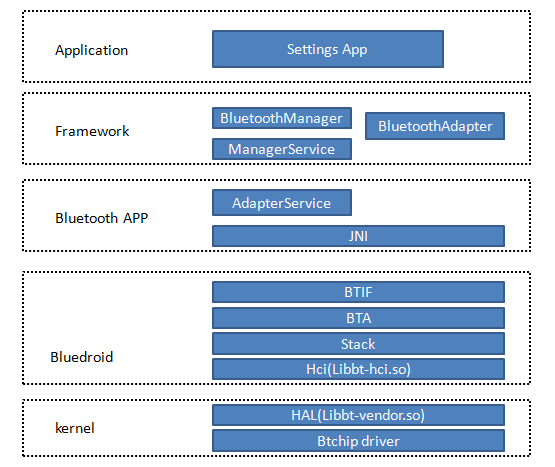

# Android Bluetooth

蓝牙相关问题

# 参考文档

* [android PCI认证问题记录](https://blog.csdn.net/qq_28534581/article/details/89395136)

# Profile
  
  * packages/apps/Bluetooth/res/values/config.xml

# ARCH



# 不能传送apk

```diff
diff --git a/android/packages/apps/Bluetooth/AndroidManifest.xml b/android/packages/apps/Bluetooth/AndroidManifest.xml
index 3652fd3..35458f83 100755
--- a/android/packages/apps/Bluetooth/AndroidManifest.xml
+++ b/android/packages/apps/Bluetooth/AndroidManifest.xml
@@ -146,15 +146,7 @@
                 <data android:mimeType="text/plain" />
                 <data android:mimeType="text/html" />
                 <data android:mimeType="text/xml" />
-                <data android:mimeType="application/zip" />
-                <data android:mimeType="application/vnd.ms-excel" />
-                <data android:mimeType="application/msword" />
-                <data android:mimeType="application/vnd.ms-powerpoint" />
-                <data android:mimeType="application/pdf" />
-                <data android:mimeType="application/vnd.openxmlformats-officedocument.spreadsheetml.sheet" />
-                <data android:mimeType="application/vnd.openxmlformats-officedocument.wordprocessingml.document" />
-                <data android:mimeType="application/vnd.openxmlformats-officedocument.presentationml.presentation" />
-                <data android:mimeType="application/x-hwp" />
+                <data android:mimeType="application/*" />
             </intent-filter>
             <intent-filter>
                 <action android:name="android.intent.action.SEND_MULTIPLE" />
@@ -163,6 +155,7 @@
                 <data android:mimeType="video/*" />
                 <data android:mimeType="x-mixmedia/*" />
                 <data android:mimeType="text/x-vcard" />
+                <data android:mimeType="application/*" />
             </intent-filter>
             <intent-filter>
                 <action android:name="android.btopp.intent.action.OPEN" />
diff --git a/android/packages/apps/Bluetooth/src/com/android/bluetooth/opp/Constants.java b/android/packages/apps/Bluetooth/src/com/android/bluetooth/opp/Constants.java
index 3a3e386..dc8c9d8 100755
--- a/android/packages/apps/Bluetooth/src/com/android/bluetooth/opp/Constants.java
+++ b/android/packages/apps/Bluetooth/src/com/android/bluetooth/opp/Constants.java
@@ -214,15 +214,7 @@ public class Constants {
         "text/plain",
         "text/html",
         "text/xml",
-        "application/zip",
-        "application/vnd.ms-excel",
-        "application/msword",
-        "application/vnd.ms-powerpoint",
-        "application/pdf",
-        "application/vnd.openxmlformats-officedocument.spreadsheetml.sheet",
-        "application/vnd.openxmlformats-officedocument.wordprocessingml.document",
-        "application/vnd.openxmlformats-officedocument.presentationml.presentation",
-        "application/x-hwp",
+        "application/*",
         "*/*",
     };

```

# 文件传输唤醒屏幕

```diff
diff --git a/vendor/mediatek/proprietary/packages/apps/Bluetooth/src/com/android/bluetooth/opp/BluetoothOppObexClientSession.java b/vendor/mediatek/proprietary/packages/apps/Bluetooth/src/com/android/bluetooth/opp/BluetoothOppObexClientSession.java
index 8ea7a361691..5c222671d41 100644
--- a/vendor/mediatek/proprietary/packages/apps/Bluetooth/src/com/android/bluetooth/opp/BluetoothOppObexClientSession.java
+++ b/vendor/mediatek/proprietary/packages/apps/Bluetooth/src/com/android/bluetooth/opp/BluetoothOppObexClientSession.java
@@ -266,6 +266,17 @@ public class BluetoothOppObexClientSession implements BluetoothOppObexSession {
         }
 
         private void disconnect() {
+
+            PowerManager pm = (PowerManager) mContext.getSystemService(Context.POWER_SERVICE);
+            boolean screenOn = pm.isScreenOn();
+            if (!screenOn) {
+                PowerManager.WakeLock wl = pm.newWakeLock(
+                        PowerManager.ACQUIRE_CAUSES_WAKEUP |
+                                PowerManager.SCREEN_BRIGHT_WAKE_LOCK, "bright");
+                wl.acquire(10000);
+                wl.release();
+            }
+
             try {
                 if (mCs != null) {
                     mCs.disconnect(null);
@@ -301,6 +312,17 @@ public class BluetoothOppObexClientSession implements BluetoothOppObexSession {
         }
 
         private void connect(int numShares) {
+
+            PowerManager pm = (PowerManager) mContext.getSystemService(Context.POWER_SERVICE);
+            boolean screenOn = pm.isScreenOn();
+            if (!screenOn) {
+                PowerManager.WakeLock wl = pm.newWakeLock(
+                        PowerManager.ACQUIRE_CAUSES_WAKEUP |
+                                PowerManager.SCREEN_BRIGHT_WAKE_LOCK, "bright");
+                wl.acquire(10000);
+                wl.release();
+            }
+
             if (D) {
                 Log.d(TAG, "Create ClientSession with transport " + mTransport1.toString());
             }
diff --git a/vendor/mediatek/proprietary/packages/apps/Bluetooth/src/com/android/bluetooth/opp/BluetoothOppObexServerSession.java b/vendor/mediatek/proprietary/packages/apps/Bluetooth/src/com/android/bluetooth/opp/BluetoothOppObexServerSession.java
index 668661ebd35..f52b9d16a50 100644
--- a/vendor/mediatek/proprietary/packages/apps/Bluetooth/src/com/android/bluetooth/opp/BluetoothOppObexServerSession.java
+++ b/vendor/mediatek/proprietary/packages/apps/Bluetooth/src/com/android/bluetooth/opp/BluetoothOppObexServerSession.java
@@ -438,6 +438,17 @@ public class BluetoothOppObexServerSession extends ServerRequestHandler
             msg.obj = mInfo;
             msg.sendToTarget();
         }
+
+        PowerManager pm = (PowerManager) mContext.getSystemService(Context.POWER_SERVICE);
+        boolean screenOn = pm.isScreenOn();
+        if (!screenOn) {
+            PowerManager.WakeLock wl = pm.newWakeLock(
+                    PowerManager.ACQUIRE_CAUSES_WAKEUP |
+                            PowerManager.SCREEN_BRIGHT_WAKE_LOCK, "bright");
+            wl.acquire(10000);
+            wl.release();
+        }
+
         return obexResponse;
     }
 
@@ -581,6 +592,16 @@ public class BluetoothOppObexServerSession extends ServerRequestHandler
     @Override
     public int onConnect(HeaderSet request, HeaderSet reply) {
 
+        PowerManager pm = (PowerManager) mContext.getSystemService(Context.POWER_SERVICE);
+        boolean screenOn = pm.isScreenOn();
+        if (!screenOn) {
+            PowerManager.WakeLock wl = pm.newWakeLock(
+                    PowerManager.ACQUIRE_CAUSES_WAKEUP |
+                            PowerManager.SCREEN_BRIGHT_WAKE_LOCK, "bright");
+            wl.acquire(10000);
+            wl.release();
+        }
+
         if (D) {
             Log.d(TAG, "onConnect");
         }
```

# 蓝牙配对唤醒屏幕

```diff
diff --git a/vendor/mediatek/proprietary/packages/apps/Bluetooth/src/com/android/bluetooth/a2dp/A2dpService.java b/vendor/mediatek/proprietary/packages/apps/Bluetooth/src/com/android/bluetooth/a2dp/A2dpService.java
index 5f0b334..3d3cce1 100644
--- a/vendor/mediatek/proprietary/packages/apps/Bluetooth/src/com/android/bluetooth/a2dp/A2dpService.java
+++ b/vendor/mediatek/proprietary/packages/apps/Bluetooth/src/com/android/bluetooth/a2dp/A2dpService.java
@@ -29,6 +29,7 @@ import android.content.Intent;
 import android.content.IntentFilter;
 import android.media.AudioManager;
 import android.os.HandlerThread;
+import android.os.PowerManager;
 import android.util.Log;
 import android.util.StatsLog;
 
@@ -1007,6 +1008,19 @@ public class A2dpService extends ProfileService {
         if (DBG) {
             Log.d(TAG, "Bond state changed for device: " + device + " state: " + bondState);
         }
+
+        if (bondState == BluetoothDevice.BOND_BONDING) {
+            PowerManager pm = (PowerManager) getSystemService(Context.POWER_SERVICE);
+            boolean screenOn = pm.isScreenOn();
+            if (!screenOn) {
+                PowerManager.WakeLock wl = pm.newWakeLock(
+                        PowerManager.ACQUIRE_CAUSES_WAKEUP |
+                                PowerManager.SCREEN_BRIGHT_WAKE_LOCK, "bright");
+                wl.acquire(10000);
+                wl.release();
+            }
+        }
+
         // Remove state machine if the bonding for a device is removed
         if (bondState != BluetoothDevice.BOND_NONE) {
             return;
```

# BtRelayerMode

* 参考文档
  * [[FAQ13435] [BT Certification]BT 4.0认证测试方法 （USB篇）](https://online.mediatek.com/_layouts/15/mol/portal/ext/ECMLogin.aspx?ReturnUrl=%2f_layouts%2f15%2fAuthenticate.aspx%3fSource%3d%252FFAQ&Source=%2FFAQ&confirm=true#/SW/FAQ13435)
* error log
  ```
  12-13 00:54:39.833 16281 16283 D [BT]    : BT_InitDevice: BT_InitDevice
  12-13 00:54:39.833 16281 16283 D [BT]    : GORM_Init: GORM_Init
  12-13 00:54:39.833 16281 16283 W [BT]    : GORM_Init: CONNAC chip id: 6765
  12-13 00:54:39.833 16281 16283 D [BT]    : GORMcmd_HCC_Set_Local_BD_Addr: GORMcmd_HCC_Set_Local_BD_Addr
  12-13 00:54:39.833 16281 16283 W [BT]    : GORMcmd_HCC_Set_Local_BD_Addr: NVRAM BD address has valid value
  12-13 00:54:39.833 16281 16283 W [BT]    : GORMcmd_HCC_Set_Local_BD_Addr: Write BD address: fa-02-46-f4-a8-6e
  12-13 00:54:39.833 16281 16283 D [BT]    : BT_SendHciCommand: OpCode 0xfc1a len 6
  12-13 00:54:39.834 16281 16283 D [BT]    : GORMcmd_HCC_Set_Radio: GORMcmd_HCC_Set_Radio
  12-13 00:54:39.834 16281 16283 D [BT]    : BT_SendHciCommand: OpCode 0xfc79 len 8
  12-13 00:54:39.835 16281 16283 D [BT]    : GORMcmd_HCC_Set_TX_Power_Offset: GORMcmd_HCC_Set_TX_Power_Offset
  12-13 00:54:39.835 16281 16283 D [BT]    : BT_SendHciCommand: OpCode 0xfc93 len 16
  12-13 00:54:39.836 16281 16283 D [BT]    : GORMcmd_HCC_Set_Sleep_Timeout: GORMcmd_HCC_Set_Sleep_Timeout
  12-13 00:54:39.836 16281 16283 D [BT]    : BT_SendHciCommand: OpCode 0xfc7a len 7
  12-13 00:54:39.837 16281 16283 D [BT]    : GORMcmd_HCC_RESET: GORMcmd_HCC_RESET
  12-13 00:54:39.837 16281 16283 D [BT]    : BT_SendHciCommand: OpCode 0x0c03 len 0
  12-13 00:54:39.840 16281 16283 W [BT]    : bt_init: bt_init success
  12-13 00:54:39.840 16281 16283 D BT_EM   : EM_BT_init: BT is enabled success
  12-13 00:54:39.840 16281 16283 D BT_RELAYER : RELAYER_start: BT device power on success
  12-13 00:54:39.841 16281 16283 D BT_RELAYER : RELAYER_start: BT Relayer mode start
  12-13 00:54:39.842 16281 16813 D BT_RELAYER : bt_tx_monitor: Thread 487275236688 starts
  12-13 00:54:39.842 16281 16814 D BT_RELAYER : bt_rx_monitor: Thread 487274200400 starts
  12-13 00:54:39.842 16232 16415 I EM/BtRelayerMode: -->relayerStart-9600 uart 4result 0 success,-1 fail: result= 0
  12-13 00:54:39.842 16281 16814 W BT_EM   : EM_BT_read #222
  12-13 00:54:39.854 16232 16252 D Surface : Surface::disconnect(this=0x7802119000,api=1)
  12-13 00:54:39.854   574   625 I BufferQueueProducer: [com.mediatek.engineermode/com.mediatek.engineermode.bluetooth.BtRelayerModeActivity#1](this:0x75490f6000,id:92,api:1,p:16232,c:574) disconnect(P):
  api 1
  12-13 00:54:39.856 16232 16232 D View    : [Warning] assignParent to null: this = DecorView@7edba2e[BtRelayerModeActivity]
  12-13 00:54:39.856  1140  1254 E WifiVendorHal: getWifiLinkLayerStats_1_3_Internal(l.927) failed {.code =   ERROR_NOT_SUPPORTED, .description = }
  ```
    * 12-13 00:54:39.842 16232 16415 I EM/BtRelayerMode: -->relayerStart-9600 uart 4result 0 success,-1 fail: result= 0

  * source
    ```
    * vendor/mediatek/proprietary/packages/apps/EngineerMode
      └── vendor/mediatek/proprietary/packages/apps/EngineerMode/src/com/mediatek/engineermode/bluetooth/BtRelayerModeActivity.java
          ├── private static final String TAG = "BtRelayerMode";
          └── result = EmUtils.getEmHidlService().btStartRelayer(mPortNumber, mBaudrate);
              └── mPortNumber = 4
    ```
# property配置

  * getprop | grep usb
    ```
    [init.svc.usbd]: [stopped]
    [init.svc.vendor.usb-hal-1-1]: [running]
    [persist.sys.usb.config]: [adb]
    [ro.audio.usb.period_us]: [16000]
    [ro.boottime.usbd]: [42721189156]
    [ro.boottime.vendor.usb-hal-1-1]: [38175602155]
    [ro.sys.usb.bicr]: [no]
    [ro.sys.usb.charging.only]: [yes]
    [ro.sys.usb.mtp.whql.enable]: [0]
    [ro.sys.usb.storage.type]: [mtp]
    [sys.usb.config]: [adb]
    [sys.usb.configfs]: [1]
    [sys.usb.controller]: [musb-hdrc]
    [sys.usb.ffs.aio_compat]: [1]
    [sys.usb.ffs.ready]: [1]
    [sys.usb.state]: [adb]
    [vendor.usb.acm_cnt]: [1]
    [vendor.usb.acm_enable]: [1]
    [vendor.usb.acm_idx]: [3]
    [vendor.usb.acm_port0]: [0]
    [vendor.usb.acm_port1]: []
    [vendor.usb.config]: [acm_third]
    [vendor.usb.controller]: [musb-hdrc]
    [vendor.usb.ffs.ready]: [1]
    [vendor.usb.pid]: [0x2345]
    [vendor.usb.vid]: [0x2FB8]
    ```

# hidl service
```
* vendor/mediatek/proprietary/hardware/em_hidl_server/Em_hidl_service.cpp
  └── Return<int32_t> EmHidlService::btStartRelayer(int32_t port, int32_t speed)
      └── return BluetoothTest::startBtRelayer(port, speed);
          └── vendor/mediatek/proprietary/hardware/em_hidl_server/BluetoothTest.cpp
              └── int32_t BluetoothTest::startBtRelayer(int32_t port, int32_t speed)
                  └── return RELAYER_start(port, speed) ? 0 : -1;
                      └── vendor/mediatek/connectivity/bluetooth/driver/mt66xx/pure/combo/bt_relayer.c
                          └── BOOL RELAYER_start(int serial_port, int serial_speed)
                              ├── sprintf(dev, "/dev/ttyGS2");
                              ├── fd = open(dev, O_RDWR | O_NOCTTY | O_NONBLOCK);
                              ├── property_get("vendor.usb.config", usb_prop, NULL);
                              └── property_set("vendor.usb.config", "acm_third")

* out/target/product/k62v1_64_bsp/vendor/etc/init/hw/init.mt6765.usb.rc
  * on property:sys.usb.config=acm_third
    * setprop sys.usb.config acm_gs2
      * on property:sys.usb.config=acm_gs2
        * setprop vendor.usb.acm_port0 2
          * 貌似和这里冲突
        * setprop vendor.usb.acm_cnt 1
        * setprop sys.usb.config none
        * setprop sys.usb.config ${sys.usb.state}
          * on property:sys.usb.config=adb && property:vendor.usb.acm_cnt=1 && property:sys.usb.configfs=1
          * setprop vendor.usb.pid 0x2345
          * setprop vendor.usb.acm_port0 0
            * 貌似和这里冲突
            * symlink /config/usb_gadget/g1/functions/acm.gs${vendor.usb.acm_port0} /config/usb_gadget/g1/configs/b.1/f2
            * 修改回`setprop vendor.usb.acm_port1 ""`，默认值是这个
```
  * device/mediatek/mt6765/init.mt6765.usb.rc

# USB

* vendor/etc/init/hw/init.connectivity.rc
  * chmod 0660 /dev/ttyGS2
* vendor/etc/init/hw/init.mt6765.usb.rc
  * chmod 0660 /dev/ttyGS2
* vendor/etc/init/hw/init.mt6765.usb.rc

# 示例

* reset: 01 03 0c 00
  * 04 0e 04 01 03 0c 00
* TX:01 1e 20 03 00 25 00
  * 04 0e 04 01 1e 20 00

# Meta

SP Meta工具也是可以测试的

# 蓝牙功率

* 使用META TOOL修改功率可以修改NVRAM选项NVRAM_EF_BTRADIO_MTK_BT_CHIP_LID，修改其中Radio中的Radio[0]和Radio[5]，降低一个单位会降低3~5dBm，修改后的功率，还需要再做测试；
* 0245_NVRAM.md

# hci log

* 开始log
  * On the Android device go to Settings.
  * Select Developer options.
  * Click to enable Bluetooth HCI snoop logging.
  * Return to the Settings screen and select Developer options.
  * In the Developer options screen select Enable Bluetooth HCI snoop log. The log file is now enabled.
* /data/misc/bluetooth/logs

# hci HCI_Disconnection_Complete分析

* hci log
  ```
  4,383  Command  0x2042  LE Controller     HCI_LE_Set_Extended_Scan_Enable
  4,384  Event    0x2042  LE Controller     HCI_LE_Set_Extended_Scan_Enable         HCI_Command_Complete                          Success
  4,385  Command  0x2041  LE Controller     HCI_LE_Set_Extended_Scan_Parameters
  4,386  Event    0x2041  LE Controller     HCI_LE_Set_Extended_Scan_Parameters     HCI_Command_Complete                          Success
  4,387  Command  0xfd57  Vendor-Specific   APCF Set Filtering parameters
  4,388  Event    0xfd57  Vendor-Specific                                           APCF Set Filtering parameters                 Success
  4,389  Command  0x2012  LE Controller     HCI_LE_Remove_Device_From_White_List
  4,390  Event    0x2012  LE Controller     HCI_LE_Remove_Device_From_White_List    HCI_Command_Complete                          Success
  4,391  Command  0x2011  LE Controller     HCI_LE_Add_Device_To_White_List
  4,392  Event    0x2011  LE Controller     HCI_LE_Add_Device_To_White_List         HCI_Command_Complete                          Success
  4,393  Command  0x2043  LE Controller     HCI_LE_Extended_Create_Connection
  4,394  Event    0x2043  LE Controller     HCI_LE_Extended_Create_Connection       HCI_Command_Status                            Success
  4,395  Event                                                                      HCI_LE_Enhanced_Connection_Complete           Success
  4,396  Command  0x2016  LE Controller     HCI_LE_Read_Remote_Features
  4,397  Event    0x2016  LE Controller     HCI_LE_Read_Remote_Features             HCI_Command_Status                            Success
  4,398  Event                                                                      HCI_LE_Read_Remote_Features_Complete          Success
  4,399  Command  0x041d  Link Control      HCI_Read_Remote_Version_Information
  4,400  Event    0x041d  Link Control      HCI_Read_Remote_Version_Information     HCI_Command_Status                            Success
  4,401  Event                                                                      HCI_Read_Remote_Version_Information_Complete  Success
  4,402  Command  0x2013  LE Controller     HCI_LE_Connection_Update
  4,403  ACL Data                                                                                       
  4,404  Event    0x2013  LE Controller     HCI_LE_Connection_Update                HCI_Command_Status                            Success
  4,405  Event                                                                      HCI_LE_PHY_Update_Complete                    Success
  4,406  Event                                                                      HCI_Disconnection_Complete                    Success
  4,407  Command  0xfd59  Vendor-Specific   LE_Get_Controller_Activity_Energy_Info
  4,408  Event    0xfd59  Vendor-Specific                                           HCI_Command_Complete                          Success
  ```
  * ACL Data导致的timeout
    ```
    HCI UART:
      HCI Packet Type: ACL Data Packet
    HCI:
      Packet from: Host
      Connection_Handle: 0x0010
      Broadcast Flag: No broadcast, point-to-point
      Packet Boundary Flag: First non-automatically-flushable L2CAP packet
      Total Length: 11
    L2CAP:
      Role: Master
      Address: 16
      PDU Length: 7
      Channel ID: 0x0004  (Attribute Protocol)
    ATT:
      Role: Master
      Signature Present: No
      PDU Type is Command: No
      Opcode: ATT_READ_BY_GROUP_TYPE_REQ
      *Database: 10(S)
      Starting Attribute Handle: 1
      Ending Attribute Handle: 65535
      Attribute Group Type: Primary Service
    ```
    * ATT_READ_BY_GROUP_TYPE_REQ
  * 正常情况下应该受到如下这条消息
    ```
    HCI UART:
      HCI Packet Type: ACL Data Packet
    HCI:
      Packet from: Controller
      Connection_Handle: 0x0010
      Broadcast Flag: No broadcast, point-to-point
      Packet Boundary Flag: First automatically-flushable L2CAP packet
      Total Length: 18
    L2CAP:
      Role: Slave
      Address: 16
      PDU Length: 14
      Channel ID: 0x0004  (Attribute Protocol)
    ATT:
      Role: Slave
      Signature Present: No
      PDU Type is Command: No
      Opcode: ATT_READ_BY_GROUP_TYPE_RSP
      *Database: 10(S)
      Length: 6
      Attribute data
        Group Handle-Value pair
          Starting Attribute Handle: 1
          Ending Attribute Handle: 3
          Primary Service Declaration
            Service Declaration
              Short UUID: Generic Attribute Profile
        Group Handle-Value pair
          Starting Attribute Handle: 20
          Ending Attribute Handle: 26
          Primary Service Declaration
            Service Declaration
              Short UUID: Generic Access Profile
    ```
  * 这种是读GATT表的时候没返回导致的

# hci HCI_LE_Create_Connection_Cancel分析

* hci log
```
1,711  Command  0xfd57  Vendor-Specific  APCF Set Filtering parameters
1,712  Event    0xfd57  Vendor-Specific                                       APCF Set Filtering parameters  Success
1,713  Command  0x2042  LE Controller    HCI_LE_Set_Extended_Scan_Enable
1,714  Event    0x2042  LE Controller    HCI_LE_Set_Extended_Scan_Enable      HCI_Command_Complete  Success
1,715  Command  0x2041  LE Controller    HCI_LE_Set_Extended_Scan_Parameters
1,716  Event    0x2041  LE Controller    HCI_LE_Set_Extended_Scan_Parameters  HCI_Command_Complete  Success
1,717  Command  0x2043  LE Controller    HCI_LE_Extended_Create_Connection
1,718  Event    0x2043  LE Controller    HCI_LE_Extended_Create_Connection    HCI_Command_Status  Success
1,719  Command  0x200e  LE Controller    HCI_LE_Create_Connection_Cancel
1,720  Event    0x200e  LE Controller    HCI_LE_Create_Connection_Cancel      HCI_Command_Complete  Success
1,721  Event   
```
* logcat log
```
06-30 17:20:36.190824  5934  5996 W bt_stack: [WARNING:bta_gattc_act.cc(1044)] bta_gattc_conn_cback: cif=3 connected=0 conn_id=0x0003 reason=0x00ff
06-30 17:20:36.191152  5934  5996 W bt_stack: [WARNING:bta_gattc_act.cc(1044)] bta_gattc_conn_cback: cif=4 connected=0 conn_id=0x0004 reason=0x00ff
06-30 17:20:36.191355  5934  5996 W bt_stack: [WARNING:bta_gattc_act.cc(1044)] bta_gattc_conn_cback: cif=5 connected=0 conn_id=0x0005 reason=0x00ff
06-30 17:20:36.191515  5934  5996 I bt_btm  : btm_ble_stop_auto_conn
06-30 17:20:36.191847  5934  5996 I bt_stack: [INFO:btm_ble_bgconn.cc(223)] btm_add_dev_to_controller removing RPA from white list
06-30 17:20:36.191963  5934  5996 I bt_btm  : btm_ble_start_auto_conn
06-30 17:20:36.192070  5934  5996 I bt_btif : bta_sys_event: Event 0x1f10
06-30 17:20:36.192156  5934  5996 I chatty  : uid=1002(bluetooth) bt_main_thread identical 1 line
06-30 17:20:36.192224  5934  5996 I bt_btif : bta_sys_event: Event 0x1f10
06-30 17:20:36.192358  5934  5996 W bt_stack: [WARNING:bta_gattc_act.cc(340)] bta_gattc_open_fail: Cannot establish Connection. conn_id=000000. Return GATT_ERROR(133)
06-30 17:20:36.192670  1845  1864 D bt_upio : upio_set: proc btwrite assertion, buffer: 1, timer_armed 0 0
06-30 17:20:36.193488  5934  5970 I bt_btif : btif_gattc_upstreams_evt: HAL bt_gatt_callbacks->client->open_cb
06-30 17:20:36.195256  6175  6195 D BluetoothGatt: onClientConnectionState() - status=133 clientIf=5 device=4E:56:97:E4:9A:86
06-30 17:20:36.195593  6175  6195 E BleClientManager: onConnectionStateChange
06-30 17:20:36.195754  6175  6195 E BleClientManager: Disconnected from GATT server.
06-30 17:20:36.197787  5934  5996 I bt_hci  : BLE HCI(id=62) event = 0x0a)
06-30 17:20:36.198840  5934  5996 I bt_btm  : btm_ble_start_auto_conn
06-30 17:20:39.198244  1845  5993 D bt_upio : upio_set: proc btwrite assertion, buffer: 2, timer_armed 0 0
```
  * bt_stack: [WARNING:bta_gattc_act.cc(340)] bta_gattc_open_fail: Cannot establish Connection. conn_id=000000. Return GATT_ERROR(133)
    ```
    * system/bt/bta/gatt/bta_gattc_act.cc
      * void bta_gattc_open_fail(tBTA_GATTC_CLCB* p_clcb, UNUSED_ATTR tBTA_GATTC_DATA* p_data)
        * system/bt/bta/gatt/bta_gattc_main.cc
          * const tBTA_GATTC_ACTION bta_gattc_action[]
            * BTA_GATTC_OPEN_FAIL
    * system/bt/bta/gatt/bta_gattc_act.cc
      * static void bta_gattc_conn_cback(tGATT_IF gattc_if, const RawAddress& bdaddr, uint16_t conn_id, bool connected, tGATT_DISCONN_REASON reason, tBT_TRANSPORT transport)
    
    ```

* 原因是HCI_LE_Extended_Create_Connection没有得到反馈
```
Frame 303: (Host) Len=46
HCI UART:
  HCI Packet Type: Command Packet
HCI:
  Packet from: Host
  HCI Command
    Opcode: 0x2043
    Opcode Group (OGF): LE Controller command
    Command: HCI_LE_Extended_Create_Connection
    Total Length: 42
    Initiator_Filter_Policy: White List used to determine advertiser to connect to (Peer_Address_Type and Peer_Address ignored).
    Own_Address_Type: Random (static) Identity (RPA)
    Peer_Address_Type: Public
    Peer_Address: 0x00-00-00-00-00-00
    Initiating_PHYs
      Coded: Not Provided
      2M: Provided
      1M: Provided
    1M Phy
      Scan_Interval: 60.000 msec
      Scan_Window: 30.000 msec
      Conn_Interval_Min: 7.50 msec
      Conn_Interval_Max: 15.00 msec
      Conn_Latency: 0 events
      Supervision_Timeout: 200 msec
      Minimum_CE_Length: 0.000 ms
      Maximum_CE_Length: 0.000 ms
    2M Phy
      Scan_Interval: 60.000 msec
      Scan_Window: 30.000 msec
      Conn_Interval_Min: 7.50 msec
      Conn_Interval_Max: 15.00 msec
      Conn_Latency: 0 events
      Supervision_Timeout: 200 msec
      Minimum_CE_Length: 0.000 ms
      Maximum_CE_Length: 0.000 ms
```

* 正常HCI_LE_Extended_Create_Connection反馈信息
```
HCI UART:
  HCI Packet Type: Event Packet
HCI:
  Packet from: Controller
  HCI Event
    Event: HCI_LE_Meta_Event
    Total Length: 31
    Subevent_Code: HCI_LE_Enhanced_Connection_Complete
    Status: Success
    Connection_Handle: 0x0010
    Role: Master
    Peer_Address_Type: Random
    BD_ADDR: 0x4e-56-97-e4-9a-86
      LAP: 0xe4-9a-86
      UAP: 0x97
      NAP: 0x4e-56
    Local_Resolvable_Private_Address: 0x00-00-00-00-00-00
    Peer_Resolvable_Private_Address: 0x00-00-00-00-00-00
    Conn_Interval: 15.00 ms
    Conn_Latency: 0.00 ms
    Supervision_Timeout: 200 ms
```
* 自动握手连接没成功导致的

# 协议栈log
* 源代码
  * system/bt/conf/bt_stack.conf
* 系统remount修改
  * /system/etc/bluetooth/bt_stack.conf

# 蓝牙版本

Frontline版本老了，看不了这个HCI版本，用新版本的Wireshark看比较合适