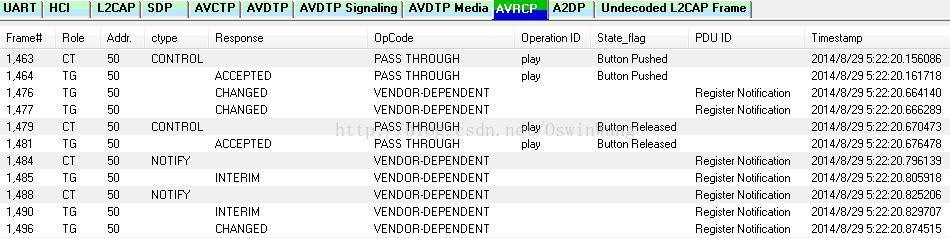

# *请确认索引缺失文件*



# BT Control Camera

BT Control Camera

# 参考文档

* [蓝牙自拍杆原理学习](https://blog.csdn.net/sinat_20059415/article/details/80777813)
* [【BLE】HID设备的实现（蓝牙自拍杆、蓝牙键盘、蓝牙鼠标、HID复合设备）](https://blog.csdn.net/qq_34254642/article/details/126672201)
* [android bt蓝牙耳机AVRCP按键分析](https://blog.csdn.net/BlackEagle215/article/details/79033781)
* [蓝牙音乐之AVRCP常用指令介绍](https://blog.csdn.net/weixin_44260005/article/details/108274193?spm=1001.2101.3001.6650.1&utm_medium=distribute.pc_relevant.none-task-blog-2%7Edefault%7EBlogCommendFromBaidu%7ERate-1-108274193-blog-79033781.235%5Ev31%5Epc_relevant_yljh&depth_1-utm_source=distribute.pc_relevant.none-task-blog-2%7Edefault%7EBlogCommendFromBaidu%7ERate-1-108274193-blog-79033781.235%5Ev31%5Epc_relevant_yljh&utm_relevant_index=2)

# 问题描述

* 测试反馈“连接蓝牙自拍杆点击自拍杆拍照键无法拍照“

# 问题分析

自拍杆原理是发送音量加减按键进行拍照，所以这里需要确认设备是否有收到音量按键。
```
adb shell getevent -l 
/dev/input/event10: EV_KEY       KEY_VOLUMEUP         DOWN                
/dev/input/event10: EV_SYN       SYN_REPORT           00000000            
/dev/input/event10: EV_MSC       MSC_SCAN             000c00e9            
/dev/input/event10: EV_KEY       KEY_VOLUMEUP         UP                  
/dev/input/event10: EV_SYN       SYN_REPORT           00000000            
/dev/input/event4: EV_ABS       ABS_DISTANCE         00000000            
/dev/input/event4: EV_SYN       SYN_REPORT           00000000            
/dev/input/event3: EV_ABS       ABS_DISTANCE         00000001            
/dev/input/event4: EV_ABS       ABS_DISTANCE         00000001            
/dev/input/event3: EV_SYN       SYN_REPORT           00000000            
/dev/input/event4: EV_SYN       SYN_REPORT           00000000  
```
如上设备有收到正常的事件，则需要确认camera是否有设置音量按键可以响应音量加减按键拍照。


简单说一下发送命令的处理过程，主要分为两步，按键按下发送一个Pass though命令，按键弹起的时候，会再次发送一个Pass though命令，第一个命令的State_flag为Button Pushed，第二个命令的state_flag为Button Released。每个命令都需要对方的回应，如果接受，则会回应Accepted,否则返回Rejected。下面就以蓝牙耳机的播放键为例子来说明一下。


而我们过滤日志跟HCI 日志中均为未对应的pass_thought 日志信息，所以判断耳机未有按键发送，所以不能支持蓝牙拍照


