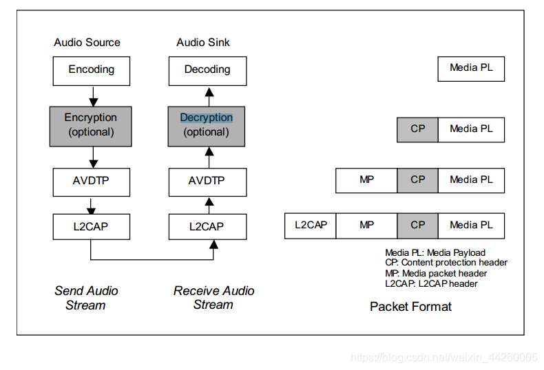
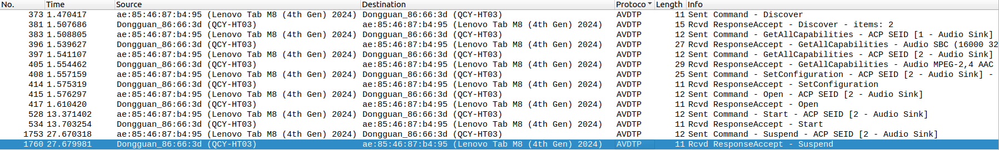
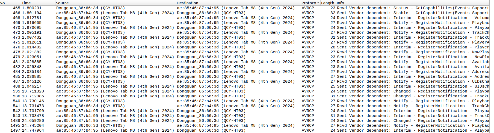
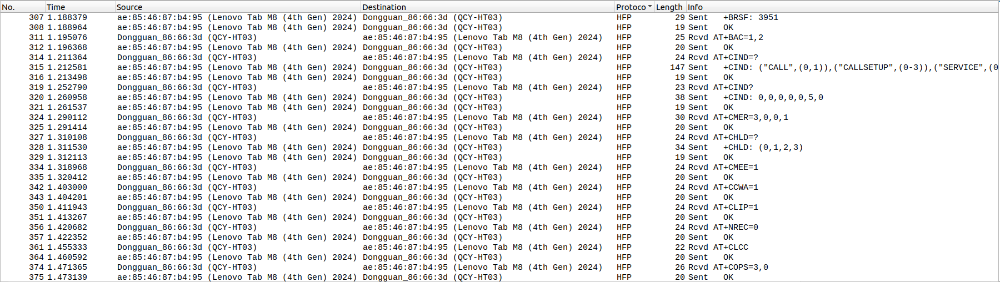
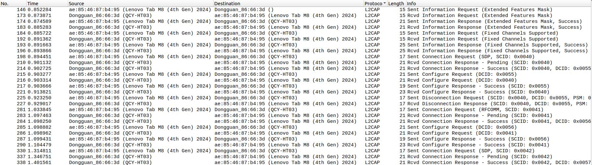
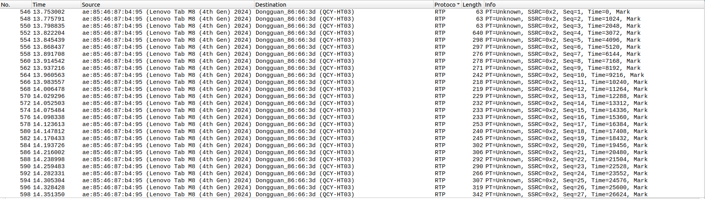

# *请确认索引缺失文件*

* [0002_bluetooth.md](0002_bluetooth.md)

# bluetooth a2dp

bluetooth a2dp

# 参考文档

* [android -- 蓝牙 bluetooth （五）接电话与听音乐](https://blog.csdn.net/baimy1985/article/details/9275559)
* [蓝牙音乐之A2DP](https://blog.csdn.net/weixin_44260005/article/details/107225738)
* [蓝牙音乐之A2DP音频流](https://blog.csdn.net/weixin_44260005/article/details/107391323)
* [A2DP音频流在安卓系统中的实现](https://blog.csdn.net/weixin_44260005/article/details/107616222)
* [0002_bluetooth.md](0002_bluetooth.md)


# a2dp 简介

Advanced Audio Distribution Profile，高级音频分发协议的简写，在这里大家需要区分开高级音频和蓝牙音频，蓝牙音频一般指传输于蓝牙SCO链路上的音频，也就是蓝牙电话；而高级音频指的传输于蓝牙ACL链路上的高质量音频，即为蓝牙音乐的媒体音频

* ACL(AsynchronousConnectionless): ACL主要用于分组数据传送
 ACL链路就是定向发送数据包，它既支持对称连接，也支持不对称连接（既可以一对一，也可以一对多）。主要用于：主单元与网中的所有从单元之间实现一点多址的连接方式
 1.主设备负责控制链路带宽，并决定微微网中的每个从设备可以占用多少带宽和连接的对称性。从设备只有被选中时才能传送数据。ACL链路也支持接收主设备发给微微网中所有从设备的广播消息。
 2.ACL 链接提供在主单元与所网中活动从单元的分组交换链接，异步和等时两种服务方式均可采用。在主―从之间，若仅是单个ACL 链接存在时，对大多数ACL 分组来说，分组重传是为确保数据的完整性而设立。
 3.在从―主时隙里，当且仅当先前的主―从时隙已被编址，则从单元允许返回一个ACL 分组。如果在分组头的从单元地址解码失败，它就不允许传输。
 4.ACL 分组未编址作为广播分组的指定从单元且各从单元可读分组。如果在ACL 链接上没有传输数据及没有轮询申请，那么在ACL 链接上就不存在发生传输过程


* SCO(Synchronous Connection Oriented)：SCO主要用于同步话音传送

SCO连接为对称连接，利用保留时隙传送数据包。它主要用于：主单元和从单元之间实现点到点链接。连接建立后，主设备和从设备可以不被选中就发送SCO数据包
1.SCO数据包既可以传送话音，也可以传送数据，但在传送数据时，只用于重发被损坏的那部分的数据;
2.SCO主要用来传输对时间要求很高的数据通信;
3.SCO 链接由主单元发送SCO 建立消息，经链接管理（LM）协议来确立。该消息分组含定时参数（如SCO 间隔Tsco 和规定保留时隙补偿Dsco）等。

# a2dp 数据传输

* 音频流从SRC到SNK中间经历的步骤很多，比如MP3、PCM、编码、加密（可选）、数据封装、传输、数据解析、解密（可选）、解码、PCM等等步骤：


A2DP连接过程中涉及到多个AVDTP交互过程，我们已经知道由于蓝牙音乐音频流的单向流动性从而决定了SRC和SNK这两种角色，而AVDTP的交互过程中也涉及到两种角色：INT + ACP，简单理解就是过程的发起者为INT，该过程的接收应答者则是ACP。由于A2DP连接的两个设备在连接之初由于其功能已经被应用层定义好，所以SRC、SNK的角色已被确定，而INT、ACP却是根据过程的启动而定，因此某一个蓝牙设备可能是INT也可能是ACP。

* AVDTP：全称为 AUDIO/VIDEO DISTRIBUTION TRANSPORT PROTOCOL，该协议定义了A/V流协商、建立和传输的过程，还指定了在这些设备之间交换的消息格式，以便在A/V分布应用程序中传输它们的音视频流。

* AVDTP常见交互命令
的基本功能信息
3. SET_CONFIGURATION：设置本次连接的配置（基于双方支持的编码方式，选取最优的编码方式）
4. OPEN：成功配置后，建立A2DP连接打开音频流

# HCI 日志分析

* [0019_BT_A2DP_HCI.cfa](refers/0019_BT_A2DP_HCI.cfa)

按协议来过滤来分析hci 日志：
如上的HCI日志包含：
AVDTP：


AVRCP：


HFP:


L2CAP 全称是逻辑链路控制与适配层，为两个通信的蓝牙设备提供一个端到端的通道:


RTP 音频数据传输：


# a2dp

这里以BondStateMachine为例进行代码跟踪，其他的回调也是类似
```
* packages/modules/Bluetooth/android/app/src/com/android/bluetooth/btservice/AdapterService.java 
  ├── classInitNative();
  │   └── packages/modules/Bluetooth/android/app/jni/com_android_bluetooth_btservice_AdapterService.cpp
  │       ├── method_stateChangeCallback = env->GetMethodID(jniCallbackClass, "stateChangeCallback", "(I)V");
  │       ├── method_deviceFoundCallback = env->GetMethodID(jniCallbackClass, "deviceFoundCallback", "([B)V");
  │       ├── method_pinRequestCallback = env->GetMethodID(jniCallbackClass, "pinRequestCallback", "([B[BIZ)V");
  │       ├── method_sspRequestCallback = env->GetMethodID(jniCallbackClass, "sspRequestCallback", "([B[BIII)V");
  │       └── method_bondStateChangeCallback = env->GetMethodID(jniCallbackClass, "bondStateChangeCallback", "(I[BII)V");
  └── public void onCreate()
      ├── mJniCallbacks = new JniCallbacks(this, mAdapterProperties);
      └── initNative(mUserManager.isGuestUser(), isCommonCriteriaMode(), configCompareResult, getInitFlags(), isAtvDevice, getApplicationInfo().dataDir);
          └── int ret = sBluetoothInterface->init(&sBluetoothCallbacks, isGuest == JNI_TRUE ? 1 : 0,isCommonCriteriaMode == JNI_TRUE ? 1 : 0, configCompareResult, flags,isAtvDevice == JNI_TRUE ? 1 : 0, user_data_directory);//这里将回调函数传入
              └── static bt_callbacks_t sBluetoothCallbacks = {sizeof(sBluetoothCallbacks),adapter_state_change_callback,adapter_properties_callback,remote_device_properties_callback,device_found_callback,discovery_state_changed_callback,pin_request_callback,ssp_request_callback,bond_state_changed_callback,address_consolidate_callback,acl_state_changed_callback,callback_thread_event,dut_mode_recv_callback,le_test_mode_recv_callback,energy_info_recv_callback,link_quality_report_callback,generate_local_oob_data_callback,switch_buffer_size_callback,switch_codec_callback};
                  └── static void bond_state_changed_callback(bt_status_t status, RawAddress* bd_addr, bt_bond_state_t state,int fail_reason) 
                      └── sCallbackEnv->CallVoidMethod(sJniCallbacksObj, method_bondStateChangeCallback,(jint)status, addr.get(), (jint)state,(jint)fail_reason);
                          └── packages/modules/Bluetooth/android/app/src/com/android/bluetooth/btservice/JniCallbacks.java
                              └── void bondStateChangeCallback(int status, byte[] address, int newState, int hciReason)
                                  └── mBondStateMachine.bondStateChangeCallback(status, address, newState, hciReason);
                                      └── packages/modules/Bluetooth/android/app/src/com/android/bluetooth/btservice/BondStateMachine.java
                                          └── void bondStateChangeCallback(int status, byte[] address, int newState, int hciReason) 
                                              ├── Message msg = obtainMessage(BONDING_STATE_CHANGE);
                                              └── sendMessage(msg);
                                                  └── sendIntent(dev, newState, reason, false);
                                                      └── packages/modules/Bluetooth/android/app/src/com/android/bluetooth/a2dp/A2dpService.java
                                                          └── private class BondStateChangedReceiver extends BroadcastReceiver 
                                                              └── bondStateChanged(device, state)
                                                                  └── void bondStateChanged(BluetoothDevice device, int bondState)
                                                                      └──  if (bondState != BluetoothDevice.BOND_NONE) return; //到这里最终好像也没处理什么
```

a2dp connect
```
* packages/modules/Bluetooth/android/app/src/com/android/bluetooth/a2dp/A2dpStateMachine.java
  ├── if (!mA2dpNativeInterface.connectA2dp(mDevice))
  │   └── packages/modules/Bluetooth/android/app/src/com/android/bluetooth/a2dp/A2dpNativeInterface.java
  │       └── public boolean connectA2dp(BluetoothDevice device)
  │           └── return connectA2dpNative(getByteAddress(device))
  │               └── packages/modules/Bluetooth/android/app/jni/com_android_bluetooth_a2dp.cpp 
  │                   └── static jboolean connectA2dpNative(JNIEnv* env, jobject object, jbyteArray address)
  │                       └── bt_status_t status = sBluetoothA2dpInterface->connect(bd_addr);
  │                           ├── sBluetoothA2dpInterface = (btav_source_interface_t*)btInf->get_profile_interface(BT_PROFILE_ADVANCED_AUDIO_ID)// initNative
  │                           │   └── packages/modules/Bluetooth/system/service/hal/bluetooth_interface.cc
  │                           │       └── static const void* get_profile_interface(const char* profile_id) 
  │                           │           ├── if (is_profile(profile_id, BT_PROFILE_ADVANCED_AUDIO_ID))
  │                           │           └── return btif_av_get_src_interface();
  │                           │               └── packages/modules/Bluetooth/system/btif/src/btif_av.cc
  │                           │                   └── const btav_source_interface_t* btif_av_get_src_interface(void) 
  │                           │                       └── return &bt_av_src_interface;
  │                           │                           └──  static const btav_source_interface_t bt_av_src_interface = {sizeof(btav_source_interface_t),init_src, src_connect_sink,src_disconnect_sink, src_set_silence_sink,src_set_active_sink,codec_config_src,cleanup_src, };
  │                           └── packages/modules/Bluetooth/system/btif/src/btif_av.cc
  │                               └── static bt_status_t src_connect_sink(const RawAddress& peer_address)
  │                                   └── return btif_queue_connect(UUID_SERVCLASS_AUDIO_SOURCE, &peer_address_copy,connect_int);     
  │                                       └── packages/modules/Bluetooth/system/btif/src/btif_profile_queue.cc 
  │                                           └── bt_status_t btif_queue_connect(uint16_t uuid, const RawAddress* bda, btif_connect_cb_t connect_cb)     
  │                                               └── return do_in_jni_thread(FROM_HERE,base::Bind(&queue_int_add, uuid, *bda, connect_cb));   
  │                                                   └── static void queue_int_add(uint16_t uuid, const RawAddress& bda, btif_connect_cb_t connect_cb)   
  │                                                       ├── connect_queue.push_back(param);  
  │                                                       └── btif_queue_connect_next(); 
  └── if (mA2dpService.okToConnect(mDevice, true)) 
      └── packages/modules/Bluetooth/android/app/src/com/android/bluetooth/a2dp/A2dpService.java 
          └── connectionPolicy = getConnectionPolicy(device);
```
# 连接状态改变，同audio 部分挂钩
```
* packages/modules/Bluetooth/android/app/src/com/android/bluetooth/btservice/JniCallbacks.java
  └── void bondStateChangeCallback(int status, byte[] address, int newState, int hciReason)
      └── mBondStateMachine.bondStateChangeCallback(status, address, newState, hciReason);
          └── packages/modules/Bluetooth/android/app/src/com/android/bluetooth/btservice/BondStateMachine.java
              └── void bondStateChangeCallback(int status, byte[] address, int newState, int hciReason) 
                  ├── Message msg = obtainMessage(BONDING_STATE_CHANGE);
                  └── sendMessage(msg);
                      └── sendIntent(dev, newState, reason, false);
                          └── packages/modules/Bluetooth/android/app/src/com/android/bluetooth/a2dp/A2dpService.java
                              └── private class ConnectionStateChangedReceiver extends BroadcastReceiver
                                  └── connectionStateChanged(device, fromState, toState); 
                                      └── setActiveDevice(device);
                                          ├── final LeAudioService leAudioService = mFactory.getLeAudioService(); 
                                          ├── updateAndBroadcastActiveDevice(device);
                                          │   ├── Intent intent = new Intent(BluetoothA2dp.ACTION_ACTIVE_DEVICE_CHANGED);
                                          │   └── sendBroadcast(intent, BLUETOOTH_CONNECT, Utils.getTempAllowlistBroadcastOptions());
                                          ├── if (!mA2dpNativeInterface.setActiveDevice(device)) 
                                          │   └── static jboolean setActiveDeviceNative(JNIEnv* env, jobject object, jbyteArray address)
                                          │       └── bt_status_t status = sBluetoothA2dpInterface->set_active_device(bd_addr);
                                          │           └── packages/modules/Bluetooth/system/btif/src/btif_av.cc 
                                          │               └── static bt_status_t src_set_active_sink(const RawAddress& peer_address) 
                                          │                   └── bt_status_t status = do_in_main_thread(FROM_HERE, base::BindOnce(&set_active_peer_int,AVDT_TSEP_SNK, peer_address, std::move(peer_ready_promise)));
                                          └── mAudioManager.handleBluetoothActiveDeviceChanged(newActiveDevice,ull,BluetoothProfileConnectionInfo.createA2dpInfo(true,rememberedVolume));
                                              └── frameworks/base/media/java/android/media/AudioManager.java
                                                  └── service.handleBluetoothActiveDeviceChanged(newDevice, previousDevice, info);
```

# audio 数据获取

* 在device/mediatek/vendor/common/device.mk 中配置加载对应的蓝牙服务"android.hardware.bluetooth@1.1-service-mediatek",开机默认启动

```
vendor/mediatek/proprietary/hardware/connectivity/bluetooth/service/1.1/service.cpp
```

```
	Line 20815: 04-11 16:16:18.414282  8600  8632 I linls bt_hci_layer: hci_module_start_up: hci_module_start_up
	Line 20822: 04-11 16:16:18.415255  8600  8632 I linls bt_hci_layer: hci_module_start_up: hci_module_start_up starting async portion
	Line 21063: 04-11 16:16:18.535877  8600  8654 I linls bt_hci_layer: event_finish_startup: event_finish_startup
	Line 25215: 04-11 16:16:24.202980  8600  8632 I linls bt_hci_layer: hci_module_shut_down: hci_module_shut_down
	Line 26613: 04-11 16:16:30.128812  9041  9086 I linls bt_hci_layer: hci_module_start_up: hci_module_start_up
	Line 26620: 04-11 16:16:30.132481  9041  9086 I linls bt_hci_layer: hci_module_start_up: hci_module_start_up starting async portion
	Line 26718: 04-11 16:16:30.206425  9041  9141 I linls bt_hci_layer: event_finish_startup: event_finish_startup

    	Line 20827: 04-11 16:16:18.421862   671   671 I mtk.hal.bt@1.0-impl: BluetoothHci::initialize_1_1()
	Line 20834: 04-11 16:16:18.440699   671   717 W mtk.hal.bt@1.1-impl: Open: No pre-set Bluetooth Address!
	Line 20837: 04-11 16:16:18.441371   671   717 D mtk.hal.bt@1.1-impl: Open vendor library loaded
	Line 21027: 04-11 16:16:18.521842   671   717 W mtk.hal.bt-state-machine: handleMessage: transact to new state: On
	Line 21061: 04-11 16:16:18.535381   671  8661 D mtk.hal.bt@1.1-impl: OnFirmwareConfigured result: 0
	Line 21062: 04-11 16:16:18.535418   671  8661 I mtk.hal.bt@1.1-impl: Firmware configured in 0.046s
	Line 21066: 04-11 16:16:18.536601   671  8661 I mtk.hal.bt@1.1-impl: OnFirmwareConfigured: lpm_timeout_ms 5000
	Line 21068: 04-11 16:16:18.536683   671  8661 D mtk.hal.bt@1.1-impl: OnFirmwareConfigured Calling StartLowPowerWatchdog()
	Line 22888: 04-11 16:16:20.201784   671   671 D mtk.hal.bt@1.1-impl: BtHostDebugInfo
	Line 22895: 04-11 16:16:20.206093   671   671 D mtk.hal.bt@1.1-impl: BtHostDebugInfo
	Line 22900: 04-11 16:16:20.210762   671   671 D mtk.hal.bt@1.1-impl: BtHostDebugInfo
	Line 23632: 04-11 16:16:21.795576   671   719 D mtk.hal.bt@1.1-impl: BtHostDebugInfo
	Line 23642: 04-11 16:16:21.800527   671   719 D mtk.hal.bt@1.1-impl: BtHostDebugInfo
	Line 23650: 04-11 16:16:21.809775   671   719 D mtk.hal.bt@1.1-impl: BtHostDebugInfo
	Line 23885: 04-11 16:16:23.115065   671   719 D mtk.hal.bt@1.1-impl: BtHostDebugInfo
	Line 23887: 04-11 16:16:23.117379   671   719 D mtk.hal.bt@1.1-impl: BtHostDebugInfo
	Line 24772: 04-11 16:16:23.815385   671   719 D mtk.hal.bt@1.1-impl: BtHostDebugInfo
	Line 24774: 04-11 16:16:23.817727   671   719 D mtk.hal.bt@1.1-impl: BtHostDebugInfo
	Line 24818: 04-11 16:16:23.926166   671   719 D mtk.hal.bt@1.1-impl: BtHostDebugInfo
	Line 25003: 04-11 16:16:24.006461   671   719 D mtk.hal.bt@1.1-impl: BtHostDebugInfo
	Line 25013: 04-11 16:16:24.010460   671   719 D mtk.hal.bt@1.1-impl: BtHostDebugInfo
	Line 25217: 04-11 16:16:24.203665   671   719 I mtk.hal.bt@1.0-impl: BluetoothHci::close()
	Line 25294: 04-11 16:16:24.235445   671   717 W mtk.hal.bt-state-machine: handleMessage: transact to new state: Off
	Line 26627: 04-11 16:16:30.136961   671   719 I mtk.hal.bt@1.0-impl: BluetoothHci::initialize_1_1()
	Line 26628: 04-11 16:16:30.140027   671   717 W mtk.hal.bt@1.1-impl: Open: No pre-set Bluetooth Address!
	Line 26630: 04-11 16:16:30.140480   671   717 D mtk.hal.bt@1.1-impl: Open vendor library loaded
	Line 26684: 04-11 16:16:30.197803   671   717 W mtk.hal.bt-state-machine: handleMessage: transact to new state: On
	Line 26716: 04-11 16:16:30.206068   671  9146 D mtk.hal.bt@1.1-impl: OnFirmwareConfigured result: 0
	Line 26717: 04-11 16:16:30.206103   671  9146 I mtk.hal.bt@1.1-impl: Firmware configured in 0.018s
	Line 26720: 04-11 16:16:30.206502   671  9146 I mtk.hal.bt@1.1-impl: OnFirmwareConfigured: lpm_timeout_ms 5000
	Line 26722: 04-11 16:16:30.206521   671  9146 D mtk.hal.bt@1.1-impl: OnFirmwareConfigured Calling StartLowPowerWatchdog()
	Line 27208: 04-11 16:16:30.719950   671   671 D mtk.hal.bt@1.1-impl: BtHostDebugInfo
	Line 27223: 04-11 16:16:30.724096   671   671 D mtk.hal.bt@1.1-impl: BtHostDebugInfo
	Line 27242: 04-11 16:16:30.728765   671   671 D mtk.hal.bt@1.1-impl: BtHostDebugInfo
	Line 27698: 04-11 16:16:31.261802   671   671 D mtk.hal.bt@1.1-impl: BtHostDebugInfo
	Line 27701: 04-11 16:16:31.263929   671   671 D mtk.hal.bt@1.1-impl: BtHostDebugInfo
	Line 27705: 04-11 16:16:31.268590   671   671 D mtk.hal.bt@1.1-impl: BtHostDebugInfo
	Line 29503: 04-11 16:16:37.198616   671   671 D mtk.hal.bt@1.1-impl: BtHostDebugInfo
	Line 41291: 04-11 16:16:44.567637   671   719 D mtk.hal.bt@1.1-impl: BtHostDebugInfo
	Line 41309: 04-11 16:16:44.569904   671   719 D mtk.hal.bt@1.1-impl: BtHostDebugInfo
	Line 41351: 04-11 16:16:44.574278   671   719 D mtk.hal.bt@1.1-impl: BtHostDebugInfo
	Line 44257: 04-11 16:16:50.430324   671   719 D mtk.hal.bt@1.1-impl: BtHostDebugInfo
	Line 50961: 04-11 16:21:05.244834   671   719 D mtk.hal.bt@1.1-impl: BtHostDebugInfo
	Line 50963: 04-11 16:21:05.249917   671   719 D mtk.hal.bt@1.1-impl: BtHostDebugInfo
	Line 51276: 04-11 16:21:07.090979   671   719 D mtk.hal.bt@1.1-impl: BtHostDebugInfo
	Line 51407: 04-11 16:21:07.729379   671   719 D mtk.hal.bt@1.1-impl: BtHostDebugInfo
	Line 51410: 04-11 16:21:07.731420   671   719 D mtk.hal.bt@1.1-impl: BtHostDebugInfo
	Line 51414: 04-11 16:21:07.747410   671   719 D mtk.hal.bt@1.1-impl: BtHostDebugInfo
	Line 51416: 04-11 16:21:07.749494   671   719 D mtk.hal.bt@1.1-impl: BtHostDebugInfo
	Line 52045: 04-11 16:21:17.072284   671   719 D mtk.hal.bt@1.1-impl: BtHostDebugInfo
	Line 52047: 04-11 16:21:17.075517   671   719 D mtk.hal.bt@1.1-impl: BtHostDebugInfo
	Line 52106: 04-11 16:21:19.904147   671   719 D mtk.hal.bt@1.1-impl: BtHostDebugInfo
	Line 52119: 04-11 16:21:21.009704   671   719 D mtk.hal.bt@1.1-impl: BtHostDebugInfo
	Line 52173: 04-11 16:21:24.816780   671   719 D mtk.hal.bt@1.1-impl: BtHostDebugInfo
	Line 52211: 04-11 16:21:25.414208   671   719 D mtk.hal.bt@1.1-impl: BtHostDebugInfo
	Line 52319: 04-11 16:21:38.231390   671   719 D mtk.hal.bt@1.1-impl: BtHostDebugInfo
	Line 52325: 04-11 16:21:38.262197   671   719 D mtk.hal.bt@1.1-impl: BtHostDebugInfo
	Line 52327: 04-11 16:21:38.266512   671   719 D mtk.hal.bt@1.1-impl: BtHostDebugInfo
	Line 53153: 04-11 16:21:46.704457   671   719 D mtk.hal.bt@1.1-impl: BtHostDebugInfo
	Line 53155: 04-11 16:21:46.706564   671   719 D mtk.hal.bt@1.1-impl: BtHostDebugInfo
	Line 53200: 04-11 16:21:47.421447   671   719 D mtk.hal.bt@1.1-impl: BtHostDebugInfo
	Line 53202: 04-11 16:21:47.426197   671   719 D mtk.hal.bt@1.1-impl: BtHostDebugInfo
	Line 53232: 04-11 16:21:48.724687   671   719 D mtk.hal.bt@1.1-impl: BtHostDebugInfo
	Line 53243: 04-11 16:21:48.738748   671   671 D mtk.hal.bt@1.1-impl: BtHostDebugInfo
	Line 53247: 04-11 16:21:48.740356   671   671 D mtk.hal.bt@1.1-impl: BtHostDebugInfo
	Line 54626: 04-11 16:21:51.914841   671   671 D mtk.hal.bt@1.1-impl: BtHostDebugInfo
	Line 54628: 04-11 16:21:51.916859   671   671 D mtk.hal.bt@1.1-impl: BtHostDebugInfo
	Line 54639: 04-11 16:21:51.942043   671   671 D mtk.hal.bt@1.1-impl: BtHostDebugInfo
	Line 54643: 04-11 16:21:51.944325   671   671 D mtk.hal.bt@1.1-impl: BtHostDebugInfo
	Line 54692: 04-11 16:21:58.184149   671   671 D mtk.hal.bt@1.1-impl: BtHostDebugInfo
	Line 54694: 04-11 16:21:58.186285   671   671 D mtk.hal.bt@1.1-impl: BtHostDebugInfo
	Line 54966: 04-11 16:22:04.575597   671   671 D mtk.hal.bt@1.1-impl: BtHostDebugInfo
	Line 54969: 04-11 16:22:04.578499   671   671 D mtk.hal.bt@1.1-impl: BtHostDebugInfo
	Line 58362: 04-11 16:22:09.790204   671   671 D mtk.hal.bt@1.1-impl: BtHostDebugInfo
	Line 58364: 04-11 16:22:09.791033   671   671 D mtk.hal.bt@1.1-impl: BtHostDebugInfo
```
