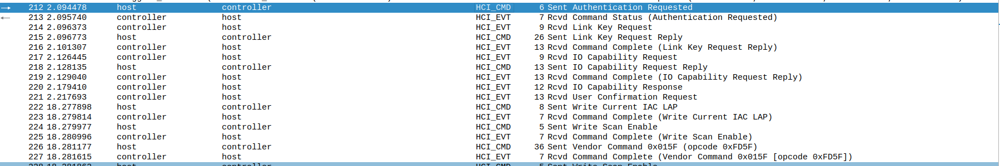

# reboot bt cannot auto connect

平板重启，蓝牙耳机不能自动连接

# 参考文档

# 日志分析
从日志看，在启动过程中密钥被删除了
```
05-20 03:03:15.068014  1250  1596 I bluetooth: system/bt/stack/rfcomm/rfc_mx_fsm.cc:79 rfc_mx_sm_execute: RFCOMM peer:xx:xx:xx:xx:66:3d event:6 state:idle
05-20 03:03:15.068088  1250  1596 I bt_btm_pm: system/bt/stack/acl/btm_pm.cc:245 BTM_SetPowerMode: Device is already in requested mode 0, interval: 0, max: 0, min: 0
05-20 03:03:15.082605   958  1379 E CountryCodeUtils: country code is null or empty
05-20 03:03:15.092003  1429  1429 D ControlsListingControllerImpl: Initializing
05-20 03:03:15.097784  1429  1568 D ControlsListingControllerImpl: Subscribing callback, service count: 0
05-20 03:03:15.099928  1250  1596 W bt_btm  : system/bt/main/bte_logmsg.cc:198 LogMsg: btm_io_capabilities_req: Incoming bond request, but 1c:52:16:86:66:3d is already bonded (removing)
05-20 03:03:15.099975  1250  1596 W bt_btm  : system/bt/main/bte_logmsg.cc:198 LogMsg: BTM_SecDeleteDevice FAILED: Cannot Delete when connection is active
05-20 03:03:15.099999  1250  1596 W bt_btif : system/bt/main/bte_logmsg.cc:198 LogMsg: Oops, can't find device 1c:52:16:86:66:3d
05-20 03:03:15.100117  1250  1596 I bt_btif_storage: system/bt/btif/src/btif_storage.cc:881 btif_storage_remove_bonded_device: Removing bonded device addr:xx:xx:xx:xx:66:3d
05-20 03:03:15.100133  1250  1596 I bt_btif_storage: system/bt/btif/src/btif_storage.cc:1208 btif_storage_remove_ble_bonding_keys: Removing bonding keys for bd addr:xx:xx:xx:xx:66:3d
05-20 03:03:15.100792  1250  1596 I bt_btif_config: system/bt/btif/src/btif_config.cc:138 btif_get_device_type: Device [xx:xx:xx:xx:66:3d] device type 3
05-20 03:03:15.100852  1250  1596 I bt_btif_dm: system/bt/btif/src/btif_dm.cc:416 get_cod: get_cod remote_cod = 0x00240418
05-20 03:03:15.100869  1250  1596 I bt_btif_dm: system/bt/btif/src/btif_dm.cc:499 bond_state_changed: Bond state changed to state=0 [0:none, 1:bonding, 2:bonded], prev_state=0, sdp_attempts = 0
05-20 03:03:15.100914  1250  1596 I bt_btif_config: system/bt/btif/src/btif_config.cc:138 btif_get_device_type: Device [xx:xx:xx:xx:66:3d] device type 3
05-20 03:03:15.101165  1250  1596 E bt_stack: [ERROR:bta_gattc_utils.cc(441)] bta_gattc_mark_bg_conn unable to find the bg connection mask for bd_addr=1c:52:16:86:66:3d
05-20 03:03:15.101313  1250  1596 I bt_bta_sys_main: system/bt/bta/sys/bta_sys_main.cc:99 bta_sys_event: Ignoring receipt of unregistered event id:HID Human interface device
```

从HCI 日志分析,在配对过程中，主芯片发起认证请求，连接成功后，蓝牙芯片发起重新认证请求


# MTK 分析

```
Dear Customer

	目前看来是对端key missing导致的需要重新认证加密的问题
	214	Event						HCI_Link_Key_Request									2023/6/3 2:43:28.668268	0x1c-52-16-86-66-3d		//固件层找host要key				
	215	Command	0x040b	Link Control	HCI_Link_Key_Request_Reply								2023/6/3 2:43:28.668709	0x1c-52-16-86-66-3d		//host回复有key	
	216	Event	0x040b	Link Control	HCI_Link_Key_Request_Reply	HCI_Command_Complete			2023/6/3 2:43:28.671006	0x1c-52-16-86-66-3d	Success							
	217	Event						HCI_IO_Capability_Request									2023/6/3 2:43:28.717014						//对端告诉固件层没有key, 需要重新计算
	218	Command	0x042b	Link Control	HCI_IO_Capability_Request_Reply							2023/6/3 2:43:28.718811	0x1c-52-16-86-66-3d	
	219	Event	0x042b	Link Control	HCI_IO_Capability_Request_Reply	HCI_Command_Complete		2023/6/3 2:43:28.719756	0x1c-52-16-86-66-3d	Success	
	220	Event						HCI_IO_Capability_Response								2023/6/3 2:43:28.748447	
	221	Event						HCI_User_Confirmation_Request								2023/6/3 2:43:28.786739						//需要双方点击弹窗确认认证配对

请问这个问题是必现的吗？在DUT重启时耳机是否和其他设备连上了？其他耳机和DUT能否打出这个问题？
```

# 总结

蓝牙MAC地址为随机地址，可能设备被格式化过，后面未再烧录MAC地址，所以每次开机过程中密钥需要重新生成


