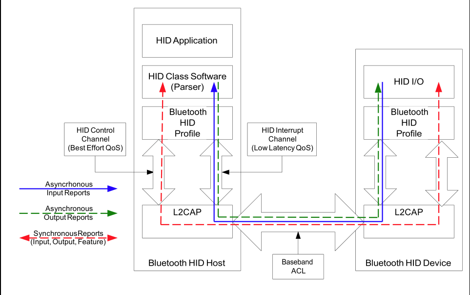
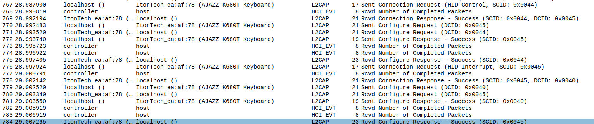
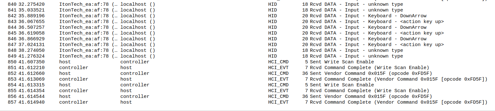

# 蓝牙鼠标键盘架构

蓝牙鼠标键盘架构

# menu

* [1 参考文档](#1-参考文档)
* [2 简述](#2-简述)
* [3 HID 设备交互](#3-HID-设备交互)
  * [3.1 设备连接](#31-设备连接)
    * [3.1.1 HCI日志连接过程](#311-HCI日志连接过程)
    * [3.1.2 连接过程代码堆栈](#312-连接过程代码堆栈)
  * [3.2 按键交互](#32-按键交互)
    * [3.2.1 HCI按键事件发送](#321-HCI按键事件发送)
    * [3.2.2 按键传递代码堆栈](#322-按键传递代码堆栈)

# 1 参考文档

* [Android Bluetooth架构](https://blog.csdn.net/u012408797/article/details/109766608)
* [蓝牙人机接口设备协议（HID）概念以及封包格式介绍](https://blog.csdn.net/XiaoXiaoPengBo/article/details/111238671)
* [BLE HID简介](https://blog.csdn.net/pig10086/article/details/71248971?spm=1001.2101.3001.6650.1&utm_medium=distribute.pc_relevant.none-task-blog-2%7Edefault%7EBlogCommendFromBaidu%7ERate-1-71248971-blog-111238671.235%5Ev38%5Epc_relevant_yljh&depth_1-utm_source=distribute.pc_relevant.none-task-blog-2%7Edefault%7EBlogCommendFromBaidu%7ERate-1-71248971-blog-111238671.235%5Ev38%5Epc_relevant_yljh&utm_relevant_index=2)

# 2 简述

HID设备，即人机交互设备，常见的有鼠标，键盘，游戏手柄，等等。  
HID 设备分为host和device, host 相当于pc主机，而device相当于鼠标、键盘这些外设  
HID 设备间的通信框架如下  


# 3 HID 设备交互

## 3.1 设备连接

### 3.1.1 HCI日志连接过程



### 3.1.2 连接过程代码堆栈

```
* mssi/vendor/mediatek/proprietary/packages/apps/MtkSettings/src/com/android/settings/bluetooth/BluetoothPairingController.java
  └── private void onPair(String passkey)
      └── mDevice.setPin(passkey);
          └── mssi/vendor/mediatek/proprietary/packages/modules/Bluetooth/framework/java/android/bluetooth/BluetoothDevice.java 
              └── public boolean setPin(byte[] pin)
                  └── service.setPin(this, true, pin.length, pin, mAttributionSource, recv);
                      └── mssi/vendor/mediatek/proprietary/packages/modules/Bluetooth/android/app/src/com/android/bluetooth/btservice/AdapterService.java
                          └── public void setPin(BluetoothDevice device, boolean accept, int len, byte[] pinCode, AttributionSource source, SynchronousResultReceiver receiver)
                              └── receiver.send(setPin(device, accept, len, pinCode, source));
                                  └── private boolean setPin(BluetoothDevice device, boolean accept, int len, byte[] pinCode, AttributionSource attributionSource)
                                      └── service.pinReplyNative(getBytesFromAddress(device.getAddress()), accept, len, pinCode);
                                          └── mssi/vendor/mediatek/proprietary/packages/modules/Bluetooth/android/app/jni/com_android_bluetooth_btservice_AdapterService.cpp
                                              └── static jboolean pinReplyNative(JNIEnv* env, jobject obj, jbyteArray address, jboolean accept, jint len, jbyteArray pinArray)
                                                  └── int ret = sBluetoothInterface->pin_reply((RawAddress*)addr, accept, len, (bt_pin_code_t*)pinPtr);
                                                      └── mssi/vendor/mediatek/proprietary/packages/modules/Bluetooth/system/btif/src/bluetooth.cc
                                                          └── static int pin_reply(const RawAddress* bd_addr, uint8_t accept, uint8_t pin_len,bt_pin_code_t* pin_code)
                                                              └── mssi/vendor/mediatek/proprietary/packages/modules/Bluetooth/system/btif/src/btif_dm.cc
                                                                  └── void btif_dm_pin_reply(const RawAddress bd_addr, uint8_t accept, uint8_t pin_len, bt_pin_code_t pin_code)
                                                                      ├── BTA_DmBlePasskeyReply(bd_addr, accept, passkey);
                                                                      └── BTA_DmPinReply(bd_addr, accept, pin_len, pin_code.pin);
                                                                          └── do_in_main_thread(FROM_HERE, base::Bind(bta_dm_pin_reply, base::Passed(&msg)));
                                                                              └── mssi/vendor/mediatek/proprietary/packages/modules/Bluetooth/system/bta/dm/bta_dm_act.cc
                                                                                  └── void bta_dm_pin_reply(std::unique_ptr<tBTA_DM_API_PIN_REPLY> msg) 
                                                                                      ├── BTM_PINCodeReply(msg->bd_addr, BTM_SUCCESS, msg->pin_len, msg->p_pin);
                                                                                      └── BTM_PINCodeReply(msg->bd_addr, BTM_NOT_AUTHORIZED, 0, NULL);
```


## 3.2 按键交互

### 3.2.1 HCI按键事件发送



### 3.2.2 按键传递代码堆栈

```
* mssi/vendor/mediatek/proprietary/packages/modules/Bluetooth/system/stack/l2cap/l2c_csm.cc
  * void l2c_csm_execute(tL2C_CCB* p_ccb, tL2CEVT event, void* p_data)
    * l2c_csm_open(p_ccb, event, p_data);
      * (*p_ccb->p_rcb->api.pL2CA_DataInd_Cb)(p_ccb->local_cid,(BT_HDR*)p_data); 
        * mssi/vendor/mediatek/proprietary/packages/modules/Bluetooth/system/stack/hid/hidh_conn.cc 
          * .pL2CA_DataInd_Cb = hidh_l2cif_data_ind,
            * static void hidh_l2cif_data_ind(uint16_t l2cap_cid, BT_HDR* p_msg) 
              *  evt = (hh_cb.devices[dhandle].conn.intr_cid == l2cap_cid)? HID_HDEV_EVT_INTR_DATA: HID_HDEV_EVT_CTRL_DATA;
              * hh_cb.callback(dhandle, hh_cb.devices[dhandle].addr, evt, rep_type, p_msg);
```


