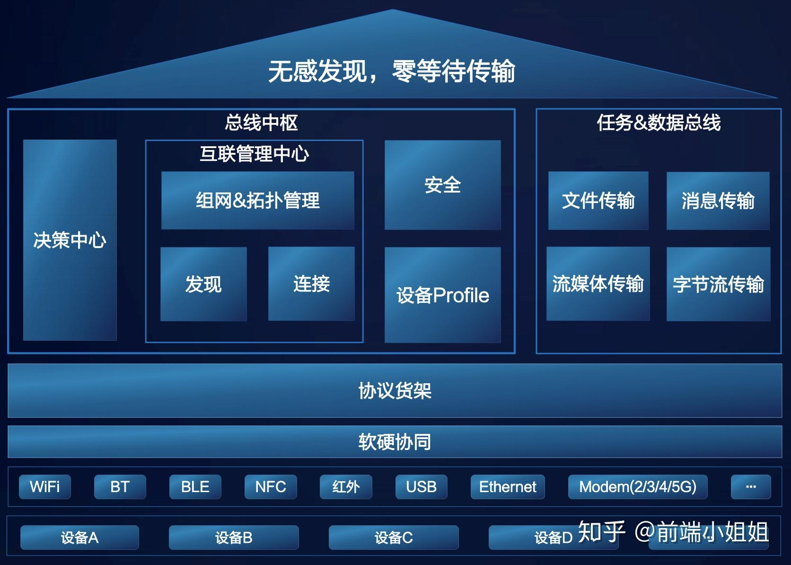

# 极简协议

华为极简协议简介

# 参考文档
* [极简协议发力 EMUI 10.1为用户带来高效简洁极速传输体验](https://cloud.tencent.com/developer/news/607166)
* [HarmonyOS 分布式软总线： 构建低时延、高带宽的多设备虚拟网络](https://ost.51cto.com/posts/825)
* [【今晚公开课】HarmonyOS分布式技术实现的影音多设备实时共享](https://ost.51cto.com/posts/2198)
* [分布式软总线和微内核，技术解答为什么鸿蒙系统和安卓为什么这么像？](https://zhuanlan.zhihu.com/p/400755201)
* [深度解读设备的“万能语言”鸿蒙的分布式软总线能力](https://bbs.huaweicloud.com/blogs/detail/239194)
* [深度解读设备的“万能语言”鸿蒙的分布式软总线能力](https://bbs.huaweicloud.com/blogs/detail/239194)

极简传输协议"简称极简协议，是通过将四层协议栈精简为一层，以及报文简化、包头简化、交互简化，基于应用场景的缓冲机制等方式，提升有效的传输负荷、突破 TCP/IP 协议的掣肘，带来传输效率与速度的极大提升的通信传输黑科技，是华为分布式软总线的核心技术 。

# HarmonyOS分布式软总线

全场景设备间可以基于软总线完成设备虚拟化、跨设备服务调用、多屏协同、文件分享等分布式业务。 
分布式软总线的典型特征:   
* 分布式软总线的典型特征
* 高带宽
* 低时延
* 高可靠
* 开放/标准

极简协议将网络七层协议：应用、表示、会话、传输、网络、数据链路、物理缩减为应用、极简协议、数据链路、物理层

鸿蒙分布式软总线致力于实现近场设备间统一的分布式通信能力，提供不区分链路的设备发现和传输接口，具备快速发现并连接设备，高效分发任务和传输数据。
分布式软总线提出了异构网络组网，自动构建一个逻辑全连接网络，以解决设备间不同协议交互的问题。设备上线后会向网络层注册，同时网络层会与设备建立通道连接，实时检测设备的变换。网络层负责管理设备的上线、下线变换，设备间可以监听自己感兴趣的设备，设备上线后可以立即与其建立连接，实现零等待体验

* 多设备间数据传输 
  提供统一的基于Session的认证、传输功能，上层业务系统可以通过sessionId收发数据或获取其相关基本属性，实现业务消息、流、控制指令等操作交互

