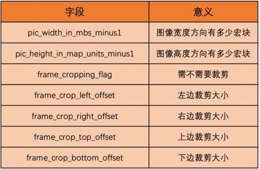
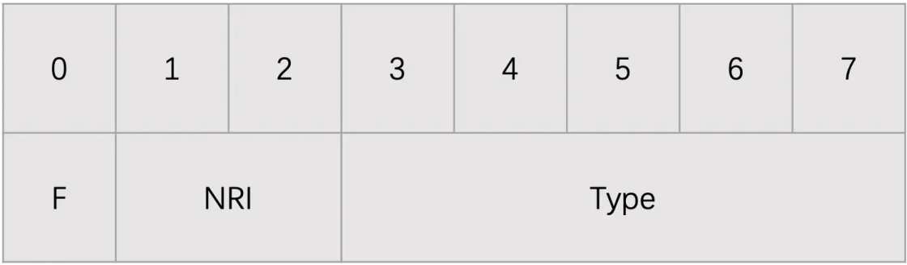

# h264编码

h264 编码

# 参考文档
* [H.264编解码原理浅析](https://zhuanlan.zhihu.com/p/158392753)
* [多媒体数据压缩与编码技术](https://wenku.baidu.com/view/b4dcc68c9dc3d5bbfd0a79563c1ec5da51e2d672.html?_wkts_=1702972386532)
* [多媒体技术](https://wenku.baidu.com/view/60c4f40e31126edb6e1a100d?aggId=b4dcc68c9dc3d5bbfd0a79563c1ec5da51e2d672&fr=catalogMain_text_ernie_recall_backup_new%3Awk_recommend_main3&_wkts_=1703060843451)

# 数据压缩的目的

  节省存储空间、传输时间、信号频带或发送能量等

# 压缩原理

  删除冗余的或者不相关的信息，减少数据量的技术  
  数据压缩技术利用了数据固有的冗余性和不相干性，将一个大的数据文件转换成较小的文件  
  由压缩的文件可以在以后需要的时候以精确的或近似的方式将源文件恢复出来  

# 数据冗余类型

* 空间冗余
* 时间冗余
* 信息熵冗余
* 视觉冗余
* 听觉冗余
* 其它冗余  
    结构冗余  
    知识冗余  
* 图像区域的相同性冗余
* 纹理的统计冗余

# 无损压缩

利用数据的统计冗余进行压缩，可完全恢复原始数据而不引入任何失真，但压缩率受到统计冗余度的理论限制一般为2：1到5：1

# 视频编码原因

* 空间冗余 比如说将一帧图像划分成一个个 16x16 的块之后，相邻的块很多时候都有比较明显的相似性，这种就叫空间冗余。 
* 时间冗余 一个帧率为 25fps 的视频中前后两帧图像相差只有 40ms，两张图像的变化是比较小的，相似性很高，这种叫做时间冗余   
* 视觉冗余 我们的眼睛是有视觉灵敏度这个东西的。人的眼睛对于图像中高频信息的敏感度是小于低频信息的。有的时候去除图像中的一些高频信息，人眼看起来跟不去除高频信息差别不大，这种叫做视觉冗余。 
* 信息熵冗余 我们一般会使用 Zip 等压缩工具去压缩文件，将文件大小减小，这个对于图像来说也是可以做的，这种冗余叫做信息熵冗余。

视频编码就是通过减少上述 4 种冗余来达到压缩视频的目的。

# 视频压缩

* 帧内预测压缩，解决的是空间数据冗余问题
* 帧间预测压缩（运动估计与补偿），解决的是时域数据冗徐问题。
* 

# VCL & NAL

VCL（Video Coding Layer） 包括核心压缩引擎和块、宏块和片的语法级别定义，设计目标是尽可能地独立于网络进行高效的编码
NAL（Network Abstraction Layer）负责将 VCL 产生的比特字符串适配到各种各样的网络和多元环境中，覆盖了所有片级以上的语法级别

# 视频编码

视频编码分为五个模块（如下图），帧类型分析、帧内/帧间预测、变换+量化、滤波、熵编码。

* 帧类型分析
  
* 帧内/帧间预测
  
  帧间预测的话，编码器会以当前块空域相邻的位置，在时域参考帧上的同为块，作为起始点进行规则搜索，直到搜索完找到能够节省码流最大的块作为帧间预测块，当前块到预测块的位移称为运动矢量，这样我们在码流中传输运动矢量、帧间预测模式标志位、残差就可以

* 变换+量化

* 滤波

# slice 

Slice 其实是为了并行编码设计的。我们可以将一帧图像划分成几个 Slice，并且 Slice 之间相互独立、互不依赖、独立编码。一个 Slice 又包含整数个宏块。图像内的层次结构就是一帧图像可以划分成一个或多个 Slice，而一个 Slice 包含多个宏块，且一个宏块又可以划分成多个不同尺寸的子块

# H264 的码流结构

* 码流格式  
  H264 码流有两种格式：一种是 Annexb 格式；一种是 MP4 格式  

  Annexb 格式使用起始码来表示一个编码数据的开始。起始码本身不是图像编码的内容，只是用来分隔用的。起始码有两种，一种是 4 字节的“00 00 00 01”，一种是 3 字节的“00 00 01”  
  这里需要注意一下，由于图像编码出来的数据中也有可能出现“00 00 00 01”和“00 00 01”的数据。那这种情况怎么办呢？为了防止出现这种情况，H264 会将图像编码数据中的下面的几种字节串做如下处理：  
  （1）“00 00 00”修改为“00 00 03 00”；  
  （2）“00 00 01”修改为“00 00 03 01”；  
  （3）“00 00 02”修改为“00 00 03 02”；  
  （4）“00 00 03”修改为“00 00 03 03”。  

  MP4 格式没有起始码，而是在图像编码数据的开始使用了 4 个字节作为长度标识，用来表示编码数据的长度，这样我们每次读取 4 个字节，计算出编码数据长度，然后取出编码数据，再继续读取 4 个字节得到长度，一直继续下去就可以取出所有的编码数据了

  # NALU

  H264 设计了两个重要的参数集：一个是 SPS（序列参数集）；一个是 PPS（图像参数集）
  SPS 主要包含的是图像的宽、高、YUV 格式和位深等基本信息   
  PPS 则主要包含熵编码类型、基础 QP 和最大参考帧数量等基本编码信息   
  如果没有 SPS、PPS 里面的基础信息，之后的 I 帧、P 帧、B 帧就都没办法进行解码

  SPS 是一个 NALU、PPS 是一个 NALU、每一个 Slice 也是一个 NALU。每一个 NALU 又都是由一个 1 字节的 NALU Header 和若干字节的 NALU Data 组成的。而对于每一个 Slice NALU，其 NALU Data 又是由 Slice Header 和 Slice Data 组成，并且 Slice Data 又是由一个个 MB Data 组成

* SPS 中获取图像的宽高
  
  在编码器编码的时候会将分辨率信息编码到 SPS 中。在 SPS 中有几个字段用来表示分辨率的大小。我们可以解码出这几个字段并通过一定的规则计算得到分辨率的大小  
  

  NALU Header 它总共占用 1 个字节，具体如下图所示  
  

  F：forbidden_zero_bit，占 1bit，禁止位，H264 码流必须为 0；  
  NRI： nal_ref_idc，占 2bits，可以取 00～11，表示当前 NALU 的重要性。参考帧、SPS 和 PPS 对应的 NALU 必须要大于 0  
  Type： nal_unit_type，占 5bits，表示 NALU 类型。其取值如下表所示   
  

  # 如何计算得到 QP 值
