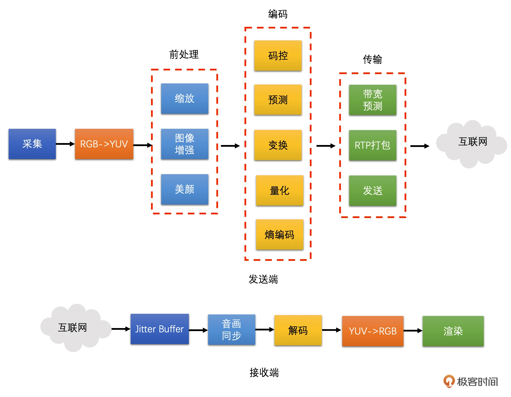
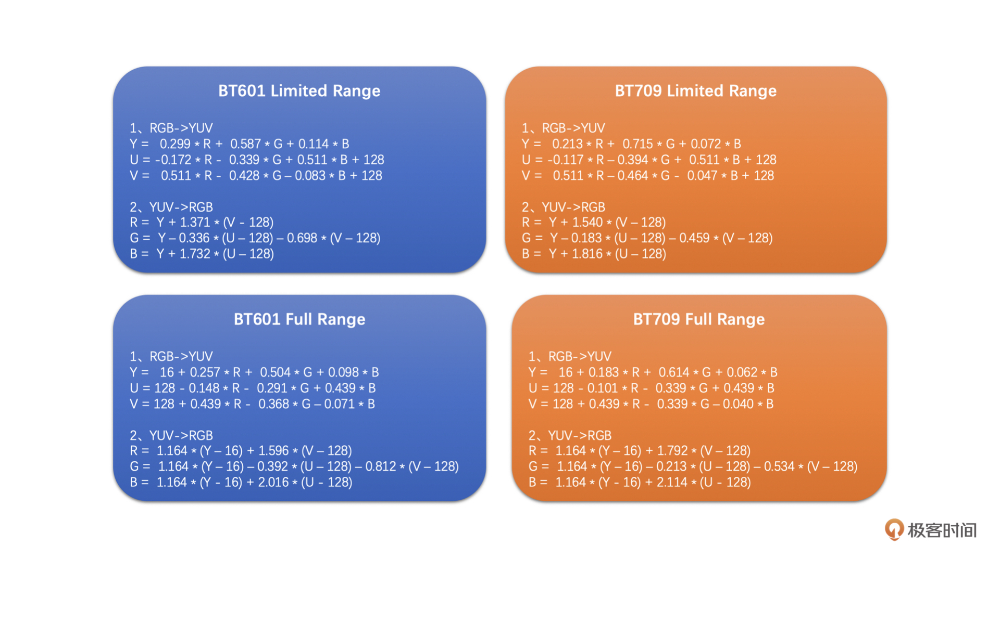

# 视频

视频知识体系

# 参考文档
* [开篇词｜为什么说视频开发是程序员的一片蓝海](https://time.geekbang.org/column/article/447639)
* [02｜YUV & RGB：原来图像是这么丰富多彩的](https://time.geekbang.org/column/article/449795)

# 视频进阶路线

* 视频编码的应用
* 传输策略优化
* 视频网络传输
* 带宽预测
* 抗丢包等网络对抗技术
* 视频AI 算法

# 视频简介

如下知识图谱中攘括视频各个阶段，可构建知识网络，也可以进行查缺补漏   

# stride

  可以成为跨距，是图像存储时的一个概念。它指的是图像存储时内存中每行像素所占用的空间，Width 是原始图像的宽，而 Stride 是对齐之后的一行像素使用的字节大小。
  如果出现一条条斜线的花屏或者说解码后图像的颜色不对的情况，需要先确认一下这个 Stride 值对不对。

# RGB

  它就是指图像的每一个像素都有 R、G、B 三个值。RGB 是我们平常遇到最多的一种图像颜色空间，比如摄像头采集的原始图像就是 RGB 图像，且显示器显示的图像也是 RGB 图像。  
  虽然 RGB 比较简单，同时在图像处理的时候也经常会用到。但是在视频领域，我们更多是使用 YUV 颜色空间来表示图像的。这是因为 R、G、B 三个颜色是有相关性的，所以不太方便做图像压缩编码。

# YUV
 
  YUV 图像将亮度信息 Y 与色彩信息 U、V 分离开来。Y 表示亮度，是图像的总体轮廓，称之为 Y 分量。U、V 表示色度，主要描绘图像的色彩等信息，分别称为 U 分量和 V 分量。
  YUV 存储方式主要分为两大类：Planar 和 Packed 两种。Planar 格式的 YUV 是先连续存储所有像素点的 Y，然后接着存储所有像素点的 U，之后再存储所有像素点的 V，也可以是先连续存储所有像素点的 Y，然后接着存储所有像素点的 V，之后再存储所有像素点的 U。Packed 格式的 YUV 是先存储完所有像素的 Y，然后 U、V 连续的交错存储。 
* YUV 4:4:4，每一个 Y 对应一组 UV。
* YUV 4:2:2，每两个 Y 共用一组 UV。如果是 8bit 图像，那么 RGB 每一个像素需要 3 个字节，而 YUV 4:2:2 只需要 2 个字节。
  * YU16（或者称为 I422、YUV422P）
  * YV16（YUV422P）
* YUV 4:2:0，每四个 Y 共用一组 UV。如果是 8bit 图像，RGB 每一个像素需要 3 个字节。而 YUV 4:2:0 只需要 1.5 个字节  
  

一般来说，采集到的原始图像、给显示器渲染的最终图像都是 RGB 图像，但是视频编码一般用的是 YUV 图像,这就需要了解RGB、YUV转换。RGB YUV转换涉及到 Color Range 这个概念。Color Range 分为两种，一种是 Full Range，一种是 Limited Range。Full Range 的 R、G、B 取值范围都是 0～255。而 Limited Range 的 R、G、B 取值范围是 16～235。转换公式如下 
  

# 缩放基本原理

图像的缩放就是将原图像的已有像素经过加权运算得到目标图像的目标像素

三种插值算法

* 最近邻插值  
  将目标图像中的目标像素位置，映射到原图像的映射位置。  
  找到原图像中映射位置周围的 4 个像素。  
  取离映射位置最近的像素点的像素值作为目标像素  
  最近邻插值有一个明显的缺点，就是它直接使用离插值位置最近的整数位置的像素作为插值像素，这样会导致相邻两个插值像素有很大的概率是相同的。这样得到的放大图像大概率会出现块状效应，而缩小图像容易出现锯齿。这是最近邻插值的缺点。但是它也有一个优点，就是不需要太多的计算，速度非常的快

* 双线性插值
  也是取待插值像素周围的 4 个像素，不同的是，它需要将这 4 个像素值通过一定的运算得到最后的插值像素。双线性插值相比最近邻插值运算要多一些，因此运行时间要长一些，但是相比而言，插值之后图像效果会好于最近邻插值

* 双三次插值
  双三次插值选取的是周围的 16 个像素  
  双三次插值算法的周围像素的权重计算是使用一个特殊的 BiCubic 基函数来计算的。   
  双三次插值需要计算 16 个点的权重再乘以像素值求和，相较于前面的最近邻插值和双线性插值计算量较大，但插值后的图像效果最好

# 视频编码的原理

  人眼对于亮度信息更加敏感，而对于色度信息稍弱，所以视频编码是将 Y 分量和 UV 分量分开来编码的  
  而对于每一帧图像，又是划分成一个个块来进行编码的，这一个个块在 H264 中叫做宏

  图像一般都是有数据冗余的  
    空间冗余  相邻的块很多时候都有比较明显的相似性，这种就叫空间冗余  
    时间冗余  两张图像的变化是比较小的，相似性很高，这种叫做时间冗余  
    视觉冗余 人的眼睛对于图像中高频信息的敏感度是小于低频信息的。有的时候去除图像中的一些高频信息，人眼看起来跟不去除高频信息差别不大，这种叫做视觉冗余
    信息熵冗余 我们一般会使用 Zip 等压缩工具去压缩文件，将文件大小减小，这个对于图像来说也是可以做的，这种冗余叫做信息熵冗余

