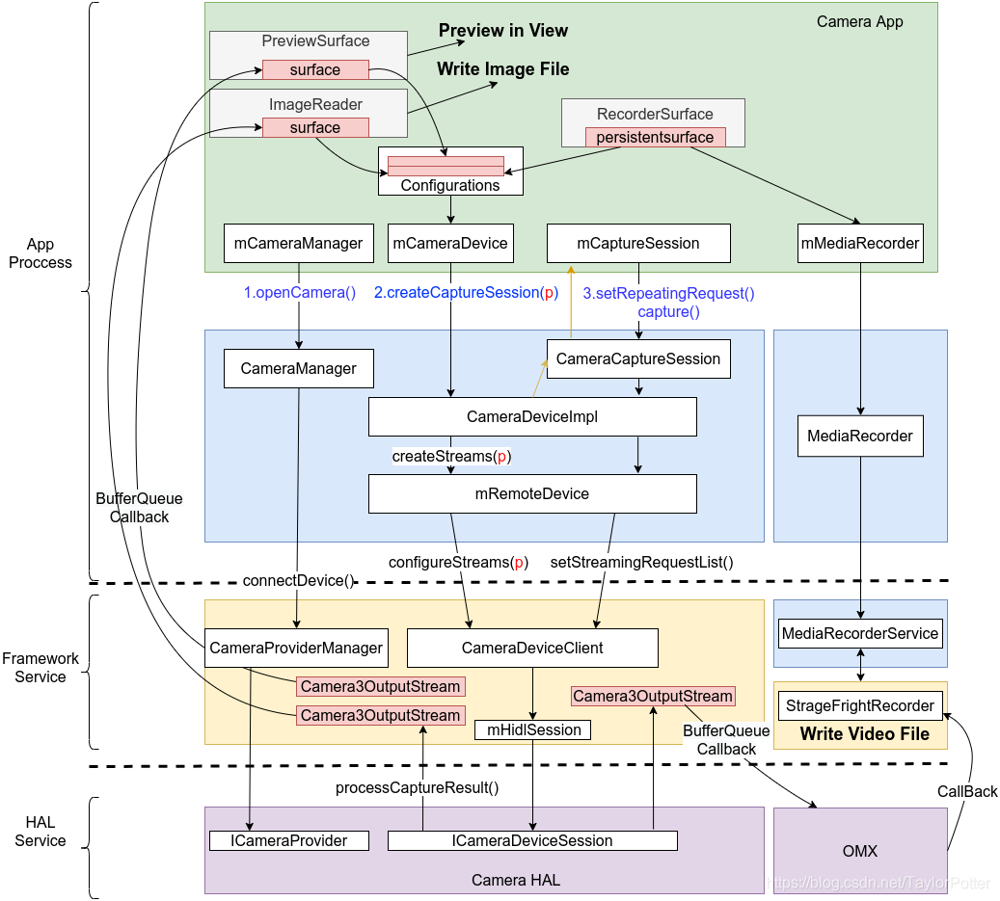
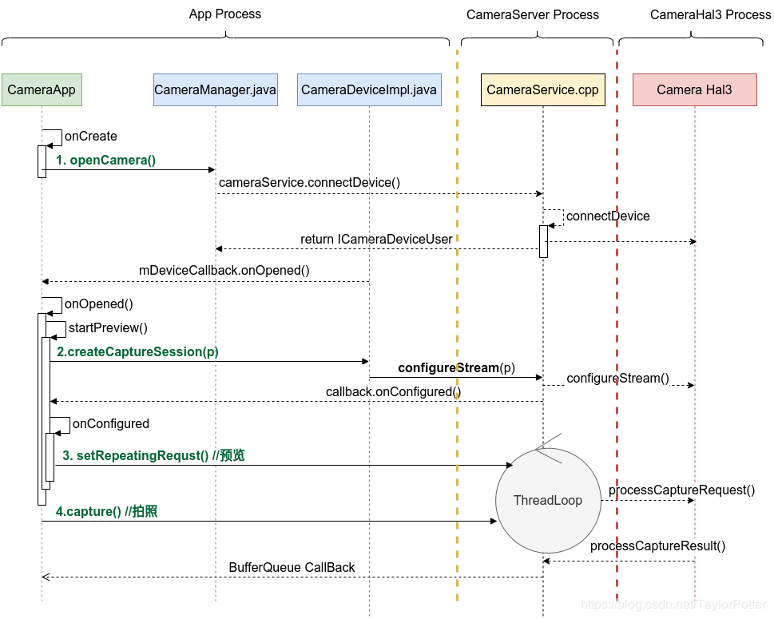
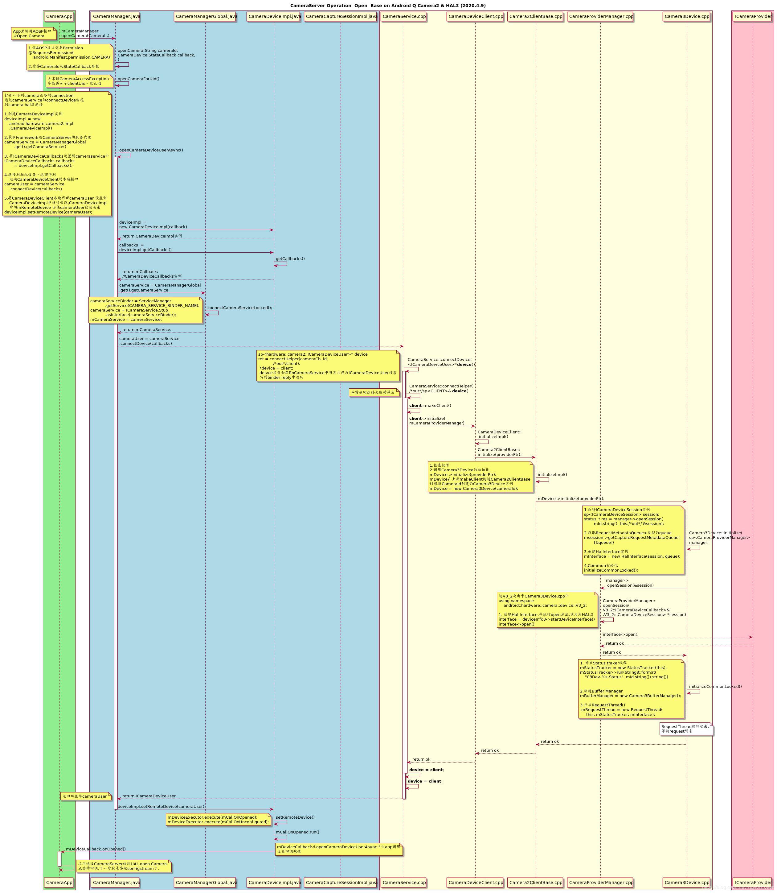
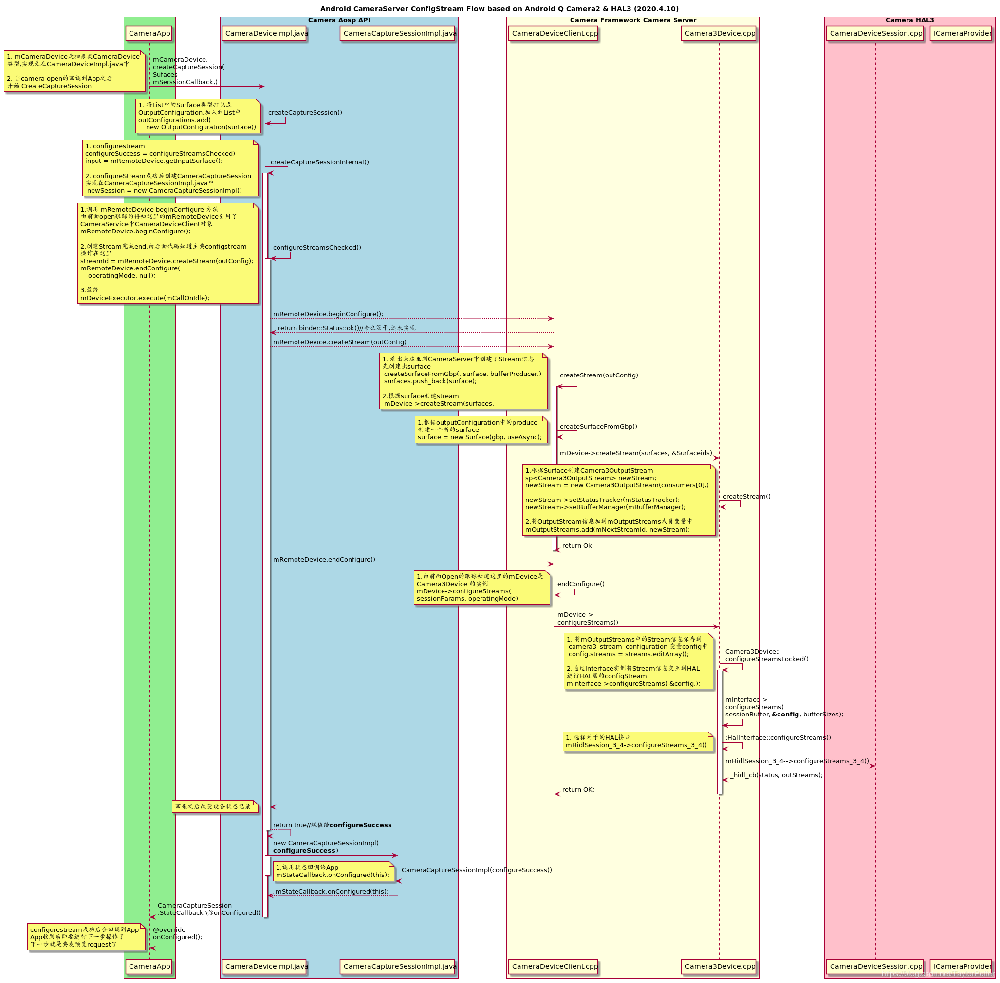
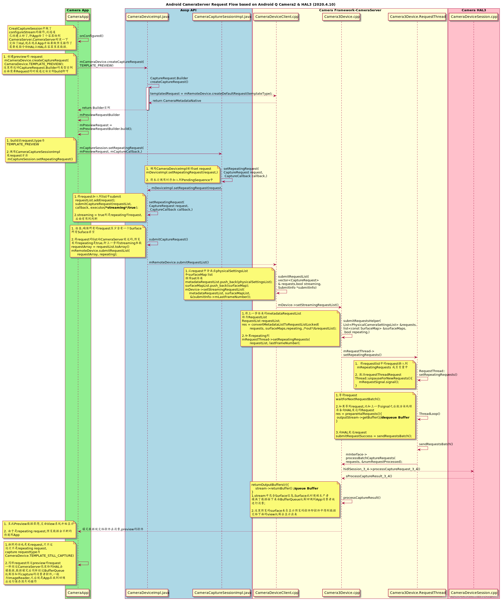
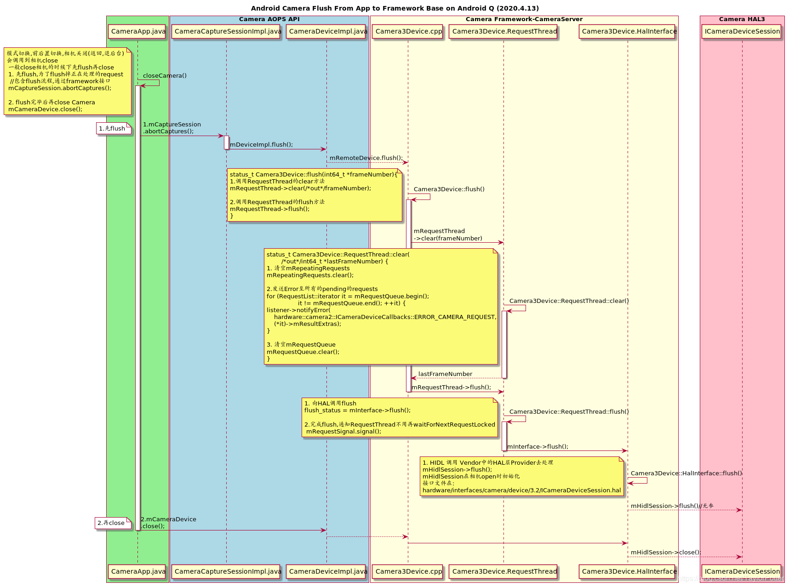
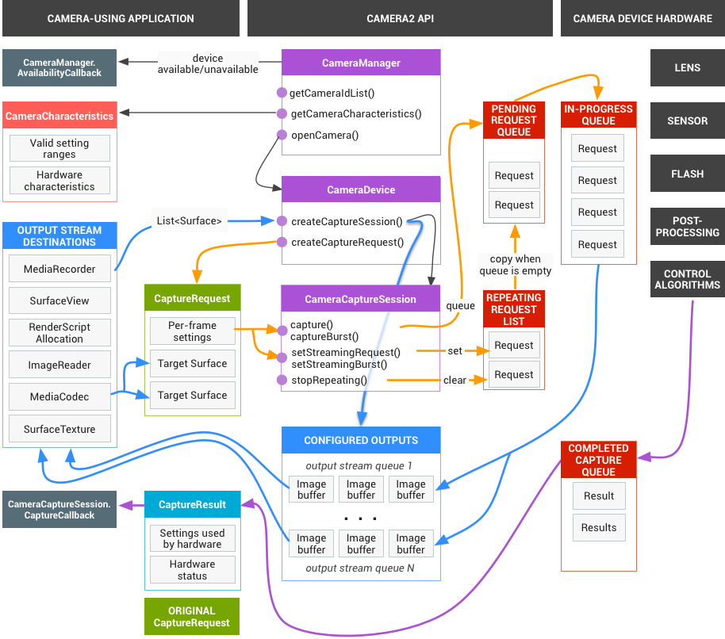

# camera

camera 架构

# 参考文档
* [Android Camera 架构](https://blog.csdn.net/wjky2014/article/details/108709778)
* [Android 13 Camera HAL启动流程](https://blog.csdn.net/weixin_41678668/article/details/130958729)
* [Android 13 Camera HAL启动流程](https://blog.csdn.net/weixin_41678668/article/details/130997399)
* [Android openCamera流程](https://blog.csdn.net/weixin_41944449/article/details/99684653)
* [[Android O] Camera 服务启动流程简析](https://blog.csdn.net/qq_16775897/article/details/81240600)
* [[Android O] HAL3 之 Open Camera2 流程（二）—— 从 CameraService 到 HAL Service](https://blog.csdn.net/qq_16775897/article/details/81661055)

# android camera 架构


# android camera 调用逻辑


# open Camera


# configurestream


# preview and capture request:


# flush and close


# Camera Hal3 子系统


# RK3588S2 camera预览黑屏
* [0001_open-mpp_srv-for-camera-preview-fail.patch](refers/0001_open-mpp_srv-for-camera-preview-fail.patch)


camera预览问题分析
* 确认是否识别到USB摄像头了
* 确认是否是解码错误导致预览黑屏


* 确认是否有USB camera设备
```
rk3588s_t:/ $ cat /sys/kernel/debug/usb/devices |grep camera
S:  Manufacturer=Rapoo camera
S:  Product=Rapoo camera
```
```
rk3588s_t:/ $ grep '' /sys/class/video4linux/video*/name                                           
/sys/class/video4linux/video0/name:stream_cif_mipi_id0
/sys/class/video4linux/video1/name:stream_cif_mipi_id1
/sys/class/video4linux/video10/name:rkcif_tools_id2
/sys/class/video4linux/video11/name:Rapoo camera: Rapoo camera
/sys/class/video4linux/video12/name:Rapoo camera: Rapoo camera
/sys/class/video4linux/video2/name:stream_cif_mipi_id2
/sys/class/video4linux/video3/name:stream_cif_mipi_id3
/sys/class/video4linux/video4/name:rkcif_scale_ch0
/sys/class/video4linux/video5/name:rkcif_scale_ch1
/sys/class/video4linux/video6/name:rkcif_scale_ch2
/sys/class/video4linux/video7/name:rkcif_scale_ch3
/sys/class/video4linux/video8/name:rkcif_tools_id0
/sys/class/video4linux/video9/name:rkcif_tools_id1
```
```
rk3588s_t:/ $ dumpsys media.camera

== Service global info: ==

Number of camera devices: 1
Number of normal camera devices: 1
Number of public camera devices visible to API1: 1
    Device 0 maps to "0"
Active Camera Clients:
[]
Allowed user IDs: 0

== Camera service events log (most recent at top): ==
  11-08 15:31:05 : ADD device 0, reason: (Device added)
  11-08 15:30:58 : REMOVE device 0, reason: (Device status changed from 1 to 0)
  11-08 15:26:59 : ADD device 0, reason: (Device added)
  11-08 15:26:55 : REMOVE device 0, reason: (Device status changed from 1 to 0)
  11-08 15:20:15 : ADD device 0, reason: (Device added)
  11-08 15:20:10 : REMOVE device 0, reason: (Device status changed from 1 to 0)
  11-08 15:19:41 : ADD device 0, reason: (Device added)
  11-08 15:19:36 : REMOVE device 0, reason: (Device status changed from 1 to 0)
  11-08 15:19:18 : USER_SWITCH previous allowed user IDs: <None>, current allowed user IDs: 0
  01-01 20:00:07 : ADD device 0, reason: (Device added)

== Camera device 0 dynamic info: ==
  Device 0 is closed, no client instance
== Camera Provider HAL external/0-0 (v2.5, remote) static info: 1 devices: ==
== Camera HAL device device@3.4/external/0 (v3.4) static information: ==
  Resource cost: 100
  Conflicting devices: None
  API1 info:
    Has a flash unit: false
    Facing: Front
    Orientation: 270
  API2 camera characteristics:
    Dumping camera metadata array: 55 / 55 entries, 2288 / 2288 bytes of extra data.
      Version: 1, Flags: 00000000
      android.info.supportedHardwareLevel (150000): byte[1]
        [EXTERNAL ]
      android.colorCorrection.availableAberrationModes (00004): byte[1]
        [0 ]
      android.control.aeAvailableAntibandingModes (10012): byte[1]
        [3 ]
      android.control.maxRegions (1001c): int32[3]
        [0 0 0 ]
      android.control.availableVideoStabilizationModes (1001a): byte[1]
        [0 ]
      android.control.awbAvailableModes (1001b): byte[1]
        [1 ]
      android.control.aeAvailableModes (10013): byte[1]
        [1 ]
      android.control.availableEffects (10018): byte[1]
        [0 ]
      android.control.availableModes (10026): byte[2]
        [0 1 ]
      android.edge.availableEdgeModes (30002): byte[1]
        [0 ]
      android.flash.info.available (50000): byte[1]
        [FALSE ]
      android.hotPixel.availableHotPixelModes (60001): byte[1]
        [0 ]
      android.jpeg.availableThumbnailSizes (70007): int32[14]
        [0 0 176 144 ]
        [240 144 256 144 ]
        [240 160 256 154 ]
        [240 180 ]
      android.jpeg.maxSize (70008): int32[1]
        [3145728 ]
      android.lens.info.focusDistanceCalibration (90007): byte[1]
        [UNCALIBRATED ]
      android.lens.info.availableOpticalStabilization (90003): byte[1]
        [0 ]
      android.lens.facing (80005): byte[1]
        [EXTERNAL ]
      android.noiseReduction.availableNoiseReductionModes (a0002): byte[1]
        [0 ]
      android.noiseReduction.mode (a0000): byte[1]
        [OFF ]
      android.request.partialResultCount (c000b): int32[1]
        [1 ]
      android.request.pipelineMaxDepth (c000a): byte[1]
        [4 ]
      android.request.maxNumOutputStreams (c0006): int32[3]
        [0 2 1 ]
      android.request.maxNumInputStreams (c0008): int32[1]
        [0 ]
      android.scaler.availableMaxDigitalZoom (d0004): float[1]
        [4.00000000 ]
      android.scaler.croppingType (d000d): byte[1]
        [CENTER_ONLY ]
      android.sensor.availableTestPatternModes (e0019): int32[2]
        [0 1 ]
      android.sensor.info.timestampSource (f0008): byte[1]
        [UNKNOWN ]
      android.sensor.orientation (e000e): int32[1]
        [270 ]
      android.shading.availableModes (100002): byte[1]
        [0 ]
      android.statistics.info.availableFaceDetectModes (120000): byte[1]
        [0 ]
      android.statistics.info.maxFaceCount (120002): int32[1]
        [0 ]
      android.statistics.info.availableHotPixelMapModes (120006): byte[1]
        [0 ]
      android.statistics.info.availableLensShadingMapModes (120007): byte[1]
        [0 ]
      android.sync.maxLatency (170001): int32[1]
        [UNKNOWN ]
      android.request.availableRequestKeys (c000d): int32[28]
        [3 65536 65537 65538 ]
        [65539 65542 65541 65543 ]
        [65545 65546 65547 65549 ]
        [65550 65551 65552 65553 ]
        [262146 458755 458756 458757 ]
        [458758 524292 655360 851968 ]
        [917528 1114112 1114115 65583 ]
      android.request.availableResultKeys (c000e): int32[35]
        [3 65536 65537 65538 ]
        [65539 65542 65567 65541 ]
        [65543 65568 65545 65546 ]
        [65547 65570 65549 65550 ]
        [65551 65552 65553 262146 ]
        [262149 458755 458756 458757 ]
        [458758 524292 655360 786441 ]
        [851968 917520 1114112 1114115 ]
        [1114128 1114126 65583 ]
      android.request.availableCharacteristicsKeys (c000f): int32[43]
        [4 65554 65555 65556 ]
        [65557 65558 65572 65559 ]
        [65560 65574 65561 65562 ]
        [65563 65573 65564 327680 ]
        [1376256 458759 524293 589827 ]
        [589831 655362 786444 786440 ]
        [786438 786443 786442 851972 ]
        [851978 851981 983040 983044 ]
        [983046 983050 983048 917518 ]
        [1048578 1179648 1179654 1179655 ]
        [1179650 1507329 65582 ]
      android.control.aeCompensationRange (10015): int32[2]
        [0 0 ]
      android.control.aeCompensationStep (10016): rational[1]
        [(0 / 1) ]
      android.control.afAvailableModes (10017): byte[2]
        [1 0 ]
      android.control.availableSceneModes (10019): byte[1]
        [0 ]
      android.control.aeLockAvailable (10024): byte[1]
        [FALSE ]
      android.control.awbLockAvailable (10025): byte[1]
        [FALSE ]
      android.scaler.availableStreamConfigurations (d000a): int32[84]
        [33 160 120 OUTPUT ]
        [35 160 120 OUTPUT ]
        [34 160 120 OUTPUT ]
        [33 176 144 OUTPUT ]
        [35 176 144 OUTPUT ]
        [34 176 144 OUTPUT ]
        [33 320 240 OUTPUT ]
        [35 320 240 OUTPUT ]
        [34 320 240 OUTPUT ]
        [33 352 288 OUTPUT ]
        [35 352 288 OUTPUT ]
        [34 352 288 OUTPUT ]
        [33 640 480 OUTPUT ]
        [35 640 480 OUTPUT ]
        [34 640 480 OUTPUT ]
        [33 1280 720 OUTPUT ]
        [35 1280 720 OUTPUT ]
        [34 1280 720 OUTPUT ]
        [33 1280 720 OUTPUT ]
        [35 1280 720 OUTPUT ]
        [34 1280 720 OUTPUT ]
      android.scaler.availableMinFrameDurations (d000b): int64[84]
        [33 160 ]
        [120 33333333 ]
        [35 160 ]
        [120 33333333 ]
        [34 160 ]
        [120 33333333 ]
        [33 176 ]
        [144 33333333 ]
        [35 176 ]
        [144 33333333 ]
        [34 176 ]
        [144 33333333 ]
        [33 320 ]
        [240 33333333 ]
        [35 320 ]
        [240 33333333 ]
        [34 320 ]
        [240 33333333 ]
        [33 352 ]
        [288 33333333 ]
        [35 352 ]
        [288 33333333 ]
        [34 352 ]
        [288 33333333 ]
        [33 640 ]
        [480 33333333 ]
        [35 640 ]
        [480 33333333 ]
        [34 640 ]
        [480 33333333 ]
        [33 1280 ]
        [720 33333333 ]
        [35 1280 ]
        [720 33333333 ]
        [34 1280 ]
        [720 33333333 ]
        [33 1280 ]
        [720 33333333 ]
        [35 1280 ]
        [720 33333333 ]
        [34 1280 ]
        [720 33333333 ]
      android.scaler.availableStallDurations (d000c): int64[84]
        [33 160 ]
        [120 1000000000 ]
        [35 160 ]
        [120 0 ]
        [34 160 ]
        [120 0 ]
        [33 176 ]
        [144 1000000000 ]
        [35 176 ]
        [144 0 ]
        [34 176 ]
        [144 0 ]
        [33 320 ]
        [240 1000000000 ]
        [35 320 ]
        [240 0 ]
        [34 320 ]
        [240 0 ]
        [33 352 ]
        [288 1000000000 ]
        [35 352 ]
        [288 0 ]
        [34 352 ]
        [288 0 ]
        [33 640 ]
        [480 1000000000 ]
        [35 640 ]
        [480 0 ]
        [34 640 ]
        [480 0 ]
        [33 1280 ]
        [720 1000000000 ]
        [35 1280 ]
        [720 0 ]
        [34 1280 ]
        [720 0 ]
        [33 1280 ]
        [720 1000000000 ]
        [35 1280 ]
        [720 0 ]
        [34 1280 ]
        [720 0 ]
      android.control.aeAvailableTargetFpsRanges (10014): int32[2]
        [15 30 ]
      android.sensor.info.maxFrameDuration (f0004): int64[1]
        [200000000 ]
      android.sensor.info.preCorrectionActiveArraySize (f000a): int32[4]
        [0 0 1280 720 ]
      android.sensor.info.activeArraySize (f0000): int32[4]
        [0 0 1280 720 ]
      android.sensor.info.pixelArraySize (f0006): int32[2]
        [1280 720 ]
      android.request.availableCapabilities (c000c): byte[1]
        [BACKWARD_COMPATIBLE ]
      android.scaler.availableRotateAndCropModes (d0010): byte[1]
        [0 ]
      android.control.zoomRatioRange (1002e): float[2]
        [1.00000000 4.00000000 ]
      android.sensor.readoutTimestamp (e0022): byte[1]
        [NOT_SUPPORTED ]
== Camera HAL device device@3.4/external/0 (v3.4) dumpState: ==
No active camera device session instance
== Camera Provider HAL legacy/0-1 (v2.5, remote) static info: 0 devices: ==

== Vendor tags: ==

  Dumping vendor tag descriptors for vendor with id 14172875900359437128 
  Dumping configured vendor tag descriptors: 10 entries
    0x80000000 (privatedata_effective_driver_frame_id) with type 3 (int64) defined in section org.codeaurora.rkcamera3.privatedata
    0x80000001 (privatedata_frame_sof_timestamp) with type 3 (int64) defined in section org.codeaurora.rkcamera3.privatedata
    0x80000002 (privatedata_stillcap_sync_needed) with type 0 (byte) defined in section org.codeaurora.rkcamera3.privatedata
    0x80000003 (privatedata_stillcap_sync_cmd) with type 0 (byte) defined in section org.codeaurora.rkcamera3.privatedata
    0x80000004 (privatedata_stillcap_isp_param) with type 0 (byte) defined in section org.codeaurora.rkcamera3.privatedata
    0x80010000 (3dnrmode) with type 0 (byte) defined in section com.rockchip.nrfeature
    0x80020000 (brightness) with type 0 (byte) defined in section com.rockchip.control.aiq
    0x80020001 (contrast) with type 0 (byte) defined in section com.rockchip.control.aiq
    0x80020002 (saturation) with type 0 (byte) defined in section com.rockchip.control.aiq
    0x80030000 (meanluma) with type 2 (float) defined in section com.rockchip.luma
  Dumping vendor tag descriptors for vendor with id 15055940602041719656 
  Dumping configured vendor tag descriptors: None set

== Camera error traces (0): ==
  No camera traces collected.

**********Dumpsys from previous open session**********

```


* RK3588S 是支持USB 摄像头预览，cameara、camera2也是正常的，所以如果有问题更多是因为dts配置导致。有异常日志如下：
```
11-12 12:33:28.083   378   378 E mpp     : error found on mpp initialization
11-12 12:33:28.083   378   378 E MpiJpegDecoder: failed to init mpp
11-12 12:33:28.083   378   378 E MpiJpegDecoder: failed to init mpp decoder
11-12 12:33:28.083   378   378 E ExtCamDevSsn@3.4: failed to prepare JPEG decoder
11-12 12:33:28.083   378   378 V ExtCamDevSsn@3.4: initDefaultRequests: unsupported RequestTemplate type 5
11-12 12:33:28.083   378   378 V ExtCamDevSsn@3.4: initDefaultRequests: unsupported RequestTemplate type 6
11-12 12:33:28.083   378   378 V ExtCamDevSsn@3.4: initDefaultRequests: unsupported RequestTemplate type 1073741824
```

* 合入patch 前没有proc/mpp_service/jpegd所以会有解码错误
```
rk3588s_t:/ # ls -l /proc/mpp_service/jpegd 
total 0
-rw-r--r-- 1 root root 0 2024-11-13 09:27 aclk
-rw-r--r-- 1 root root 0 2024-11-13 09:27 disable_work
-rw-r--r-- 1 root root 0 2024-11-13 09:27 session_buffers
-rw-r--r-- 1 root root 0 2024-11-13 09:27 timing_check
```

