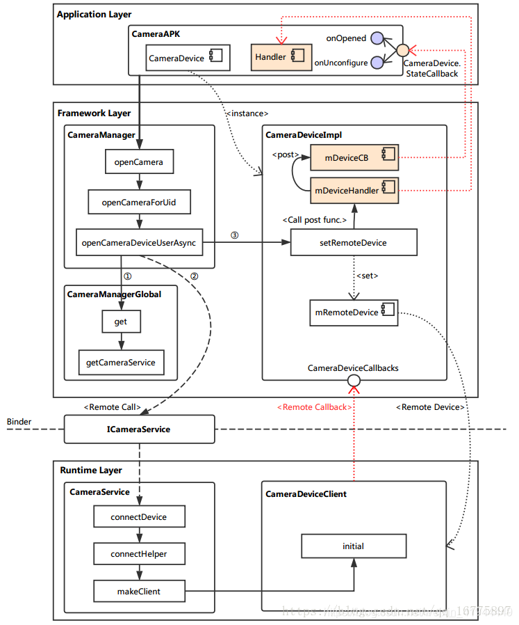
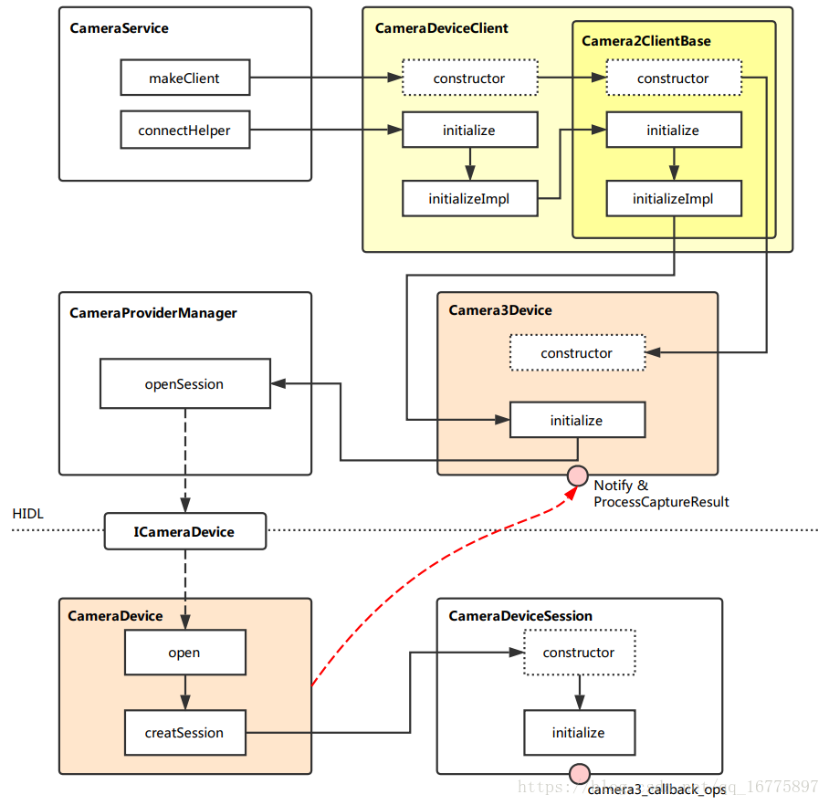

# open camera

open camera 流程

# Author Info

 Field  | Info
--------|----------
 Author | linliangsong 
 Date   | 2025-2-26
 Email  | linliangsong@boe.com.cn 

# 参考文档
* [Android openCamera流程](https://blog.csdn.net/weixin_41944449/article/details/99684653)
* [Android camera open 流程](https://blog.csdn.net/andytian1991/article/details/118090561)


# 从APP到CameraService
调用逻辑如下图所示  


camera打开整体框架图



# 代码堆栈
```
* frameworks/base/core/java/android/hardware/camera2/CameraManager.java 
  └── public void openCamera(@NonNull String cameraId, @NonNull final CameraDevice.StateCallback callback, @Nullable Handler handler)
      └── openCameraForUid(cameraId, callback, CameraDeviceImpl.checkAndWrapHandler(handler), USE_CALLING_UID);
          └── public void openCameraForUid(@NonNull String cameraId, @NonNull final CameraDevice.StateCallback callback, @NonNull Executor executor, int clientUid)
              └── openCameraForUid(cameraId, callback, executor, clientUid, /*oomScoreOffset*/0);
                  └── openCameraDeviceUserAsync(cameraId, callback, executor, clientUid, oomScoreOffset);
                      ├── CameraCharacteristics characteristics = getCameraCharacteristics(cameraId); // 获取camera 特性信息
                      ├── ICameraService cameraService = CameraManagerGlobal.get().getCameraService();//获取 Android 系统中相机服务
                      ├── boolean overrideToPortrait = shouldOverrideToPortrait(mContext); //是否需要强制转为竖屏
                      ├── cameraUser = cameraService.connectDevice(callbacks, cameraId,
                      │   └── frameworks/av/services/camera/libcameraservice/CameraService.cpp
                      │       └── ret = connectHelper<hardware::camera2::ICameraDeviceCallbacks,CameraDeviceClient>(cameraCb, id,
                      │           └── Status CameraService::connectHelper(const sp<CALLBACK>& cameraCb, const String8& cameraId,
                      │               ├── if ((err = handleEvictionsLocked(cameraId, originalClientPid, effectiveApiLevel,  //根据策略决定是否回收先有的相机连接
                      │               ├──  mFlashlight->prepareDeviceOpen(cameraId);//针对相机闪光灯开机准备的工作
                      │               ├── if(!(ret = makeClient(this, cameraCb, clientPackageName, systemNativeClient,...)//创建相机客户端
                      │               └── err = client->initialize(mCameraProviderManager, monitorTags);
                      │                   └── frameworks/av/services/camera/libcameraservice/api2/CameraDeviceClient.cpp 
                      │                       └── status_t CameraDeviceClient::initialize(sp<CameraProviderManager> manager, const String8& monitorTags) 
                      │                           └── return initializeImpl(manager, monitorTags);
                      │                               └── status_t CameraDeviceClient::initializeImpl(TProviderPtr providerPtr, const String8& monitorTags) 
                      └── deviceImpl.setRemoteDevice(cameraUser);//      
```


